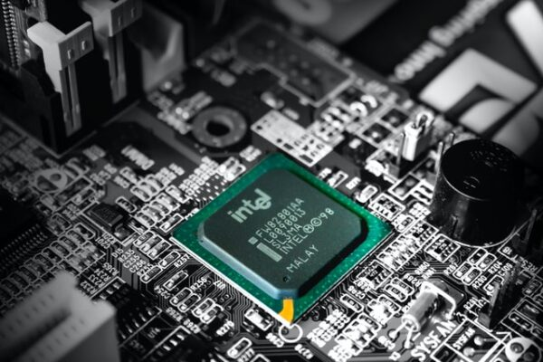
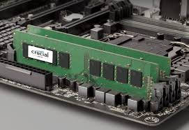
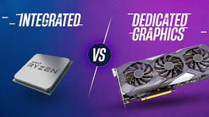
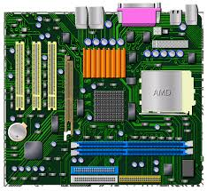
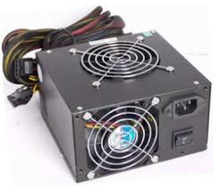
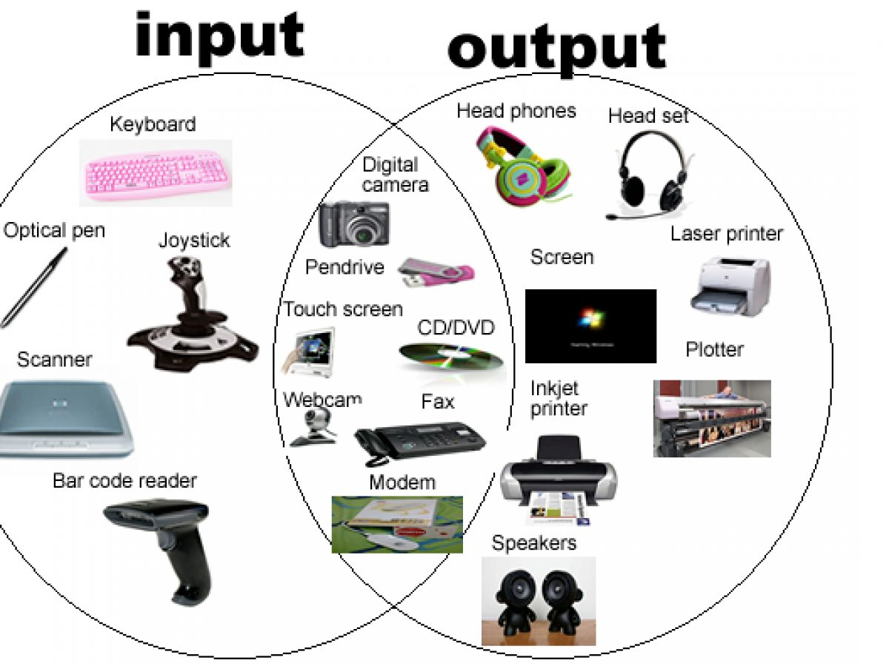
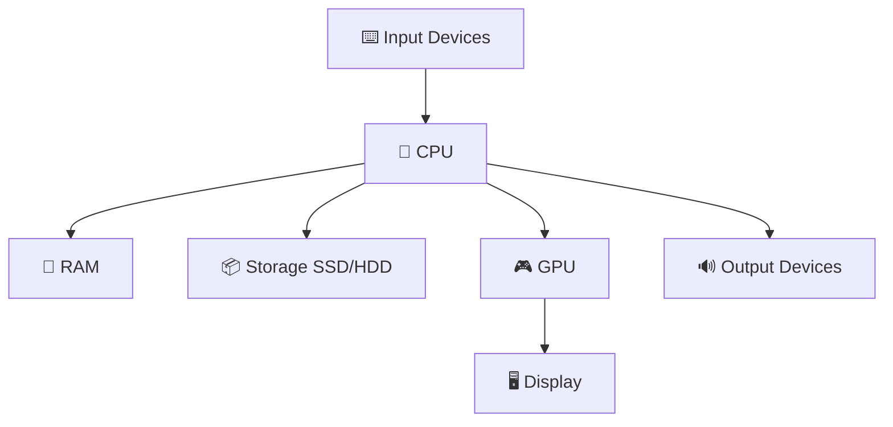

# 🧠 Fundamentals of Computers: How Computers Work

## 1. What Is a Computer?

A **computer** is an electronic device that processes input data, performs operations, and produces output. It performs four essential functions:

- **Input** – Receives data (e.g., keyboard, mouse)
- **Processing** – Computes or manipulates data (CPU/GPU)
- **Storage** – Saves data (RAM, SSD/HDD)
- **Output** – Presents results (monitor, printer)

> **Analogy:** A computer is like a kitchen:
>
> - Ingredients = Input
> - Recipe = Program
> - Cooking = Processing
> - Serving = Output
> - Pantry = Storage

---

## 2. Core Hardware Components

### 🧩 a. Central Processing Unit (CPU)

- Known as the **brain** of the computer.
- Executes instructions and performs operations.
- Contains **cores** for multitasking.

### 💾 b. Random Access Memory (RAM)

- Temporary, fast memory used during processing.
- Volatile – data is lost when the computer is off.

### 💽 c. Storage Devices (HDD/SSD)

- **HDD**: Mechanical, cheaper, slower.
- **SSD**: Electronic, faster, more expensive.

### 🎮 d. Graphics Processing Unit (GPU)

- Specialized for rendering images and videos.
- Used in gaming, video editing, and AI.

### 🧬 e. Motherboard

- Connects all components.
- Allows communication between CPU, RAM, storage, etc.

### 🔌 f. Power Supply Unit (PSU)

- Converts electricity from wall to usable power for components.

### ⌨️🖱️ g. Input/Output Devices

- **Input**: Keyboard, mouse, microphone
- **Output**: Monitor, speakers, printer

---

## 3. How Data Flows in a Computer

### 🧭 Input → Process → Output Model

Example: Typing a Document

1. **Input**: Keyboard sends signal
2. **Process**: CPU handles input, stores in RAM, GPU renders text
3. **Storage**: User saves document to SSD
4. **Output**: Text displayed on screen

### 🔄 CPU Fetch-Decode-Execute Cycle

1. **Fetch**: Retrieves instruction from memory
2. **Decode**: Interprets instruction
3. **Execute**: Performs the task

### 📊 Data Flow Diagram

