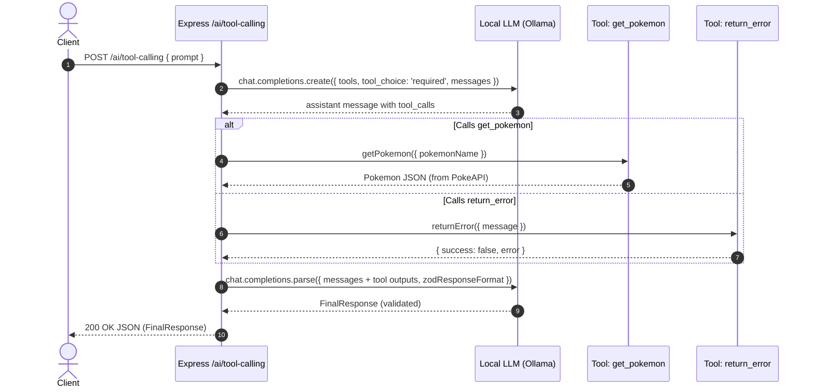
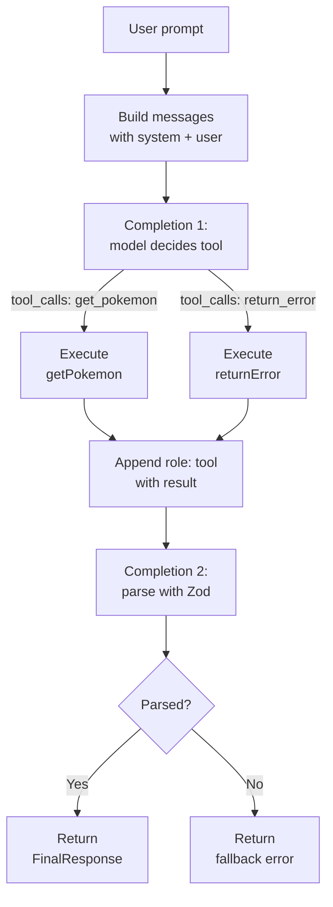

> **Educational content by Bashar Alwarad**:
> Tool Calling with a Local LLM.

## Connect with Me [](https://www.linkedin.com/in/bashar-alwarad-2a960b1b6/)

# 🎓 Chapter 22 — Tool Calling with a Local LLM (Ollama)

How an LLM can decide to call your functions, fetch external data, and return a structured answer — all running locally via Ollama and the OpenAI-compatible SDK.

---

## ✅ What you’ll learn

- Define tools (functions) the model can call
- Orchestrate a 2-step completion flow (intent → tool calls → final answer)
- Execute tools safely and pass results back to the model
- Enforce structured JSON output with Zod
- Run everything locally using Ollama

---

## 🧭 Project scope (tool calling only)

This repo is focused on a single endpoint that demonstrates tool calling:

- POST /ai/tool-calling — Given a natural-language prompt, the model decides whether to call:
  - get_pokemon(pokemonName) to fetch Pokémon data from PokeAPI
  - return_error(message) when the prompt isn’t about Pokémon

Other endpoints and providers are intentionally out of scope here to keep the lesson focused.

---

## 📂 Relevant files

```
openai-compatible-local/
├── src/
│   ├── app.ts
│   ├── controllers/
│   │   ├── toolCallingCompletion.ts   # Full tool-calling flow (intent → tools → final)
│   ├── routes/
│   │   └── completionsRouter.ts       # Adds POST /ai/tool-calling
│   ├── schemas/
│   │   └── completionsSchemas.ts      # FinalResponse schema (Zod)
│   ├── types/
│   │   └── index.ts                   # Shared types (FinalResponseDTO, etc.)
│   └── utils/
│       └── index.ts                   # Tools: getPokemon, returnError; streaming helper
└── package.json
```

---

## ⚙️ Setup

1. Install Node and Ollama (Windows/macOS/Linux). Then pull a tool-capable model:

```bash
ollama pull llama3.1:8b
```

2. Install dependencies in the project folder:

```bash
npm install
```

3. Create `.env.development.local` (or copy from the example) and set:

```bash
NODE_ENV=development
PORT=3000
OLLAMA_URL=http://127.0.0.1:11434/v1
OLLAMA_API_KEY=ollama
OLLAMA_MODEL=llama3.1:8b
```

4. Start the API server:

```bash
npm run dev
```

You should see something like:

```
Example app listening at http://localhost:3000
```

---

## 🚀 Try it

POST /ai/tool-calling

Body:

```json
{
  "prompt": "Who is Pikachu?"
}
```

Example with a non-English name (German):

```json
{
  "prompt": "Was ist ein Bisasam?"
}
```

Notes:

- The controller instructs the model to pass English Pokémon names to the tool. For common cases (like “Bisasam”), the util maps to the canonical name (“bulbasaur”).
- If the question is not about Pokémon, the model calls return_error and you’ll get a friendly error message.

### Expected responses

Successful Pokémon query (example):

```json
{
  "isPokemon": true,
  "pokemonInfo": {
    "id": 25,
    "name": "pikachu",
    "aboutSpecies": "Pikachu is an Electric-type Pokemon...",
    "types": ["electric"],
    "abilities": ["static", "lightning-rod"],
    "abilitiesExplained": "Static may cause paralysis on contact moves...",
    "frontSpriteURL": "https://raw.githubusercontent.com/PokeAPI/sprites/master/sprites/pokemon/25.png"
  },
  "error": null
}
```

Non-Pokémon question (example):

```json
{
  "isPokemon": false,
  "pokemonInfo": null,
  "error": "This question is not about Pokémon. It asks about geography."
}
```

---

## 🧪 Response shape (Zod-enforced)

`FinalResponse` schema (simplified):

```ts
{
  isPokemon: boolean,
  pokemonInfo?: {
    id: number,
    name: string,
    aboutSpecies: string,
    types: string[],
    abilities: string[],
    abilitiesExplained: string,
    frontSpriteURL: string
  } | null,
  error?: string | null
}
```

The model’s final message must match this structure thanks to `zodResponseFormat()`.

---

## 🧩 How it works (at a glance)

1. You define tools the model can call:
   - get_pokemon({ pokemonName })
   - return_error({ message })
2. First completion: ask the model to determine intent and call a tool (tool_choice: 'required')
3. Your server executes the requested tool(s) and appends the result(s) to the conversation as role: 'tool'
4. Second completion: ask the model for a final, structured answer using Zod

---

## 🗺️ Sequence: HTTP request → tools → final answer


```mermaid
sequenceDiagram
    autonumber
    actor C as Client
    participant E as Express /ai/tool-calling
    participant L as Local LLM (Ollama)
    participant T1 as Tool: get_pokemon
    participant T2 as Tool: return_error

    C->>E: POST /ai/tool-calling { prompt }
    E->>L: chat.completions.create({ tools, tool_choice: 'required', messages })
    L-->>E: assistant message with tool_calls
    alt Calls get_pokemon
        E->>T1: getPokemon({ pokemonName })
        T1-->>E: Pokemon JSON (from PokeAPI)
    else Calls return_error
        E->>T2: returnError({ message })
        T2-->>E: { success: false, error }
    end
    E->>L: chat.completions.parse({ messages + tool outputs, zodResponseFormat })
    L-->>E: FinalResponse (validated)
    E-->>C: 200 OK JSON (FinalResponse)
```

---

## 🔁 Flow: model-driven tool use


```mermaid
flowchart TD
  A["User prompt"] --> B["Build messages<br/>with system + user"]
  B --> C["Completion 1:<br/>model decides tool"]
  C -->|tool_calls: get_pokemon| D["Execute<br/>getPokemon"]
  C -->|tool_calls: return_error| E["Execute<br/>returnError"]
  D --> F["Append role: tool<br/>with result"]
  E --> F
  F --> G["Completion 2:<br/>parse with Zod"]
  G --> H{"Parsed?"}
  H -->|Yes| I["Return<br/>FinalResponse"]
  H -->|No| J["Return<br/>fallback error"]
```

---

## 🛠️ Implementation details (where to look)

- `src/controllers/toolCallingCompletion.ts`

  - Defines tools (get_pokemon, return_error)
  - Forces function calling (`tool_choice: 'required'`)
  - Iterates tool_calls, executes tools, appends role: 'tool'
  - Requests final structured output with `zodResponseFormat(FinalResponse, 'FinalResponse')`

- `src/utils/index.ts`

  - `getPokemon()` — fetches from PokeAPI; includes a small alias map (e.g., "bisasam" → "bulbasaur") and helpful errors
  - `returnError()` — uniform error DTO

- `src/schemas/completionsSchemas.ts`
  - `FinalResponse` — the contract for the final JSON

---

## 🧰 Troubleshooting

- Model doesn’t call tools

  - Use `llama3.1:8b` and keep `tool_choice: 'required'`
  - Make the system message crystal clear about when to call which tool

- 404 from PokeAPI (unknown name)

  - Ensure the tool receives the English canonical name (the util maps some common aliases)

- Long responses / slow

  - Tool calling uses two completions; expect slightly longer latency
  - Close heavy apps; consider a quantized model variant

- Model returns text instead of calling functions

  - Some models ignore tool calls. We already set `tool_choice: 'required'`. If it still happens, switch to `llama3.1:8b` or try a quantized variant with good tool use.

- Failed to parse arguments

  - Rarely, the model may produce invalid JSON for tool args. Try simplifying the prompt, ensuring enough context, or restarting Ollama.

---

## 🆚 What’s different from basic completions?

| Feature           | Basic `/ai/ollama` | Tool Calling `/ai/tool-calling` |
| ----------------- | ------------------ | ------------------------------- |
| Completions       | 1 (just answer)    | 2 (intent check + final answer) |
| External Data     | No                 | Yes (Pokemon API)               |
| Structured Output | Plain text         | Zod-validated JSON              |
| Functions         | None               | 2 (get_pokemon, return_error)   |
| Use Case          | Simple Q&A         | Dynamic data fetching           |

---

## 🧪 Testing with Postman

If you prefer a GUI:

1. Method: POST
2. URL: `http://localhost:3000/ai/tool-calling`
3. Headers: `Content-Type: application/json`
4. Body (raw):

```json
{ "prompt": "Who is Pikachu?" }
```

Click Send and observe both the response and terminal logs.

---

## ▶️ Next steps

1. Modify tool definitions to accept more parameters
2. Add a new tool (for example, `compare_pokemon`)
3. Experiment with system prompts to influence tool selection
4. Read the controller at `src/controllers/toolCallingCompletion.ts` to understand the full flow

---

## 🔗 Quick reference

- Endpoint: POST `/ai/tool-calling`
- Body: `{ "prompt": string }`
- Requires: Ollama running locally with `llama3.1:8b`
- Output: Validated `FinalResponse` JSON

**Happy Learning! 🎓🚀**
