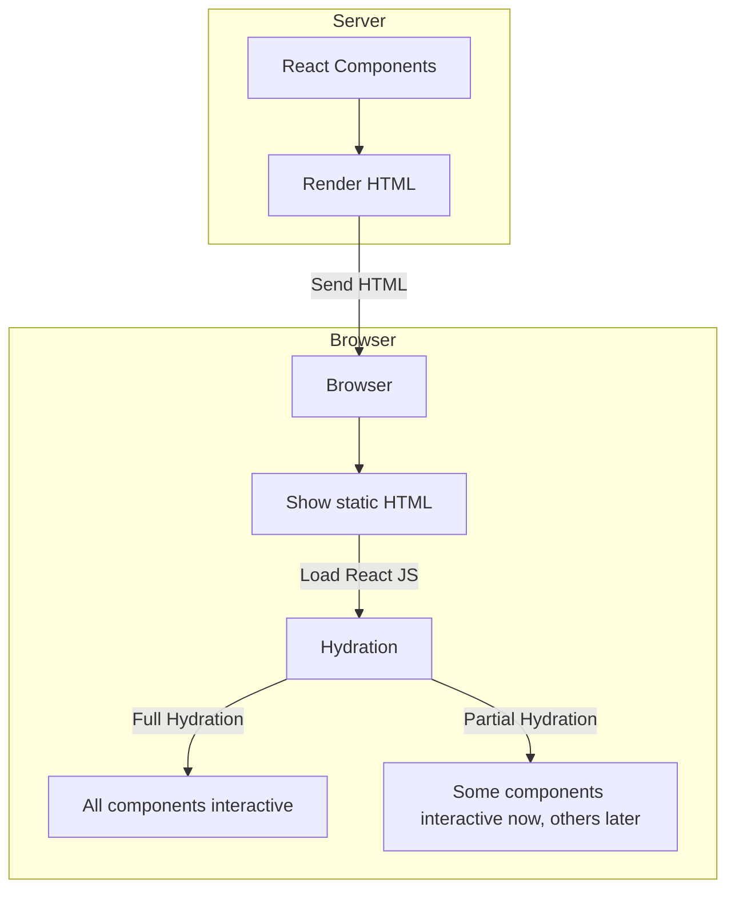
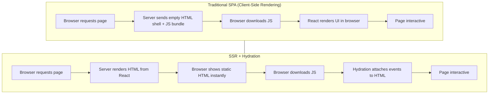
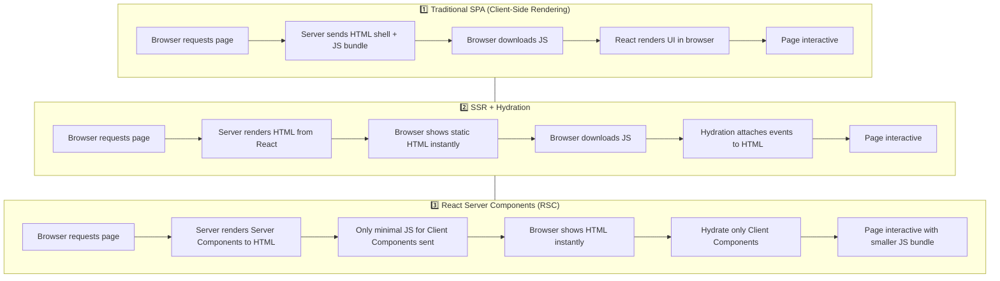

# React Server Components (RSC) Overview

## Introduction

```mermaid
flowchart TB
    subgraph Server
        A[React Components] --> B[Render HTML]
    end

    B -->|Send HTML| C[Browser]

    subgraph Browser
        C --> D[Show static HTML]
        D -->|Load React JS| E[Hydration]
        E -->|Full Hydration| F[All components interactive]
        E -->|Partial Hydration| G[Some components interactive now, others later]
    end
```

## Comparison of Rendering Techniques

```mermaid
flowchart TB
    subgraph SPA["Traditional SPA (Client-Side Rendering)"]
        A1[Browser requests page] --> A2[Server sends empty HTML shell + JS bundle]
        A2 --> A3[Browser downloads JS]
        A3 --> A4[React renders UI in browser]
        A4 --> A5[Page interactive]
    end

    subgraph SSR["SSR + Hydration"]
        B1[Browser requests page] --> B2[Server renders HTML from React]
        B2 --> B3[Browser shows static HTML instantly]
        B3 --> B4[Browser downloads JS]
        B4 --> B5[Hydration attaches events to HTML]
        B5 --> B6[Page interactive]
    end

    SPA --- SSR

```

## Comparison of Rendering Techniques with React Server Components

```mermaid
flowchart TB
    %% --- SPA Column ---
    subgraph SPA["1️⃣ Traditional SPA (Client-Side Rendering)"]
        A1[Browser requests page] --> A2[Server sends HTML shell + JS bundle]
        A2 --> A3[Browser downloads JS]
        A3 --> A4[React renders UI in browser]
        A4 --> A5[Page interactive]
    end

    %% --- SSR Column ---
    subgraph SSR["2️⃣ SSR + Hydration"]
        B1[Browser requests page] --> B2[Server renders HTML from React]
        B2 --> B3[Browser shows static HTML instantly]
        B3 --> B4[Browser downloads JS]
        B4 --> B5[Hydration attaches events to HTML]
        B5 --> B6[Page interactive]
    end

    %% --- RSC Column ---
    subgraph RSC["3️⃣ React Server Components (RSC)"]
        C1[Browser requests page] --> C2[Server renders Server Components to HTML]
        C2 --> C3[Only minimal JS for Client Components sent]
        C3 --> C4[Browser shows HTML instantly]
        C4 --> C5[Hydrate only Client Components]
        C5 --> C6[Page interactive with smaller JS bundle]
    end

    SPA --- SSR --- RSC


```

## React Lifecycle Diagram

```mermaid

flowchart TB
    subgraph Mounting
        A1["constructor()"] --> A2["getDerivedStateFromProps()"]
        A2 --> A3["render()"]
        A3 --> A4["componentDidMount()"]
    end

    subgraph Updating
        B1["getDerivedStateFromProps()"] --> B2["shouldComponentUpdate()"]
        B2 --> B3["render()"]
        B3 --> B4["getSnapshotBeforeUpdate()"]
        B4 --> B5["componentDidUpdate()"]
    end

    subgraph Unmounting
        C1["componentWillUnmount()"]
    end

```

## parcel compiling

1. `npm install parcel --save-dev `
2. `"scripts": {
  "build": "parcel build index.html --dist-dir dist"
}`
3. `npm run build`
4. `npm install -g serve`
5. `serve dist`

## react router

1. `npm i react-router`
2. `import {Route, Routes} from 'react-router';` to App.jsx
3. `BrowserRouter` to main.jsx
4. `<Route path="/" element={<MainLayout />}>`
5. `<Link to="/" >Home</Link>` in Nav.jsx
6. ``
7. ``
8. ``
9. ``
