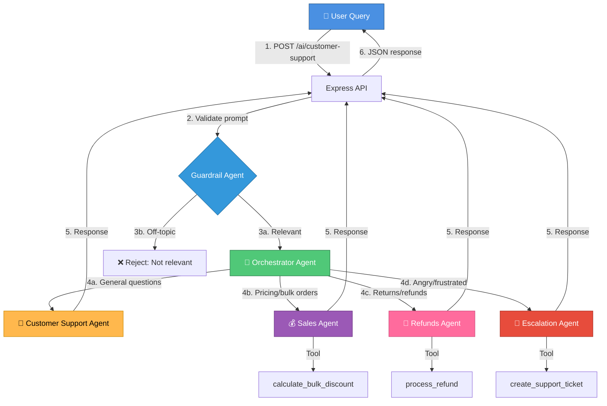
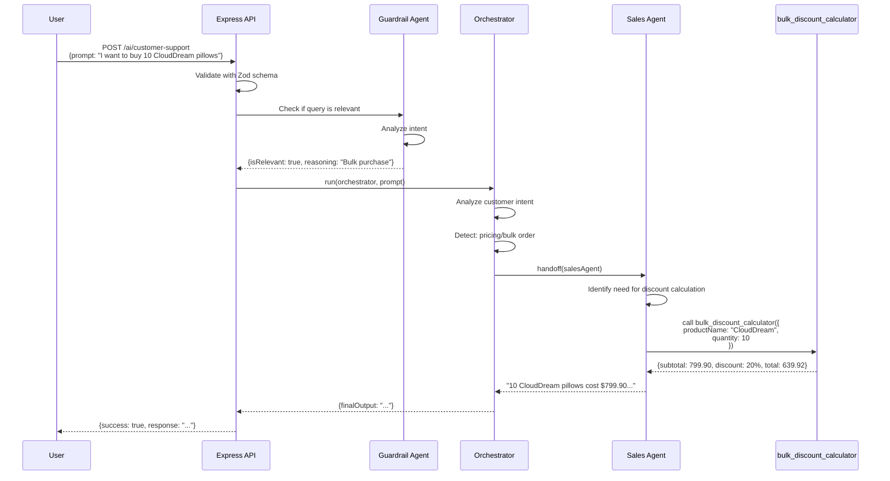

# 🤖 CloudPillow AI - Multi-Agent Customer Support System

> **Educational content by Bashar Alwarad**:  
> Advanced Agentic AI integration using OpenAI Agents SDK with local LLM support (Ollama).

## Connect with Me [](https://www.linkedin.com/in/bashar-alwarad-2a960b1b6/)

---

## 🎓 What is this?

This is a **Multi-Agent AI System** that provides intelligent customer support for CloudPillow Co., a fictional premium pillow company. The system demonstrates advanced AI concepts including:

- **Agent Orchestration** - Multiple specialized AI agents working together
- **Guardrails** - Input validation to ensure relevance
- **Handoffs** - Intelligent routing between specialized agents
- **Tool Calling** - Agents can execute functions (calculate discounts, process refunds, create tickets)
- **Local LLM Support** - Works with Ollama (llama3.1:8b) for cost-free development

**This is the evolution of AI from simple completions → function calling → autonomous agents** 🚀

---

## 🤖 The Evolution: From LLM to Agentic AI

Understanding the progression from basic AI to intelligent multi-agent systems.

### **1️⃣ Simple LLM Completions**

**How it works:**

- Send a prompt, get a response
- No context, no memory, no actions
- AI just generates text based on training data

**Example:**

```typescript
const response = await openai.chat.completions.create({
  model: 'gpt-4o-mini',
  messages: [{ role: 'user', content: 'Tell me about your pillows' }],
});
```

**Limitations:**

- ❌ No access to real-time data
- ❌ Cannot perform actions
- ❌ May hallucinate product info
- ❌ No specialized knowledge

---

### **2️⃣ LLM + Function Calling (Chapter 22)**

**How it works:**

- LLM can call predefined functions to get data or perform actions
- You manually define tools in OpenAI format
- LLM decides when to use tools based on context

**Example:**

```typescript
const tools = [
  {
    type: "function",
    function: {
      name: "get_product_price",
      description: "Get the price of a product",
      parameters: {
        type: "object",
        properties: {
          productName: { type: "string" }
        }
      }
    }
  }
];

const response = await openai.chat.completions.create({
  model: "llama3.1:8b",
  messages: [...],
  tools: tools
});

// Check if LLM wants to call a function
if (response.choices[0].message.tool_calls) {
  // Execute the function
  // Send result back to LLM
  // Get final response
}
```

**Benefits:**

- ✅ Real-time data access
- ✅ Can perform actions
- ✅ No hallucination for factual data

**Limitations:**

- ⚠️ **Complex orchestration logic** - You write all the tool calling logic
- ⚠️ **No agent specialization** - One AI tries to do everything
- ⚠️ **Manual routing** - You decide when to use which tool
- ⚠️ **No guardrails** - AI might answer irrelevant questions

---

### **3️⃣ Agentic AI (This Project)**

**How it works:**

- Multiple **specialized agents** with specific roles
- **Orchestrator agent** routes conversations automatically
- **Guardrails** validate inputs before processing
- **Handoffs** transfer control between agents seamlessly
- Agents have **context awareness** and can collaborate

**Example:**

```typescript
// Define specialized agents
const salesAgent = new Agent({
  name: 'Sales Agent',
  instructions: 'Help with pricing and bulk orders',
  tools: [bulk_discount_calculator],
});

const refundsAgent = new Agent({
  name: 'Refunds Agent',
  instructions: 'Handle returns and refunds',
  tools: [process_refund],
});

// Orchestrator routes automatically
const orchestrator = Agent.create({
  name: 'Orchestrator',
  instructions: 'Route to the right specialist',
  inputGuardrails: [relevanceCheck],
  handoffs: [salesAgent, refundsAgent, escalationAgent],
});

// Just run it - agents handle everything
const result = await run(orchestrator, userPrompt);
```

**Benefits:**

- ✅ Real-time data (like function calling)
- ✅ Automatic routing (no manual logic)
- ✅ **Specialized expertise** per agent
- ✅ **Built-in guardrails** for safety
- ✅ **Seamless handoffs** between agents
- ✅ **Cleaner code** - SDK handles orchestration
- ✅ **Context preservation** across handoffs
- ✅ **Scalable** - add new agents without changing core logic

**Unique Agentic Features:**

- **Guardrails**: Pre-validation before expensive processing
- **Handoffs**: Automatic routing to specialized agents
- **Tool Calling**: Each agent has its own toolset
- **Context Sharing**: Agents pass information seamlessly

---

### **📊 Side-by-Side Comparison**

| Feature                | **Simple LLM** | **LLM + Functions** | **Agentic AI**        |
| ---------------------- | -------------- | ------------------- | --------------------- |
| **Real-time data**     | ❌             | ✅                  | ✅                    |
| **Perform actions**    | ❌             | ✅                  | ✅                    |
| **Routing logic**      | N/A            | ⚠️ Manual           | ✅ Automatic          |
| **Specialization**     | ❌             | ❌                  | ✅ Multiple agents    |
| **Guardrails**         | ❌             | ⚠️ Manual           | ✅ Built-in           |
| **Code complexity**    | Simple         | 😫 Complex          | ✅ Clean & modular    |
| **Context awareness**  | ❌             | ⚠️ Limited          | ✅ Full context       |
| **Scalability**        | Limited        | Hard to scale       | ✅ Easy to add agents |
| **Handoff management** | N/A            | ⚠️ Manual           | ✅ Automatic          |
| **Error handling**     | Basic          | ⚠️ Custom per tool  | ✅ SDK-managed        |

---

### **💡 The Evolution**

```
Simple LLM Completions
   ↓ (Add external data access)
LLM + Function Calling
   ↓ (Add specialization and orchestration)
Agentic AI (Multi-Agent Systems)
```

**Agentic AI is the future** - autonomous agents that collaborate, specialize, and route intelligently! 🤖

---

### **🎯 When to Use What?**

| Approach            | Best For                                                                   |
| ------------------- | -------------------------------------------------------------------------- |
| **Simple LLM**      | General knowledge, creative writing, no actions needed                     |
| **LLM + Functions** | Single-purpose tools with simple workflows                                 |
| **Agentic AI**      | **Complex workflows requiring routing, specialization, and guardrails** ⭐ |

**Key Takeaway:** Agentic AI = Functions + Orchestration + Specialization + Guardrails + Handoffs 🚀

---

## 🏗️ Architecture

### **Multi-Agent System Overview**


```mermaid
graph TB
    User[👤 User Query] -->|1. POST /ai/customer-support| API[Express API]
    API -->|2. Validate prompt| Guard{Guardrail Agent}
    Guard -->|3a. Relevant| Orch[🎯 Orchestrator Agent]
    Guard -->|3b. Off-topic| Reject[❌ Reject: Not relevant]

    Orch -->|4a. General questions| Support[💬 Customer Support Agent]
    Orch -->|4b. Pricing/bulk orders| Sales[💰 Sales Agent]
    Orch -->|4c. Returns/refunds| Refunds[🔄 Refunds Agent]
    Orch -->|4d. Angry/frustrated| Escalation[🚨 Escalation Agent]

    Sales -->|Tool| Discount[calculate_bulk_discount]
    Refunds -->|Tool| Process[process_refund]
    Escalation -->|Tool| Ticket[create_support_ticket]

    Support -->|5. Response| API
    Sales -->|5. Response| API
    Refunds -->|5. Response| API
    Escalation -->|5. Response| API

    API -->|6. JSON response| User

    style User fill:#4A90E2,stroke:#2E5C8A,color:#fff
    style Orch fill:#50C878,stroke:#2E7D4E,color:#fff
    style Support fill:#FFB84D,stroke:#CC8A00,color:#000
    style Sales fill:#9B59B6,stroke:#6C3483,color:#fff
    style Refunds fill:#FF6B9D,stroke:#CC4A7A,color:#fff
    style Escalation fill:#E74C3C,stroke:#A93226,color:#fff
    style Guard fill:#3498DB,stroke:#2874A6,color:#fff
```

---

## 🔄 Complete Request Flow

### **User Journey: "I want to buy 10 CloudDream pillows"**


```mermaid
sequenceDiagram
    participant U as User
    participant API as Express API
    participant G as Guardrail Agent
    participant O as Orchestrator
    participant S as Sales Agent
    participant T as bulk_discount_calculator

    U->>API: POST /ai/customer-support<br/>{prompt: "I want to buy 10 CloudDream pillows"}
    API->>API: Validate with Zod schema
    API->>G: Check if query is relevant
    G->>G: Analyze intent
    G-->>API: {isRelevant: true, reasoning: "Bulk purchase"}
    API->>O: run(orchestrator, prompt)
    O->>O: Analyze customer intent
    O->>O: Detect: pricing/bulk order
    O->>S: handoff(salesAgent)
    S->>S: Identify need for discount calculation
    S->>T: call bulk_discount_calculator({<br/>  productName: "CloudDream",<br/>  quantity: 10<br/>})
    T-->>S: {subtotal: 799.90, discount: 20%, total: 639.92}
    S-->>O: "10 CloudDream pillows cost $799.90..."
    O-->>API: {finalOutput: "..."}
    API-->>U: {success: true, response: "..."}
```

---

### **Detailed Breakdown**

#### **1. User Input**

```json
POST /ai/customer-support
{
  "prompt": "I want to buy 10 CloudDream pillows, what's the price?"
}
```

#### **2. API Layer (Express)**

- Validates request with Zod schema (`promptBodySchema`)
- Ensures `prompt` is 1-1000 characters
- Routes to `createCustomerSupportCompletion` controller

#### **3. Guardrail Agent (Pre-validation)**

```typescript
const pillowGuardrail: InputGuardrail = {
  name: 'CloudPillow Intent Guardrail',
  execute: async ({ input }) => {
    const result = await run(guardrailAgent, input);
    return {
      tripwireTriggered: !(result.finalOutput?.isRelevant ?? true),
    };
  },
};
```

**What it checks:**

- Is this about CloudPillow Co. products/services?
- Returns: `{isRelevant: true, reasoning: "Customer asking about bulk purchase"}`

**If irrelevant:**

```json
{
  "success": false,
  "error": "Your question does not appear to be related to CloudPillow Co.",
  "reason": "guardrail_triggered"
}
```

#### **4. Orchestrator Agent (Routing)**

```typescript
export const orchestratorAgent = Agent.create({
  name: 'CloudPillow Support Orchestrator',
  instructions: `Route customers to the right specialist:
    - Pricing/bulk → Sales Agent
    - Returns → Refunds Agent
    - Angry → Escalation Agent
    - General → Support Agent`,
  handoffs: [
    customerSupportAgent,
    salesAgent,
    refundsAgent,
    handoff(escalationAgent, {
      inputType: EscalationData,
      onHandoff: (ctx, input) => console.log('ESCALATION:', input.reason),
    }),
  ],
});
```

**Decision:**

- Detects: "buy 10 CloudDream pillows" → pricing/bulk order
- Routes to: **Sales Agent**

#### **5. Sales Agent (Specialist)**

```typescript
export const salesAgent = new Agent({
  name: 'Sales Agent',
  instructions: `Help with pricing and bulk orders.
    Product prices: CloudDream $79.99, SkyFeather $99.99, BambooCool $89.99
    Use bulk_discount_calculator for quantity pricing.`,
  tools: [bulk_discount_calculator],
});
```

**Agent thinks:**

- Customer wants pricing for quantity
- I need to calculate bulk discount
- Calls tool: `bulk_discount_calculator({productName: "CloudDream", quantity: 10})`

#### **6. Tool Execution**

```typescript
const calculateBulkDiscount = async ({ productName, quantity }) => {
  const unitPrice = PRODUCT_PRICES[productName]; // $79.99
  const subtotal = unitPrice * quantity; // $799.90

  let discount = 0;
  if (quantity >= 10) discount = 0.2; // 20%
  else if (quantity >= 5) discount = 0.1; // 10%

  const discountAmount = subtotal * discount; // $159.98
  const total = subtotal - discountAmount; // $639.92

  return { subtotal, discount: 20, discountAmount, total };
};
```

**Tool returns:**

```json
{
  "product": "CloudDream",
  "quantity": 10,
  "unitPrice": 79.99,
  "subtotal": 799.9,
  "discount": 20,
  "discountAmount": 159.98,
  "total": 639.92
}
```

#### **7. Sales Agent Response**

```
"Great choice! For 10 CloudDream Memory Foam pillows:

- Unit price: $79.99
- Subtotal: $799.90
- Bulk discount (20%): -$159.98
- **Total: $639.92**

You're saving $159.98 with our bulk discount!

Would you like to proceed with the order? I can also tell you about our
first-time customer code CLOUD20 for an additional discount!"
```

#### **8. API Response**

```json
{
  "success": true,
  "response": "Great choice! For 10 CloudDream Memory Foam pillows..."
}
```

---

## 🤖 The Agents

### **1. Guardrail Agent** 🛡️

**Role:** Validate query relevance before processing

**Purpose:**

- Prevent off-topic queries (e.g., "What's the weather?")
- Save compute resources
- Maintain focus on business domain

**Output Schema:**

```typescript
{
  isRelevant: boolean,
  reasoning: string
}
```

**Example:**

```
Input: "What's 2+2?"
Output: {isRelevant: false, reasoning: "Math question unrelated to pillows"}
→ Request rejected
```

---

### **2. Orchestrator Agent** 🎯

**Role:** Route conversations to specialized agents

**Routing Logic:**

- Upset/angry/frustrated → **Escalation Agent**
- Pricing/bulk orders/discounts → **Sales Agent**
- Returns/refunds/exchanges → **Refunds Agent**
- General questions → **Customer Support Agent**

**Handoffs:**

```typescript
handoffs: [
  customerSupportAgent,
  salesAgent,
  refundsAgent,
  handoff(escalationAgent, {
    inputType: EscalationData,
    onHandoff: (ctx, input) => {
      console.log('ESCALATION TRIGGERED:', input.reason);
    },
  }),
];
```

---

### **3. Customer Support Agent** 💬

**Role:** Answer general product questions

**Knowledge:**

- Product lines: CloudDream ($79.99), SkyFeather ($99.99), BambooCool ($89.99)
- Shipping: 2-5 business days, free over $50
- Warranty: Lifetime warranty on all products

**Example:**

```
User: "Do you have hypoallergenic pillows?"
Agent: "Yes! Our BambooCool Hypoallergenic pillow ($89.99) is made from
natural bamboo fibers..."
```

**No tools** - just knowledge-based responses.

---

### **4. Sales Agent** 💰

**Role:** Handle pricing and bulk orders

**Tools:**

- `bulk_discount_calculator` - Calculate tiered pricing

**Discount Tiers:**

- 5-9 items: 10% off
- 10+ items: 20% off

**Example:**

```
User: "What's the price for 7 SkyFeather pillows?"
Agent: [Calls tool] → "7 SkyFeather pillows: $699.93 - $69.99 = $629.94 (10% bulk discount)"
```

---

### **5. Refunds Agent** 🔄

**Role:** Process returns and refunds

**Tools:**

- `process_refund` - Initiate refund/exchange

**Policies:**

- 30-day money-back guarantee
- Lifetime warranty coverage
- Free return shipping

**Example:**

```
User: "I want to return my pillow"
Agent: "I can help! May I have your order number?"
User: "ORDER-12345"
Agent: [Calls process_refund] → "Refund request REF-XXX initiated.
You'll receive a prepaid return label..."
```

---

### **6. Escalation Agent** 🚨

**Role:** Handle upset customers with empathy

**Tools:**

- `create_support_ticket` - Create high-priority tickets

**Approach:**

1. Acknowledge frustration immediately
2. Apologize sincerely
3. Offer concrete solutions
4. Create tracking ticket
5. Assure manager follow-up within 24 hours

**Example:**

```
User: "This is ridiculous! My pillow arrived damaged!"
Orchestrator: [Detects anger] → handoff(escalationAgent, {reason: "Damaged product"})
Agent: "I sincerely apologize for this experience. Let me create an urgent
ticket and arrange for an immediate replacement with expedited shipping at
no cost to you..."
[Creates TICKET-XXX with 'urgent' severity]
```

---

## 📂 Project Structure

```
openai-compatible-local/
├── .env.development.local    # Environment config (Ollama/OpenAI)
├── .env.example              # Example env variables
├── package.json              # Dependencies & scripts
├── tsconfig.json             # TypeScript configuration
├── src/
│   ├── app.ts                # Express server entry point
│   ├── agents/
│   │   ├── config.ts         # Agent configuration (Ollama/OpenAI)
│   │   ├── guardrailAgent.ts # Input validation agent
│   │   ├── orchestratorAgent.ts  # Main routing agent
│   │   ├── customerSupportAgent.ts  # General support
│   │   ├── salesAgent.ts     # Pricing & bulk orders
│   │   ├── refundsAgent.ts   # Returns & refunds
│   │   ├── escalationAgent.ts  # Upset customer handling
│   │   └── index.ts          # Export all agents
│   ├── controllers/
│   │   ├── customerSupportCompletion.ts  # Main controller
│   │   └── index.ts
│   ├── middlewares/
│   │   ├── errorHandler.ts   # Global error handling
│   │   ├── notFoundHandler.ts  # 404 handler
│   │   ├── validateBodyZod.ts  # Zod validation middleware
│   │   └── index.ts
│   ├── routes/
│   │   ├── completionsRouter.ts  # API routes
│   │   └── index.ts
│   ├── schemas/
│   │   ├── completionsSchemas.ts  # Zod schemas
│   │   └── index.ts
│   ├── types/
│   │   └── index.ts          # TypeScript types
│   └── utils/
│       └── index.ts          # Tool functions (bulk discount, refunds, tickets)
└── dist/                     # Built JS files (after npm run build)
```

---

## ⚙️ Setup

### **Prerequisites**

- Node.js 18+
- Ollama installed (for local development)
- llama3.1:8b model pulled in Ollama

### **1. Install Ollama (Local LLM)**

**Windows/Mac/Linux:**
Visit [ollama.ai](https://ollama.ai) and install.

**Pull the model:**

```bash
ollama pull llama3.1:8b
```

**Verify it's running:**

```bash
ollama list
```

### **2. Install Dependencies**

```bash
cd openai-compatible-local
npm install
```

### **3. Configure Environment**

Copy the example environment file:

```bash
cp .env.example .env.development.local
```

**For local development (Ollama):**

```bash
NODE_ENV=development

OLLAMA_URL=http://127.0.0.1:11434/v1
OLLAMA_API_KEY=ollama
OLLAMA_MODEL=llama3.1:8b
```

**For production (OpenAI Cloud):**

```bash
NODE_ENV=production

OPENAI_API_KEY=sk-your-actual-api-key
OPENAI_MODEL=gpt-4o-mini
```

### **4. Run the Server**

**Development (watch mode):**

```bash
npm run dev
```

**Production:**

```bash
npm run build
npm start
```

Server runs at: `http://localhost:3000`

---

## 🚀 How to Use

### **Test with cURL**

**1. General Support Question:**

```bash
curl -X POST http://localhost:3000/ai/customer-support \
  -H "Content-Type: application/json" \
  -d '{"prompt": "Tell me about your pillows"}'
```

**Response:**

```json
{
  "success": true,
  "response": "We offer three premium pillow lines: CloudDream Memory Foam ($79.99)..."
}
```

---

**2. Bulk Order (Sales Agent):**

```bash
curl -X POST http://localhost:3000/ai/customer-support \
  -H "Content-Type: application/json" \
  -d '{"prompt": "I want to buy 15 BambooCool pillows, what is the price?"}'
```

**What happens:**

- Guardrail: ✅ Relevant
- Orchestrator: → Routes to Sales Agent
- Sales Agent: → Calls `bulk_discount_calculator` tool
- Response: Detailed pricing with 20% bulk discount

---

**3. Refund Request (Refunds Agent):**

```bash
curl -X POST http://localhost:3000/ai/customer-support \
  -H "Content-Type: application/json" \
  -d '{"prompt": "I want to return my pillow, order number ORDER-12345"}'
```

**What happens:**

- Orchestrator: → Routes to Refunds Agent
- Refunds Agent: → Calls `process_refund` tool
- Response: Refund ID, return label, timeline

---

**4. Angry Customer (Escalation Agent):**

```bash
curl -X POST http://localhost:3000/ai/customer-support \
  -H "Content-Type: application/json" \
  -d '{"prompt": "This is unacceptable! My order is 2 weeks late!"}'
```

**What happens:**

- Orchestrator: → Detects frustration → Routes to Escalation Agent
- Escalation Agent: → Calls `create_support_ticket` tool
- Console: `🚨 ESCALATION TRIGGERED: Late delivery`
- Response: Empathetic apology, ticket ID, manager follow-up timeline

---

**5. Off-Topic Query (Guardrail Rejection):**

```bash
curl -X POST http://localhost:3000/ai/customer-support \
  -H "Content-Type: application/json" \
  -d '{"prompt": "What is the capital of France?"}'
```

**What happens:**

- Guardrail: ❌ Not relevant
- Response:

```json
{
  "success": false,
  "error": "Your question does not appear to be related to CloudPillow Co. products or services.",
  "reason": "guardrail_triggered"
}
```

---

### **Test with Postman**

1. Create new POST request
2. URL: `http://localhost:3000/ai/customer-support`
3. Headers: `Content-Type: application/json`
4. Body (raw JSON):

```json
{
  "prompt": "I need 20 CloudDream pillows for my hotel, what's the best price?"
}
```

5. Send → See agent orchestration in action!

---

## 🔧 Available Tools

### **1. `bulk_discount_calculator`**

**Used by:** Sales Agent

**Purpose:** Calculate tiered bulk pricing

**Parameters:**

```typescript
{
  productName: 'CloudDream' | 'SkyFeather' | 'BambooCool',
  quantity: number
}
```

**Returns:**

```typescript
{
  product: string,
  quantity: number,
  unitPrice: number,
  subtotal: number,
  discount: number,      // Percentage (10 or 20)
  discountAmount: number,
  total: number
}
```

**Example:**

```typescript
calculateBulkDiscount({ productName: 'CloudDream', quantity: 10 })
→ { subtotal: 799.90, discount: 20, total: 639.92 }
```

---

### **2. `process_refund`**

**Used by:** Refunds Agent

**Purpose:** Initiate refund or exchange

**Parameters:**

```typescript
{
  orderNumber: string,
  reason: string,
  preferExchange: boolean
}
```

**Returns:**

```typescript
{
  requestId: string,
  status: 'pending',
  message: string,
  returnLabel: string
}
```

**Example:**

```typescript
processRefundRequest({
  orderNumber: 'ORDER-12345',
  reason: 'Not satisfied',
  preferExchange: false
})
→ { requestId: 'REF-XXX', returnLabel: 'LABEL-ABC123', ... }
```

---

### **3. `create_support_ticket`**

**Used by:** Escalation Agent

**Purpose:** Create high-priority support ticket

**Parameters:**

```typescript
{
  customerIssue: string,
  severity: 'high' | 'urgent'
}
```

**Returns:**

```typescript
{
  ticketId: string,
  message: string
}
```

**Example:**

```typescript
createSupportTicket({
  customerIssue: 'Damaged product on delivery',
  severity: 'urgent'
})
→ { ticketId: 'TICKET-XXX', message: '...manager will contact within 24hrs' }
```

---

## 🆚 This Project vs Chapter 22 (Direct Function Calling)

| Aspect              | **Chapter 22 (Functions)** | **This Project (Agents)**   |
| ------------------- | -------------------------- | --------------------------- |
| **Architecture**    | Single LLM with tools      | Multi-agent system          |
| **Routing**         | ⚠️ Manual logic            | ✅ Automatic (orchestrator) |
| **Specialization**  | ❌ One AI does everything  | ✅ Specialized agents       |
| **Guardrails**      | ⚠️ Manual validation       | ✅ Built-in guardrail agent |
| **Handoffs**        | ❌ Not supported           | ✅ Seamless agent handoffs  |
| **Tool Management** | ⚠️ All tools in one place  | ✅ Tools per agent          |
| **Code Complexity** | 😫 Complex orchestration   | ✅ Clean & modular          |
| **Scalability**     | Hard to add features       | ✅ Add agents independently |
| **Context Sharing** | ⚠️ Manual state management | ✅ Automatic via SDK        |
| **Error Handling**  | ⚠️ Custom per tool         | ✅ SDK-managed              |
| **Learning Curve**  | Moderate                   | Higher (but worth it!)      |

---

## 🔄 Development Workflow

### **Watch Mode (Development):**

```bash
npm run dev
```

- Auto-restarts on file changes
- Uses Ollama (free local LLM)
- Experimental TypeScript transform

### **Build for Production:**

```bash
npm run build
```

- Compiles TypeScript to `dist/` folder
- Uses `tsconfig.json` settings

### **Run Production:**

```bash
npm run build
npm start
```

- Uses OpenAI Cloud (requires API key)
- Loads `.env.production.local`

---

## 🧪 Testing

### **Manual Testing Flow:**

**1. Start the server:**

```bash
npm run dev
```

**2. Test each agent:**

**Customer Support:**

```bash
curl -X POST http://localhost:3000/ai/customer-support \
  -H "Content-Type: application/json" \
  -d '{"prompt": "What materials are your pillows made of?"}'
```

**Sales (with tool call):**

```bash
curl -X POST http://localhost:3000/ai/customer-support \
  -H "Content-Type: application/json" \
  -d '{"prompt": "I need 8 SkyFeather pillows"}'
```

**Refunds (with tool call):**

```bash
curl -X POST http://localhost:3000/ai/customer-support \
  -H "Content-Type: application/json" \
  -d '{"prompt": "I want to return my order #12345, pillow is too firm"}'
```

**Escalation (with tool call):**

```bash
curl -X POST http://localhost:3000/ai/customer-support \
  -H "Content-Type: application/json" \
  -d '{"prompt": "I am extremely upset! My pillow never arrived!"}'
```

**Guardrail rejection:**

```bash
curl -X POST http://localhost:3000/ai/customer-support \
  -H "Content-Type: application/json" \
  -d '{"prompt": "Tell me a joke"}'
```

### **Check Console Logs:**

Watch for colored output showing:

- 🤖 Request received
- ⚠️ Guardrail checks
- 💰 Tool calls (discount calculator)
- 🔄 Refund processing
- 🚨 Escalation triggers
- ✓ Successful responses

---

## 🎯 Next Steps

### **1. Add More Agents:**

- **Shipping Agent** - Track orders, update addresses
- **Product Recommendations Agent** - Suggest based on sleep position
- **Warranty Agent** - Handle warranty claims separately

### **2. Add More Tools:**

```typescript
// Inventory check
tool({
  name: 'check_inventory',
  description: 'Check if product is in stock',
  parameters: z.object({
    productName: z.string(),
    quantity: z.number(),
  }),
});

// Order tracking
tool({
  name: 'track_order',
  description: 'Get order status and shipping info',
  parameters: z.object({
    orderNumber: z.string(),
  }),
});
```

### **3. Add Persistence:**

```typescript
// Store conversations in MongoDB
import mongoose from 'mongoose';

const ConversationSchema = new mongoose.Schema({
  sessionId: String,
  messages: Array,
  agentsInvolved: [String],
  toolsCalled: [String],
  timestamp: Date,
});
```

### **4. Add Web Interface:**

- Build a React chat UI
- Connect via WebSocket for real-time responses
- Show agent handoffs visually

### **5. Add Advanced Features:**

- **Multi-turn conversations** - Remember context across requests
- **Sentiment analysis** - Auto-escalate based on tone
- **A/B testing** - Compare agent performance
- **Analytics dashboard** - Track agent usage, tool calls, escalations

---

## 🐛 Troubleshooting

### **Server won't start:**

**Error: `Cannot find module '#agents'`**

```bash
# Clean and rebuild
rm -rf dist/
npm run build
npm run dev
```

**Error: `OLLAMA_URL is not set`**

```bash
# Check .env.development.local exists
ls -la .env.development.local

# Create if missing
cp .env.example .env.development.local
```

---

### **Ollama connection fails:**

**Error: `fetch failed` or `ECONNREFUSED`**

```bash
# Check Ollama is running
ollama list

# Start Ollama service
ollama serve

# Verify endpoint
curl http://127.0.0.1:11434/v1/models
```

---

### **Guardrail always rejects:**

**Issue:** All queries marked as "not relevant"

**Fix:** Guardrail agent is too strict. Adjust instructions in `guardrailAgent.ts`:

```typescript
instructions: `Be VERY lenient. If there's ANY connection to pillows, 
bedding, sleep, or customer service, mark as relevant.`;
```

---

### **Agent doesn't call tools:**

**Issue:** Sales agent doesn't calculate discounts

**Reasons:**

1. Instructions too vague
2. Tool description unclear
3. LLM capability (llama3.1:8b vs gpt-4o)

**Fix:** Make instructions more explicit:

```typescript
instructions: `When customer asks about pricing for 5+ items, 
YOU MUST call bulk_discount_calculator tool. Do not estimate prices.`;
```

---

### **Tools return errors:**

**Error: `Zod validation failed`**

**Fix:** Check parameter types:

```typescript
// ❌ Wrong
{ productName: 'clouddream', quantity: '10' }

// ✅ Correct
{ productName: 'CloudDream', quantity: 10 }
```

---

## 📖 Further Reading

### **OpenAI Agents SDK:**

- [Official Docs](https://github.com/openai/openai-agents)
- [Agent API Reference](https://platform.openai.com/docs/agents)
- [Function Calling Guide](https://platform.openai.com/docs/guides/function-calling)

### **Ollama:**

- [Ollama Docs](https://ollama.ai/docs)
- [Model Library](https://ollama.ai/library)
- [OpenAI Compatibility](https://ollama.ai/blog/openai-compatibility)

### **Agentic AI Concepts:**

- [ReAct Prompting](https://arxiv.org/abs/2210.03629)
- [AutoGPT Architecture](https://github.com/Significant-Gravitas/AutoGPT)
- [LangChain Agents](https://python.langchain.com/docs/modules/agents/)

---

## 🎓 Learning Objectives Completed

✅ Understand multi-agent architecture  
✅ Implement orchestrator pattern for routing  
✅ Build specialized agents with tools  
✅ Add input guardrails for validation  
✅ Manage handoffs between agents  
✅ Use Ollama for local LLM development  
✅ Structure production-ready agentic AI systems  
✅ Handle errors and edge cases in agent workflows  
✅ See the evolution from functions → agents

**You've mastered Agentic AI! 🚀🤖**

---

## 💡 Key Takeaways

### **Why Agentic AI Matters:**

1. **Specialization** - Each agent is an expert in its domain
2. **Scalability** - Add agents without changing core logic
3. **Maintainability** - Modular, clean, testable code
4. **User Experience** - Natural routing, context-aware responses
5. **Cost Efficiency** - Guardrails prevent wasted LLM calls
6. **Future-Proof** - Easy to extend and enhance

### **Real-World Applications:**

- Customer support (like this project)
- Multi-department routing (sales, legal, technical)
- Healthcare triage (symptoms → specialist)
- E-commerce (product search, checkout, returns)
- HR automation (recruiting, onboarding, benefits)

### **The Future is Agentic:**

```
Simple AI → Tool-Using AI → Multi-Agent Systems → Autonomous Agents
```

**You're now equipped to build the next generation of AI applications!** 🎉

---

## 📄 License

Educational project by Bashar Alwarad for Software Engineering course.

---

**Happy Learning! 🤖🚀**
