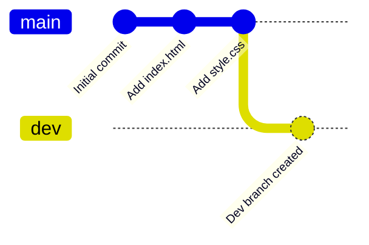
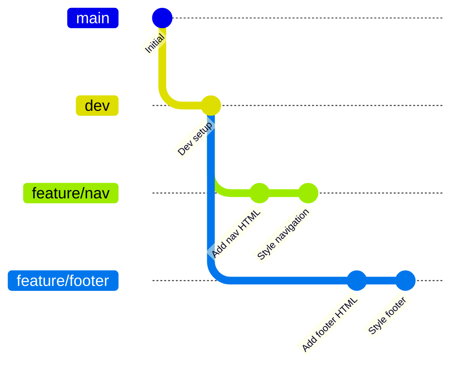
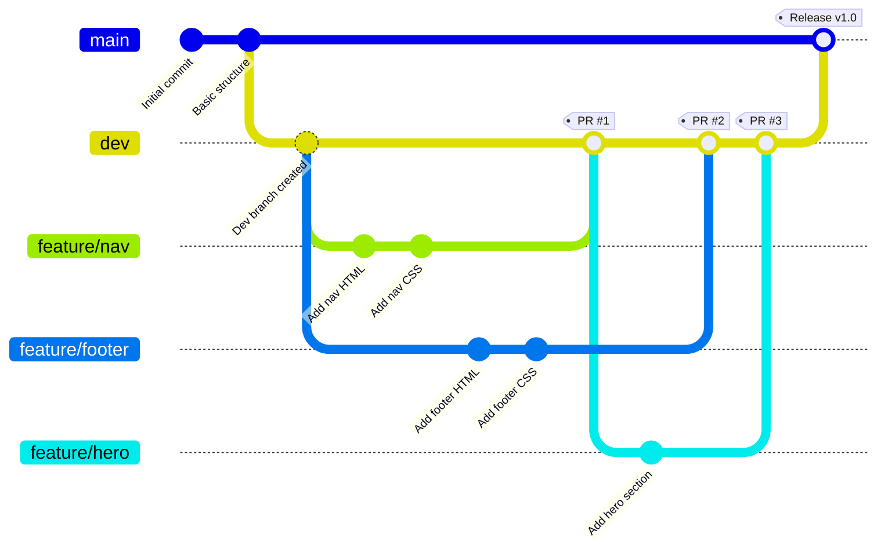
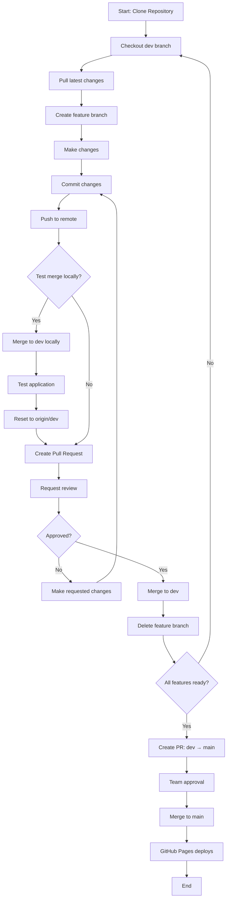

# Git & GitHub Collaboration - Team Project Workflow

## Table of Contents

1. [Project Setup](#project-setup)
2. [Initial Repository Structure](#initial-repository-structure)
3. [GitHub Pages Deployment](#github-pages-deployment)
4. [Development Branch Setup](#development-branch-setup)
5. [Team Collaboration Setup](#team-collaboration-setup)
6. [Branch Protection Rules](#branch-protection-rules)
7. [Collaborator Workflow](#collaborator-workflow)
8. [Feature Development Process](#feature-development-process)
9. [Merging Strategy](#merging-strategy)
10. [Complete Workflow Diagram](#complete-workflow-diagram)

---

## Project Setup

### Step 1: Create a New Repository on GitHub

1. Go to GitHub and click **"New Repository"**
2. Name your repository (e.g., `team-project`)
3. Add a description
4. Choose **Public** (required for GitHub Pages)
5. Initialize with a README
6. Click **"Create Repository"**

### Step 2: Clone Repository Locally

```bash
# Clone the repository to your local machine
git clone https://github.com/YOUR-USERNAME/team-project.git

# Navigate into the project directory
cd team-project
```

---

## Initial Repository Structure

### Step 3: Create Basic Project Layout

As the project lead, create the basic structure that all team members will build upon.

```bash
# Create necessary files and folders
touch index.html
touch style.css
mkdir pages
mkdir styles

# Verify the structure
ls -la
```

### Step 4: Add Basic HTML Structure

Create a simple `index.html`:

```html
<!DOCTYPE html>
<html lang="en">
  <head>
    <meta charset="UTF-8" />
    <meta name="viewport" content="width=device-width, initial-scale=1.0" />
    <title>Team Project</title>
    <link rel="stylesheet" href="style.css" />
  </head>
  <body>
    <header>
      <!-- Navigation will be added here -->
    </header>

    <main>
      <h1>Welcome to Our Team Project</h1>
    </main>

    <footer>
      <!-- Footer will be added here -->
    </footer>
  </body>
</html>
```

### Step 5: Add Basic CSS

Create a simple `style.css`:

```css
* {
  margin: 0;
  padding: 0;
  box-sizing: border-box;
}

body {
  font-family: Arial, sans-serif;
  line-height: 1.6;
}
```

### Step 6: Commit and Push Initial Structure

```bash
# Add all files to staging
git add .

# Commit with a descriptive message
git commit -m "Initial project structure with index.html and style.css"

# Push to main branch
git push origin main
```

---

## GitHub Pages Deployment

### Step 7: Enable GitHub Pages

1. Go to your repository on GitHub
2. Click **Settings** → **Pages**
3. Under **Source**, select **main** branch
4. Select **/ (root)** folder
5. Click **Save**
6. Your site will be published at: `https://YOUR-USERNAME.github.io/team-project/`

```bash
# Verify your site is live by visiting the URL
# It may take a few minutes to deploy
```

---

## Development Branch Setup

### Step 8: Create Development Branch

```bash
# Create and switch to dev branch
git checkout -b dev

# Push dev branch to remote
git push -u origin dev
```

### Branch Structure Diagram


```mermaid
gitGraph
    commit id: "Initial commit"
    commit id: "Add index.html"
    commit id: "Add style.css"
    branch dev
    checkout dev
    commit id: "Dev branch created"
```

---

## Team Collaboration Setup

### Step 9: Invite Collaborators

1. Go to **Settings** → **Collaborators**
2. Click **Add people**
3. Enter collaborator's GitHub username or email
4. Send invitation

### Step 10: Collaborators Accept Invitation

Collaborators will receive an email invitation and must accept it to gain access.

---

## Branch Protection Rules

### Step 11: Set Up Branch Protection

Protect `main` and `dev` branches to enforce code review and prevent direct pushes.

#### For Main Branch:

1. Go to **Settings** → **Branches**
2. Click **Add rule**
3. Branch name pattern: `main`
4. Enable:
   - ✅ **Require a pull request before merging**
   - ✅ **Require approvals** (set to 1 or 2)
   - ✅ **Require status checks to pass**
   - ✅ **Require conversation resolution before merging**
5. Click **Create**

#### For Dev Branch:

Repeat the same process with branch name pattern: `dev`

```bash
# Now direct pushes to main and dev are blocked
# All changes must go through pull requests
```

---

## Collaborator Workflow

### Step 12: Collaborators Clone the Repository

```bash
# Clone the repository
git clone https://github.com/TEAM-LEAD-USERNAME/team-project.git

# Navigate into the directory
cd team-project

# Verify you can see all branches
git branch -a
```

### Step 13: Set Up Local Dev Branch

```bash
# Switch to dev branch
git checkout dev

# Pull latest changes
git pull origin dev
```

---

## Feature Development Process

### Step 14: Create Feature Branches

Each team member creates their own feature branch from `dev`.

#### Example: Adding Navigation Feature

```bash
# Make sure you're on dev branch
git checkout dev

# Pull latest changes
git pull origin dev

# Create feature branch
git checkout -b feature/nav

# Verify you're on the new branch
git branch
```

#### Example: Adding Footer Feature

```bash
# Make sure you're on dev branch
git checkout dev

# Pull latest changes
git pull origin dev

# Create feature branch
git checkout -b feature/footer
```

### Feature Branch Diagram


```mermaid
gitGraph
    commit id: "Initial"
    branch dev
    checkout dev
    commit id: "Dev setup"
    branch feature/nav
    branch feature/footer
    checkout feature/nav
    commit id: "Add nav HTML"
    commit id: "Style navigation"
    checkout feature/footer
    commit id: "Add footer HTML"
    commit id: "Style footer"
```

---

## Merging Strategy

### Step 15: Work on Your Feature

```bash
# After making changes to your files
git add .

# Commit with descriptive message
git commit -m "Add responsive navigation bar"

# Push feature branch to remote
git push -u origin feature/nav
```

### Step 16: Local Merge Test (Optional but Recommended)

Before creating a pull request, test the merge locally.

```bash
# Switch to dev branch
git checkout dev

# Pull latest changes
git pull origin dev

# Merge your feature branch locally
git merge feature/nav

# Test the application
# If everything works, you can proceed to create a PR
# If there are conflicts, resolve them now

# Don't push this merge! Undo it:
git reset --hard origin/dev
```

### Step 17: Create Pull Request to Dev

1. Go to GitHub repository
2. Click **Pull requests** → **New pull request**
3. Set **base**: `dev` ← **compare**: `feature/nav`
4. Click **Create pull request**
5. Add descriptive title and description
6. Request review from team members
7. Click **Create pull request**

### Pull Request Review Process

```bash
# Team lead or reviewers check the code
# Comment on changes if needed
# Approve the PR when ready
```

### Step 18: Merge Feature to Dev

After approval:

1. Click **Merge pull request**
2. Click **Confirm merge**
3. Delete the feature branch (optional)

```bash
# Update your local dev branch
git checkout dev
git pull origin dev

# Delete local feature branch (optional)
git branch -d feature/nav
```

### Step 19: Merge Dev to Main

Once all features are tested and ready:

1. Create Pull Request from `dev` to `main`
2. Set **base**: `main` ← **compare**: `dev`
3. Get team approval
4. Merge to main
5. GitHub Pages will automatically update

```bash
# Update your local main branch
git checkout main
git pull origin main
```

---

## Complete Workflow Diagram

### Full Branching and Merging Strategy


```mermaid
gitGraph
    commit id: "Initial commit"
    commit id: "Basic structure"
    branch dev
    checkout dev
    commit id: "Dev branch created"

    branch feature/nav
    checkout feature/nav
    commit id: "Add nav HTML"
    commit id: "Add nav CSS"

    checkout dev
    branch feature/footer
    checkout feature/footer
    commit id: "Add footer HTML"
    commit id: "Add footer CSS"

    checkout dev
    merge feature/nav tag: "PR #1"

    branch feature/hero
    checkout feature/hero
    commit id: "Add hero section"

    checkout dev
    merge feature/footer tag: "PR #2"
    merge feature/hero tag: "PR #3"

    checkout main
    merge dev tag: "Release v1.0"
```

### Detailed Workflow Diagram


```mermaid
flowchart TD
    A[Start: Clone Repository] --> B[Checkout dev branch]
    B --> C[Pull latest changes]
    C --> D[Create feature branch]
    D --> E[Make changes]
    E --> F[Commit changes]
    F --> G[Push to remote]
    G --> H{Test merge locally?}
    H -->|Yes| I[Merge to dev locally]
    I --> J[Test application]
    J --> K[Reset to origin/dev]
    K --> L[Create Pull Request]
    H -->|No| L
    L --> M[Request review]
    M --> N{Approved?}
    N -->|No| O[Make requested changes]
    O --> F
    N -->|Yes| P[Merge to dev]
    P --> Q[Delete feature branch]
    Q --> R{All features ready?}
    R -->|No| B
    R -->|Yes| S[Create PR: dev → main]
    S --> T[Team approval]
    T --> U[Merge to main]
    U --> V[GitHub Pages deploys]
    V --> W[End]
```

---

## Best Practices

### Commit Messages

```bash
# Good commit messages
git commit -m "Add responsive navigation bar with mobile menu"
git commit -m "Fix footer alignment on mobile devices"
git commit -m "Update hero section background image"

# Bad commit messages
git commit -m "update"
git commit -m "fix"
git commit -m "changes"
```

### Branch Naming Conventions

```bash
# Feature branches
feature/navigation
feature/footer
feature/contact-form

# Bug fix branches
bugfix/mobile-menu
bugfix/footer-spacing

# Hotfix branches (urgent fixes to main)
hotfix/security-patch
```

### Keeping Your Branch Updated

```bash
# Regularly sync with dev to avoid conflicts
git checkout dev
git pull origin dev
git checkout feature/your-feature
git merge dev

# Or use rebase (advanced)
git checkout feature/your-feature
git rebase dev
```

---

## Common Issues and Solutions

### Merge Conflicts

```bash
# If you encounter conflicts during merge
git status  # See conflicted files

# Open conflicted files and look for:
<<<<<<< HEAD
Your changes
=======
Their changes
>>>>>>> feature/nav

# Edit the file to resolve conflicts
# Remove conflict markers
# Keep the code you want

# After resolving
git add .
git commit -m "Resolve merge conflicts"
```

### Undo Last Commit (Not Pushed)

```bash
# Keep changes, undo commit
git reset --soft HEAD~1

# Discard changes, undo commit
git reset --hard HEAD~1
```

### Pull Latest Changes

```bash
# Update all branches
git fetch --all

# Update current branch
git pull
```

---

## Summary

1. ✅ Create repository on GitHub
2. ✅ Clone locally and create basic structure
3. ✅ Deploy to GitHub Pages
4. ✅ Create `dev` branch
5. ✅ Invite collaborators and set branch protection
6. ✅ Collaborators create feature branches from `dev`
7. ✅ Test merge locally (optional)
8. ✅ Create Pull Request to `dev`
9. ✅ Review and merge to `dev`
10. ✅ When ready, merge `dev` to `main`

**Remember**: Always pull before you push, and communicate with your team!

---

## Additional Resources

- [Git Documentation](https://git-scm.com/doc)
- [GitHub Flow Guide](https://guides.github.com/introduction/flow/)
- [Resolving Merge Conflicts](https://docs.github.com/en/pull-requests/collaborating-with-pull-requests/addressing-merge-conflicts)
