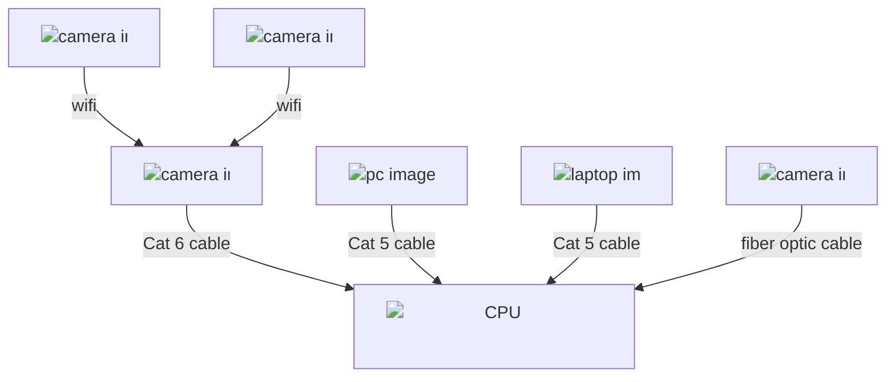

## Internet Service Provider ISP

hosting company web server farm
cloud provider amazon
telecom company router

## LAN local area network

```mermaid
flowchart TB
    MOBILE["<img src="./images/mobile.jpg" alt="camera image" width="50"/>"]
    WATCH["<img src="./images/watch.jpg" alt="camera image" width="50"/>"]
    APD["<img src="./images/apd.jpg" alt="camera image" width="50"/>"]

    PC["<img src="./images/pc.jpg" alt="pc image" width="50"/>"]
    LAPTOP["<img src="./images/laptop.jpg" alt="laptop image" width="50"/>"]
    CAM["<img src="./images/cam.jpg" alt="camera image" width="50"/>"]

    SWITCH["<div style='width:200px'><img src="./images/switch.png" alt="CPU" width="300"/> </div>"]


    MOBILE -->|wifi|APD
    WATCH -->|wifi|APD
    APD -->|Cat 6 cable|SWITCH
    PC -->|Cat 5 cable|SWITCH
    LAPTOP -->|Cat 5 cable| SWITCH
    CAM -->|fiber optic cable | SWITCH


    %% style PC1 fill:#8fbc8f,color:#fff
    %% style PC2 fill:#8fbc8f,color:#fff
    %% style PC3 fill:#8fbc8f,color:#fff
    %% style PC5 fill:#8fbc8f,color:#fff
```

## access point device uses wireless, switches uses cables

## osi open system interconnection

## iso: international organization of standards

### osi layers

1.  application layer
2.  presentation layer

## the internet has 468 cables underwater

## ISP internet service provider

### local ISP

### regional ISP

### global ISP

## point of present POP

## internet exchange point
