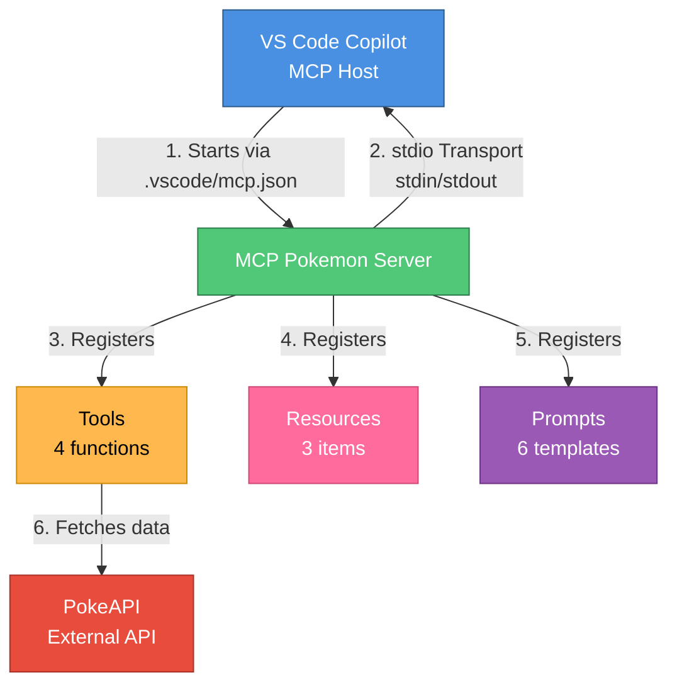
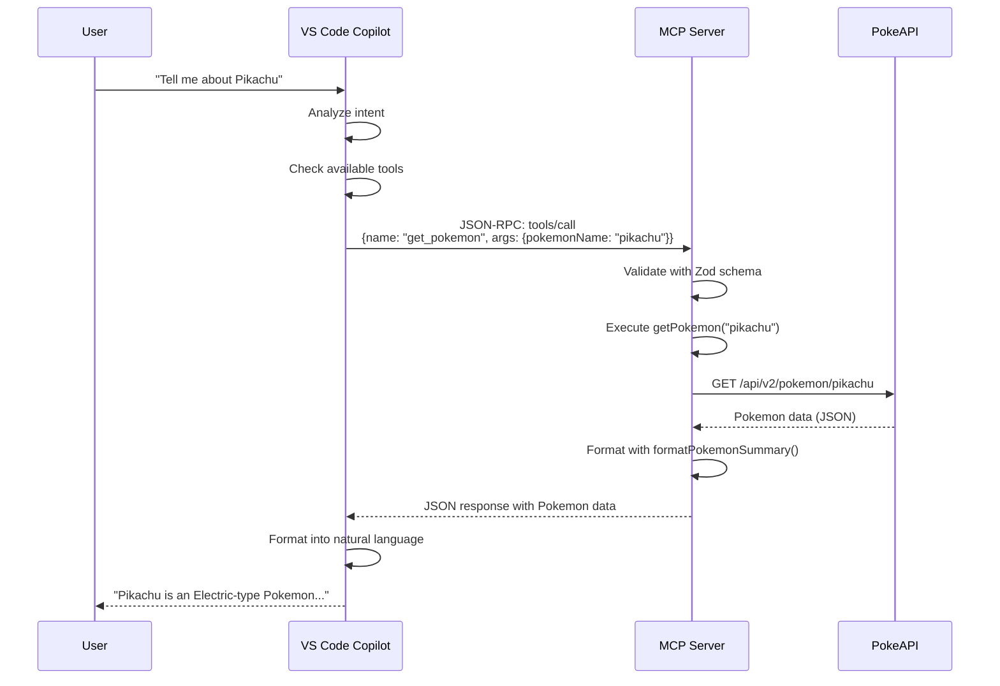
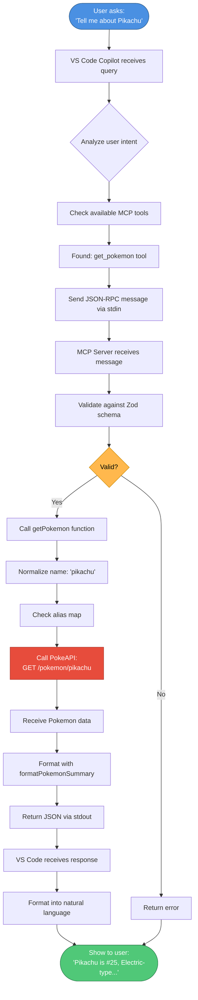

# 🎮 Pokemon MCP Server

> **Educational content by Bashar Alwarad**:  
> Model Context Protocol (MCP) integration with Pokemon data.

## Connect with Me [](https://www.linkedin.com/in/bashar-alwarad-2a960b1b6/)

---

## 🎓 What is this?

This is an **MCP (Model Context Protocol) Server** that provides Pokemon data to AI assistants like VS Code Copilot, Claude Desktop, and Gemini CLI.

**MCP is like USB-C for AI** - one standard protocol that works across different AI hosts.

---

## 🤖 LLM Only vs Tools vs MCP

Understanding the evolution of AI assistants - from basic LLMs to standardized MCP protocol.

### **1️⃣ LLM Only (No Tools)**

**How it works:**

- LLM only uses its **training data** (knowledge cutoff)
- No access to external data or real-time information
- Can only generate responses based on what it learned during training

**Example:**

```
User: "What are Pikachu's stats?"

LLM Response: "Based on my training data, Pikachu is an Electric-type
Pokemon with approximately 35 HP, 55 Attack... However, I cannot verify
current game mechanics or recent updates."
```

**Limitations:**

- ❌ Outdated information (training cutoff)
- ❌ Cannot access real-time data
- ❌ Cannot perform actions (fetch, calculate, search)
- ❌ May hallucinate (make up plausible-sounding but wrong info)
- ❌ Cannot verify facts

---

### **2️⃣ LLM + Tools (Direct Integration - Chapter 22)**

**How it works:**

- LLM can **call external functions** to get fresh data
- You manually define tools for ONE specific platform (e.g., OpenAI function calling)
- LLM decides when to use tools based on user query

**Example:**

```typescript
// You define tools for OpenAI specifically
const tools = [
  {
    type: "function",
    function: {
      name: "get_pokemon",
      description: "Fetch Pokemon data from PokeAPI",
      parameters: {
        type: "object",
        properties: {
          pokemonName: { type: "string" }
        }
      }
    }
  }
];

// Send to OpenAI/Ollama
const response = await openai.chat.completions.create({
  model: "llama3.1:8b",
  messages: [...],
  tools: tools  // OpenAI-specific format
});
```

```
User: "What are Pikachu's stats?"

LLM thinks: "I need fresh data. Let me call get_pokemon tool."
→ Calls: get_pokemon("pikachu")
→ Gets: Real-time data from PokeAPI
→ Response: "Pikachu (#25) is an Electric-type with 35 HP, 55 Attack..."
```

**Benefits:**

- ✅ Real-time data
- ✅ Can verify facts
- ✅ No hallucination (data comes from API)
- ✅ AI decides when to use tools

**Limitations:**

- ⚠️ **Platform-specific**: Code only works with OpenAI API format
- ⚠️ **No reusability**: Want to use with Claude? Rewrite everything!
- ⚠️ **No standardization**: Each platform has different tool formats
- ⚠️ **Maintenance nightmare**: Update tools 5+ times for different platforms

---

### **3️⃣ LLM + MCP (Standardized Protocol)**

**How it works:**

- LLM can call tools through **standardized MCP protocol**
- You write tools **once**, works with **all MCP-compatible hosts**
- Same exact code works in VS Code, Claude, Gemini, etc.

**Example:**

```typescript
// Define tool once using MCP standard
server.registerTool({
  name: 'get_pokemon',
  description: 'Fetch Pokemon data from PokeAPI',
  inputSchema: {
    type: 'object',
    properties: {
      pokemonName: { type: 'string' },
    },
  },
  handler: async ({ pokemonName }) => {
    const data = await getPokemon(pokemonName);
    return { content: [{ type: 'text', text: JSON.stringify(data) }] };
  },
});

// This SAME code works in:
// - VS Code Copilot ✅
// - Claude Desktop ✅
// - Gemini CLI ✅
// - Any future MCP host ✅
```

**Benefits:**

- ✅ Real-time data (like direct tools)
- ✅ No hallucination (like direct tools)
- ✅ **Write once, run anywhere** 🔌
- ✅ **Standardized protocol** (JSON-RPC 2.0)
- ✅ **Automatic discovery** (AI can list available tools)
- ✅ **Rich context** (Resources + Prompts + Tools)
- ✅ **Future-proof** (new AI hosts just need to support MCP)

**Unique MCP Features:**

- **Resources**: Pre-defined context data (type charts, docs)
- **Prompts**: Reusable templates for common tasks
- **Tools**: AI-invoked actions (like direct tools, but standardized)

---

### **📊 Side-by-Side Comparison**

| Feature                    | **LLM Only**        | **LLM + Direct Tools**       | **LLM + MCP**      |
| -------------------------- | ------------------- | ---------------------------- | ------------------ |
| **Real-time data**         | ❌                  | ✅                           | ✅                 |
| **Accuracy**               | ⚠️ May hallucinate  | ✅                           | ✅                 |
| **Platform compatibility** | ✅ Works everywhere | ❌ One platform only         | ✅ All MCP hosts   |
| **Code reusability**       | N/A                 | ❌ Rewrite for each platform | ✅ Write once      |
| **Standardization**        | N/A                 | ❌ Custom per platform       | ✅ JSON-RPC 2.0    |
| **Discovery**              | N/A                 | ⚠️ Manual docs               | ✅ Automatic       |
| **Context sharing**        | ❌                  | ❌                           | ✅ Resources       |
| **Templates**              | ❌                  | ❌                           | ✅ Prompts         |
| **Maintenance**            | Easy                | 😫 Multiple codebases        | ✅ Single codebase |
| **Future-proof**           | Limited by training | ⚠️ Vendor lock-in            | ✅ Open standard   |

---

### **💡 The Evolution**

```
LLM Only
   ↓ (Add external data access)
LLM + Tools (Custom per platform)
   ↓ (Standardize the protocol)
LLM + MCP (Universal standard)
```

**MCP is the "USB-C moment" for AI** - instead of having different chargers for different devices, you have one standard that works everywhere! 🔌

---

### **🎯 When to Use What?**

| Approach               | Best For                                                     |
| ---------------------- | ------------------------------------------------------------ |
| **LLM Only**           | General knowledge, creative tasks, no real-time data needed  |
| **LLM + Direct Tools** | Single-platform integration (e.g., only using OpenAI)        |
| **LLM + MCP**          | **Building reusable AI tools that work across platforms** ⭐ |

**Key Takeaway:** MCP = Tools + Standardization + Reusability + Future-proofing 🚀

---

## 🎯 Why Use MCP?

### **The Problem MCP Solves**

Imagine you built an amazing tool that fetches Pokemon data. You want it to work with:

- ✅ VS Code Copilot
- ✅ Claude Desktop
- ✅ Gemini CLI
- ✅ ChatGPT
- ✅ Future AI assistants we don't even know about yet

**Without MCP:**

- 😫 Build a custom integration for EACH platform
- 😫 Different APIs, different protocols, different authentication
- 😫 Maintain 5+ separate codebases
- 😫 When you add a new feature, update it 5+ times

**With MCP:**

- ✅ Write your tool **once** using MCP
- ✅ Works with **any** MCP-compatible AI host
- ✅ One codebase, one protocol
- ✅ Add a feature once, it works everywhere

**MCP is like USB-C for AI** - one standard that works everywhere! 🔌

---

## 🆚 MCP vs REST API

| Aspect            | **REST API**                     | **MCP**                                         |
| ----------------- | -------------------------------- | ----------------------------------------------- |
| **Purpose**       | General-purpose web API          | **AI-specific integration protocol**            |
| **Transport**     | HTTP/HTTPS (network)             | **stdio (local process)** or HTTP               |
| **Communication** | Request → Response               | **Bidirectional JSON-RPC**                      |
| **Discovery**     | Manual (read docs)               | **Automatic (tools/list, resources/list)**      |
| **Who Calls?**    | You (developer) write the code   | **AI decides** when to call tools               |
| **Context**       | Stateless, each call independent | **Rich context sharing** (resources, prompts)   |
| **Use Case**      | "I want to fetch Pokemon data"   | **"AI, figure out when you need Pokemon data"** |

### **Key Differences**

#### **1. Who Makes the Call?**

**REST API:**

```typescript
// YOU write this code explicitly
const response = await fetch('https://pokeapi.co/api/v2/pokemon/pikachu');
const data = await response.json();
console.log(data.name); // You decide WHEN and HOW to call
```

**MCP:**

```typescript
// YOU register a tool
server.registerTool({
  name: 'get_pokemon',
  description: 'Fetch Pokemon data',
  // ...
});

// THE AI DECIDES when to call it based on user's question
// User: "Tell me about Pikachu"
// AI: "I should call get_pokemon tool"
```

#### **2. Discovery**

**REST API:**

- ❌ No standard way to discover what's available
- 📖 Read documentation manually
- 💻 Hard-code endpoints in your application

**MCP:**

```json
// AI automatically discovers tools
{
  "method": "tools/list",
  "result": {
    "tools": [
      { "name": "get_pokemon", "description": "..." },
      { "name": "compare_pokemon", "description": "..." }
    ]
  }
}
```

- ✅ AI knows what tools exist
- ✅ AI knows what they do
- ✅ AI knows what parameters they need

#### **3. Transport Layer**

**REST API:**

- 🌐 HTTP/HTTPS over network
- 📡 Can call from anywhere (browser, server, mobile)
- 🔒 Requires authentication, CORS, rate limits

**MCP:**

- 💻 stdio (stdin/stdout) - direct process communication
- 🚀 No network overhead
- 🔐 No authentication needed (local process)
- ⚡ Faster, simpler

#### **4. Context Sharing**

**REST API:**

- ❌ No built-in context mechanism
- 📝 You manually pass all data in each request

**MCP:**

- ✅ Resources: Share context data (type charts, docs)
- ✅ Prompts: Reusable templates
- ✅ Tools: AI-invoked actions

### **When to Use What?**

**Use REST API when:**

- ✅ Building a public web service
- ✅ Need to access from browsers/mobile apps
- ✅ Want to monetize your API
- ✅ Need fine-grained access control

**Use MCP when:**

- ✅ Building AI integrations
- ✅ Want to work with multiple AI platforms
- ✅ Need AI to decide when to use your tools
- ✅ Want automatic discovery and context sharing
- ✅ Building local dev tools

---

## ✅ What you'll learn

- How to build an MCP server using the official SDK
- The difference between **Tools**, **Resources**, and **Prompts**
- How to connect your server to VS Code Copilot
- How MCP differs from direct API tool calling (Chapter 22)
- How to make your integrations reusable across AI platforms
- Complete understanding of the MCP protocol flow
- Why MCP is the future of AI integrations

---

## 🏗️ Architecture

### **Three Building Blocks:**

| Primitive     | Who Controls It        | Purpose                        | Examples in this Server                                 |
| ------------- | ---------------------- | ------------------------------ | ------------------------------------------------------- |
| **Tools**     | Model-controlled       | Actions the AI decides to call | `get_pokemon`, `compare_pokemon`, `get_evolution_chain` |
| **Resources** | Application-controlled | Context data to inject         | `type_chart`, `generations`, `api_docs`                 |
| **Prompts**   | User-controlled        | Reusable templates             | `pokemon_search`, `team_builder`, `type_matchup`        |

---

## 🔄 How MCP Server Works

### **High-Level Architecture**


```mermaid
graph TB
    A[VS Code Copilot<br/>MCP Host] -->|1. Starts via .vscode/mcp.json| B[MCP Pokemon Server]
    B -->|2. stdio Transport<br/>stdin/stdout| A
    B -->|3. Registers| C[Tools<br/>4 functions]
    B -->|4. Registers| D[Resources<br/>3 items]
    B -->|5. Registers| E[Prompts<br/>6 templates]
    C -->|6. Fetches data| F[PokeAPI<br/>External API]

    style A fill:#4A90E2,stroke:#2E5C8A,color:#fff
    style B fill:#50C878,stroke:#2E7D4E,color:#fff
    style C fill:#FFB84D,stroke:#CC8A00,color:#000
    style D fill:#FF6B9D,stroke:#CC4A7A,color:#fff
    style E fill:#9B59B6,stroke:#6C3483,color:#fff
    style F fill:#E74C3C,stroke:#A93226,color:#fff
```

### **Communication Flow**


```mermaid
sequenceDiagram
    participant U as User
    participant VS as VS Code Copilot
    participant MCP as MCP Server
    participant API as PokeAPI

    U->>VS: "Tell me about Pikachu"
    VS->>VS: Analyze intent
    VS->>VS: Check available tools
    VS->>MCP: JSON-RPC: tools/call<br/>{name: "get_pokemon", args: {pokemonName: "pikachu"}}
    MCP->>MCP: Validate with Zod schema
    MCP->>MCP: Execute getPokemon("pikachu")
    MCP->>API: GET /api/v2/pokemon/pikachu
    API-->>MCP: Pokemon data (JSON)
    MCP->>MCP: Format with formatPokemonSummary()
    MCP-->>VS: JSON response with Pokemon data
    VS->>VS: Format into natural language
    VS-->>U: "Pikachu is an Electric-type Pokemon..."
```

---

## 📋 Complete User Journey: "Tell me about Pikachu"

### **Step-by-Step Flow**


```mermaid
flowchart TD
    Start([User asks:<br/>'Tell me about Pikachu']) --> A[VS Code Copilot receives query]
    A --> B{Analyze user intent}
    B --> C[Check available MCP tools]
    C --> D[Found: get_pokemon tool]
    D --> E[Send JSON-RPC message via stdin]
    E --> F[MCP Server receives message]
    F --> G[Validate against Zod schema]
    G --> H{Valid?}
    H -->|No| I[Return error]
    H -->|Yes| J[Call getPokemon function]
    J --> K[Normalize name: 'pikachu']
    K --> L[Check alias map]
    L --> M[Call PokeAPI:<br/>GET /pokemon/pikachu]
    M --> N[Receive Pokemon data]
    N --> O[Format with formatPokemonSummary]
    O --> P[Return JSON via stdout]
    P --> Q[VS Code receives response]
    Q --> R[Format into natural language]
    R --> End([Show to user:<br/>'Pikachu is #25, Electric-type...'])
    I --> End

    style Start fill:#4A90E2,stroke:#2E5C8A,color:#fff
    style End fill:#50C878,stroke:#2E7D4E,color:#fff
    style H fill:#FFB84D,stroke:#CC8A00,color:#000
    style M fill:#E74C3C,stroke:#A93226,color:#fff
```

### **Detailed Breakdown**

#### **1. User Input**

```
User types in VS Code Copilot Chat:
"Tell me about Pikachu"
```

#### **2. VS Code Copilot (MCP Host)**

- Analyzes user intent
- Checks available MCP tools
- Sees `get_pokemon` tool with description:
  > "Fetch detailed information about a Pokemon by name from PokeAPI"
- Decides: "I need to call get_pokemon"

#### **3. JSON-RPC Message (stdin)**

```json
{
  "jsonrpc": "2.0",
  "id": 1,
  "method": "tools/call",
  "params": {
    "name": "get_pokemon",
    "arguments": {
      "pokemonName": "pikachu"
    }
  }
}
```

#### **4. MCP Server Processing**

```typescript
// Validates against Zod schema
inputSchema: {
  pokemonName: z.string().describe('Pokemon name');
}

// Calls registered handler
async ({ pokemonName }) => {
  const pokemon = await getPokemon(pokemonName);
  const summary = formatPokemonSummary(pokemon);
  return { content: [{ type: 'text', text: JSON.stringify(summary) }] };
};
```

#### **5. Utility Execution**

```typescript
getPokemon("pikachu"):
  1. Normalize: "pikachu" → "pikachu"
  2. Check alias: POKEMON_ALIAS_MAP["pikachu"] ?? "pikachu"
  3. Call PokeAPI: GET https://pokeapi.co/api/v2/pokemon/pikachu
  4. Return Pokemon object
```

#### **6. PokeAPI Response**

```json
{
  "id": 25,
  "name": "pikachu",
  "height": 4,
  "weight": 60,
  "types": [{"type": {"name": "electric"}}],
  "abilities": [
    {"ability": {"name": "static"}},
    {"ability": {"name": "lightning-rod"}}
  ],
  "stats": [
    {"stat": {"name": "hp"}, "base_stat": 35},
    {"stat": {"name": "attack"}, "base_stat": 55},
    ...
  ]
}
```

#### **7. Format Summary**

```typescript
formatPokemonSummary(pokemon) returns:
{
  "id": 25,
  "name": "pikachu",
  "height": 4,
  "weight": 60,
  "types": ["electric"],
  "abilities": ["static", "lightning-rod"],
  "stats": [
    {"name": "hp", "value": 35},
    {"name": "attack", "value": 55},
    ...
  ],
  "sprite": "https://raw.githubusercontent.com/PokeAPI/sprites/master/sprites/pokemon/25.png"
}
```

#### **8. MCP Response (stdout)**

```json
{
  "jsonrpc": "2.0",
  "id": 1,
  "result": {
    "content": [
      {
        "type": "text",
        "text": "{\"id\": 25, \"name\": \"pikachu\", ...}"
      }
    ]
  }
}
```

#### **9. VS Code Copilot Formats**

Converts JSON data into natural language:

```
"Pikachu is an Electric-type Pokemon (#25).
It has the abilities Static and Lightning Rod.
Its base stats are:
- HP: 35
- Attack: 55
- Defense: 40
..."
```

#### **10. User Sees Result**

Beautiful, formatted response in chat! ⚡

---

## 🔧 MCP Protocol Layers


```mermaid
graph LR
    A[Application Layer] --> B[Data Layer<br/>JSON-RPC 2.0]
    B --> C[Transport Layer<br/>stdio]

    style A fill:#4A90E2,stroke:#2E5C8A,color:#fff
    style B fill:#50C878,stroke:#2E7D4E,color:#fff
    style C fill:#FFB84D,stroke:#CC8A00,color:#000
```

### **Data Layer (JSON-RPC 2.0)**

- Defines message structure and semantics
- Tool discovery: `/list`
- Tool execution: `tools/call`
- Resource access: `resources/read`
- Prompt templates: `prompts/get`

### **Transport Layer (stdio)**

- Communication channel between host and server
- stdin: VS Code → MCP Server
- stdout: MCP Server → VS Code
- No network overhead, direct process communication

---

## 📂 Project Structure

```
MCP_server/
├── .vscode/
│   └── mcp.json              # VS Code Copilot configuration
├── dist/                     # Built JS files
├── src/
│   ├── app.ts                # Main MCP server entry point
│   ├── tools/
│   │   └── index.ts          # Model-invoked tools (get_pokemon, etc.)
│   ├── resources/
│   │   └── index.ts          # App-controlled resources (type charts, etc.)
│   ├── prompts/
│   │   └── index.ts          # User-invoked prompts (templates)
│   └── utils/
│       └── index.ts          # Shared utilities (getPokemon, etc.)
├── package.json
├── tsconfig.json
└── README.md
```

---

## ⚙️ Setup

### **1. Install Dependencies**

```bash
cd MCP_server
npm install
```

### **2. Build the Server**

```bash
npm run build
```

### **3. Configure VS Code Copilot**

The `.vscode/mcp.json` file is already configured, but **verify the path is correct**:

```json
{
  "servers": {
    "pokemon": {
      "command": "node",
      "args": [
        "C:/Users/beelw/Desktop/Software_Engineering_course/MCP_server/dist/app.js"
      ]
    }
  }
}
```

> ⚠️ **Important**: Update the path if your project is in a different location.

### **4. Restart VS Code**

After building, restart VS Code to load the MCP server.

---

## 🚀 How to Use

### **Using Tools (Model-Invoked)**

Just ask in VS Code Copilot chat (Agent mode):

```
"Tell me about Pikachu"
```

The model will automatically call the `get_pokemon` tool.

```
"Compare Charizard and Blastoise"
```

The model will call the `compare_pokemon` tool.

### **Using Resources (Manual Context)**

1. Click **"Add Context"** in the chat
2. Select **"MCP Resources"**
3. Choose a resource:
   - `type_chart` - Pokemon type effectiveness
   - `generations` - Info about all generations
   - `api_docs` - PokeAPI reference

### **Using Prompts (Templates)**

Type in chat:

```
/mcp.pokemon.pokemon_search
```

Then enter the Pokemon name when prompted.

**Available prompts:**

- `/mcp.pokemon.pokemon_search` - Search for a Pokemon
- `/mcp.pokemon.type_matchup` - Analyze type advantages
- `/mcp.pokemon.team_builder` - Build a balanced team
- `/mcp.pokemon.evolution_path` - Show evolution chain
- `/mcp.pokemon.compare_pokemon` - Compare two Pokemon
- `/mcp.pokemon.type_strategy` - Mono-type team strategy

---

## 🔧 Available Tools

### **1. `get_pokemon`**

Fetch detailed Pokemon information.

**Example:**

```
"What are Pikachu's stats?"
```

### **2. `compare_pokemon`**

Compare two Pokemon side-by-side.

**Example:**

```
"Who would win: Charizard or Blastoise?"
```

### **3. `get_pokemon_by_type`**

Find Pokemon of a specific type.

**Example:**

```
"Show me fire-type Pokemon"
```

### **4. `get_evolution_chain`**

Get the evolution line for a Pokemon.

**Example:**

```
"What does Charmander evolve into?"
```

---

## 📚 Available Resources

### **1. `type_chart`**

Complete Pokemon type effectiveness chart.

### **2. `generations`**

Information about all Pokemon generations and regions.

### **3. `api_docs`**

PokeAPI documentation reference.

---

## 💬 Available Prompts

### **1. `pokemon_search`**

Template for searching Pokemon details.

### **2. `type_matchup`**

Analyze type advantages and weaknesses.

### **3. `team_builder`**

Build a balanced competitive team.

### **4. `evolution_path`**

Explore evolution chains.

### **5. `compare_pokemon`**

Compare two Pokemon.

### **6. `type_strategy`**

Build mono-type team strategies.

---

## 🆚 MCP vs. Direct Tool Calling (Chapter 22)

| Aspect                | Chapter 22 (Direct)            | Chapter 23 (MCP)                       |
| --------------------- | ------------------------------ | -------------------------------------- |
| **Protocol**          | Custom HTTP API                | Standardized MCP                       |
| **Transport**         | HTTP POST                      | stdio (local)                          |
| **Discovery**         | Manual documentation           | Auto-discovery via MCP                 |
| **Reusability**       | Only HTTP clients              | Works in VS Code, Claude, Gemini, etc. |
| **Resources**         | Not supported                  | Native support                         |
| **Prompts**           | Not supported                  | Native support                         |
| **Tool Registration** | Manual OpenAI function calling | `server.registerTool()`                |
| **Host**              | Any HTTP client                | MCP-compatible hosts only              |

---

## 🧪 Testing

### **In VS Code:**

1. Open Copilot chat in **Agent mode**
2. Ask: `"Tell me about Bulbasaur"`
3. The model should call `get_pokemon("bulbasaur")`
4. You'll see the Pokemon data in the response

### **Debug Logs:**

Check the terminal where `npm run dev` is running to see:

- When tools are called
- What data is fetched
- Any errors

---

## 🔄 Development Workflow

### **Watch Mode (Auto-rebuild):**

```bash
npm run dev
```

This watches for file changes and auto-restarts the server.

### **Build for Production:**

```bash
npm run build
```

### **Run Production:**

```bash
npm start
```

---

## 🎯 Next Steps

1. **Add more tools:**

   - `get_move_details(moveName)` - Explain Pokemon moves
   - `search_by_ability(abilityName)` - Find Pokemon with an ability
   - `get_legendary_pokemon()` - List legendary Pokemon

2. **Add more resources:**

   - `pokedex://abilities` - All abilities reference
   - `pokedex://items` - All items reference

3. **Experiment with prompts:**

   - Create custom team-building strategies
   - Add competitive battle analysis prompts

4. **Connect to other hosts:**
   - Try Claude Desktop
   - Try Gemini CLI
   - See how the same server works everywhere!

---

## 🐛 Troubleshooting

### **Server not appearing in VS Code:**

1. Make sure you built the project: `npm run build`
2. Check the path in `.vscode/mcp.json` is correct
3. Restart VS Code completely

### **Tools not being called:**

1. Use Agent mode in Copilot chat
2. Make your prompt clear (e.g., "Tell me about Pikachu")
3. Check terminal logs for errors

### **Pokemon not found:**

1. Use official English names (e.g., "bulbasaur" not "Bisasam")
2. Check spelling
3. Some Pokemon have special characters (e.g., "mr-mime")

---

## 📖 Further Reading

- [Model Context Protocol Docs](https://modelcontextprotocol.io/)
- [MCP TypeScript SDK](https://github.com/modelcontextprotocol/typescript-sdk)
- [PokeAPI Documentation](https://pokeapi.co/docs/v2)
- [VS Code MCP Integration](https://code.visualstudio.com/docs/copilot/copilot-mcp)

---

## 🎓 Learning Objectives Completed

✅ Understand the MCP protocol architecture  
✅ Build an MCP server with tools, resources, and prompts  
✅ Connect to VS Code Copilot  
✅ See the difference between direct tool calling and MCP  
✅ Create reusable AI integrations  
✅ Master the complete MCP flow from user query to response

**Happy Learning! 🎮🚀**
