<nav>
    <ul>
        <li><a href="./README.md">Intro</a></li>
        <li><a href="./STRING.md">String</a></li>
        <li><a href="./DEF.md">Def</a></li>
    </ul>
</nav>

# python_intro

## starting with the basics

1. VSC
2. terminal
3. hello.py
4. `print("Hello world)`

## explain function such as print

1. what is a function
2. what is an argument
3. what is a bug
4. syntaxError
5. strings

## variables

1. use a variable in the print method.

2. variables in memory

```mermaid
graph TD
    subgraph Stack
        X["x = ref → 0x0001"]
        Y["y = ref → 0x0101"]
        Z["z = ref → 0x1250"]
    end

    subgraph Heap
        A["0x0001<br/>type: str<br/>data: 01001010 01101111 01101000 01101110"]
        B["0x0101<br/>type: str<br/>data: 01101010 01100001 01101110 01100101"]
        C["0x1250<br/>type: str<br/>data: 01001101 01101001 01101011 01100101"]
    end

    X --> A
    Y --> B
    Z --> C

    Print["print(x)"] --> X

```



## introduce `input("")`

1. explain the input output process

## comments

1. why comments
2. use pseudocode in comments

## go deeper in `print()`

1. concatenation
2. multi arguments
3. python documentation https://docs.python.org/3/library/functions.html#print
4. explain `print(*objects, sep="", end="\n")`
5. format string `print(f"Hello {x} {y} {z}")`

```pgsql
+-------------------------------+
|           STACK               |  ← Fast, small, automatic
+-------------------------------+
| make_order() call             |
| ├── burger: "Cheeseburger"    |  ← Stored directly in stack or points to string in heap
| └── ingredients: [Ref ID#123] |  ← Reference to a list in heap
+-------------------------------+

           ↓ (references)

+-------------------------------+
|           HEAP                |  ← Large, slower, dynamic
+-------------------------------+
| ID#123: ["bun", "patty",      |
|         "cheese"]             |  ← Actual list object in memory
+-------------------------------+

```

```pgsql
+------------------------------+
|   Program Instructions       | ← Code section (binary code)
+------------------------------+
|   Global / Static Variables  |
+------------------------------+
|   Stack                      | ← Grows **downward**
|   (Function calls, local vars)|
+------------------------------+
|                              |
|           FREE SPACE         |
|                              |
+------------------------------+
|   Heap                       | ← Grows **upward**
|   (Dynamic objects, lists)   |
+------------------------------+

```

## 📥 1. Diagram for Stack (Function Calls)


## 📦 2.Diagram for Heap (Objects Stored)


## 🧠 3. Diagram for RAM Memory Layout


## <a href="./STRING.md">Next</a>
