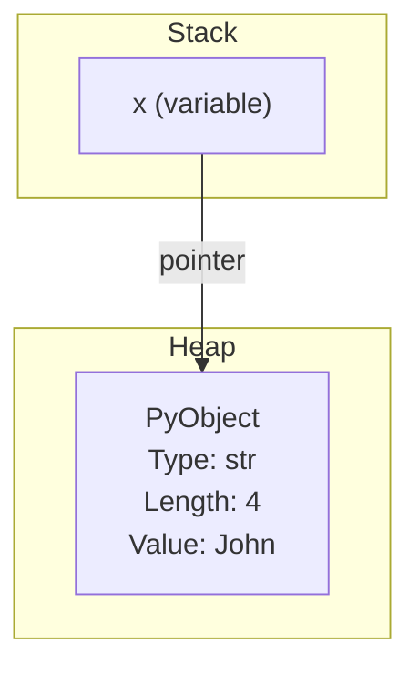
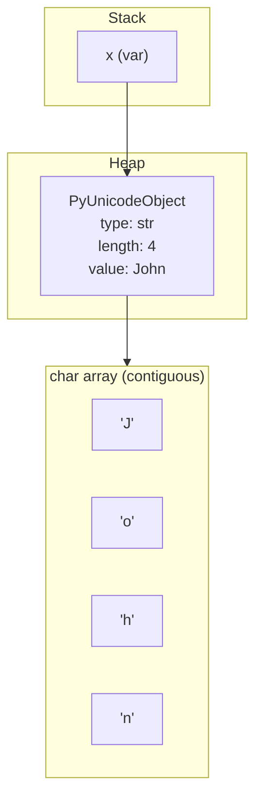
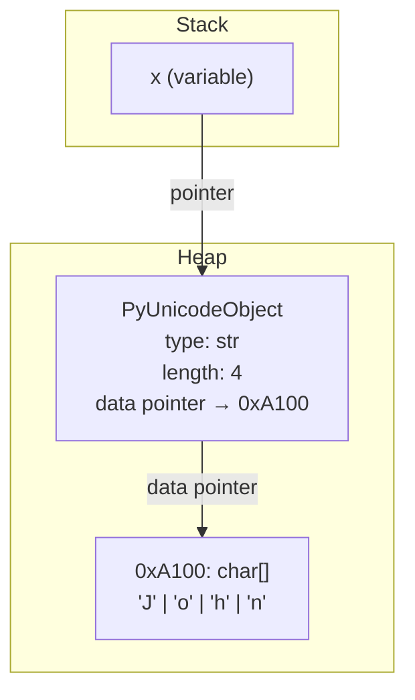
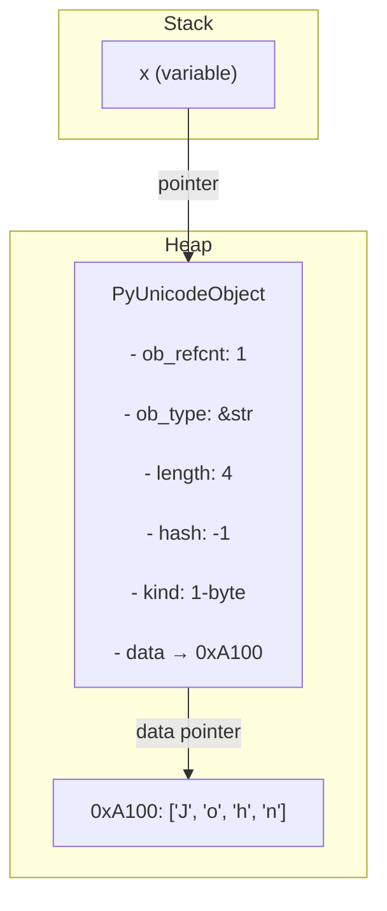

<nav>
    <ul>
        <li><a href="./README.md">Intro</a></li>
        <li><a href="./STRING.md">String</a></li>
        <li><a href="./DEF.md">Def</a></li>
    </ul>
</nav>

## print params

## string methods

1. how python store and treat strings.





```sql
[STACK]
x ───────────▶ [address 0xA000]

[HEAP at 0xA000]
+----------------------------+
| type: str                 |
| length: 4                 |
| data: pointer to 0xA100   |
+----------------------------+

[0xA100]
+-----+-----+-----+-----+
| 'J' | 'o' | 'h' | 'n' |
+-----+-----+-----+-----+
```





1. strip()
2. capitalize()
3. title()
4. chain methods
5. chain methods on the return of input
6. split(" ")
7. first, last = split(" ")
8. format()

## looping throw a string for loop

## string length `len()`

## Check if a String Exists in a Phrase `in` and `not in`

## String Slicing `sting[:]`

## Modifying Strings

1. `upper()` and `lower()`
2. `strip()`
3. `replace()`
4. `split()`

## format function:

1. format two strings
2. format using `.format()`
3. format using `f""`

## string in memory

```py
char = 'hello world'
for c in char:
    ascii_code = ord(c)
    binary_code = bin(ascii_code)
    print(f"Character: {c}")
    print(f"address: {id(c)}")
    print(f"ASCII Code: {ascii_code}")
    print(f"Binary (bitwise): {binary_code}")

```
