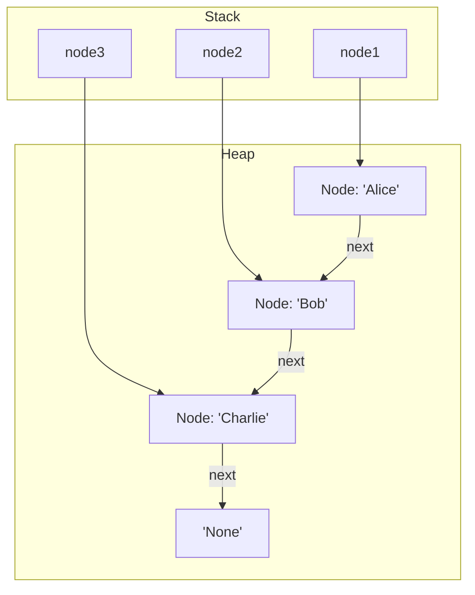
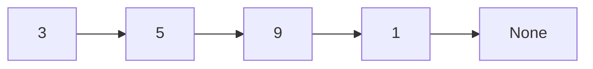
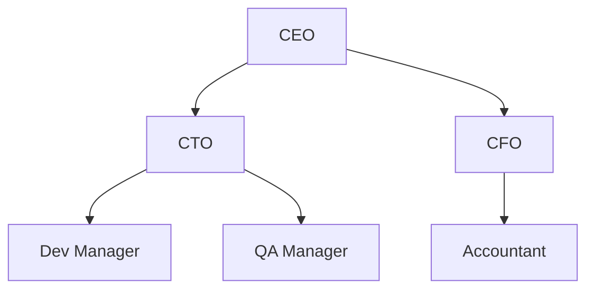
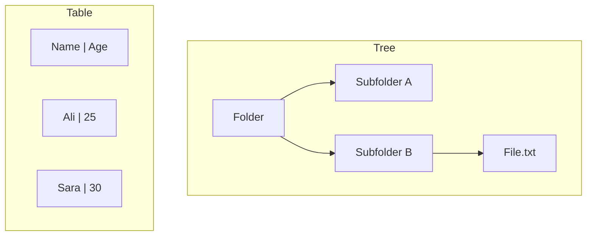
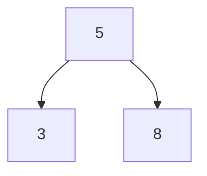
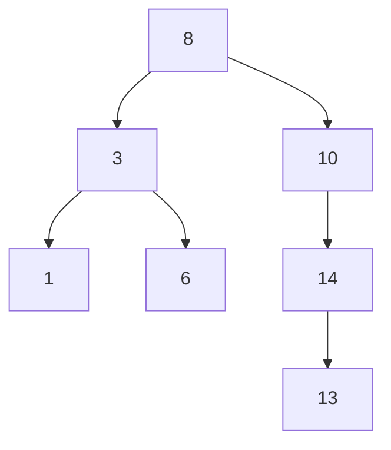
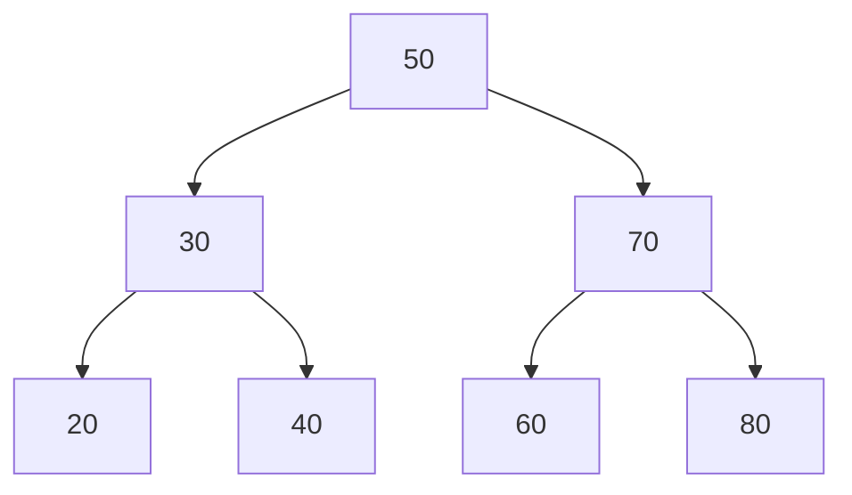
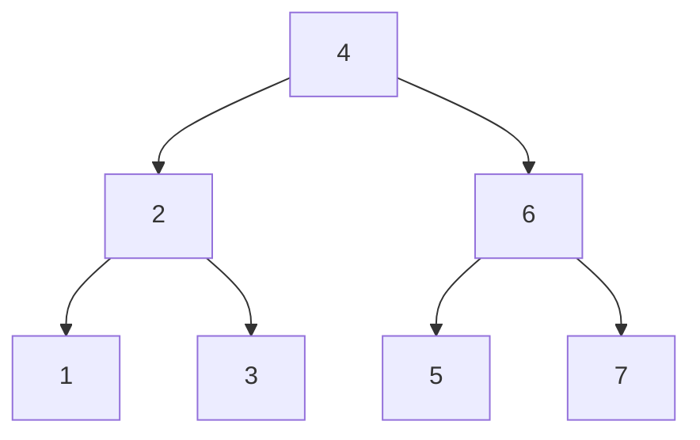
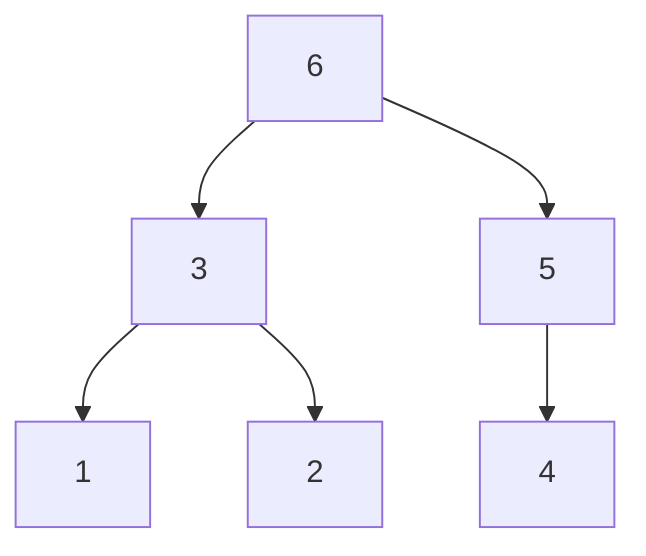

## 🌳 Lecture: **Why We Need Trees in Data Structures**

---

### 🧩 Act 1: A Familiar Struggle — Add, Remove, Search

> ❓ You need a system to **insert**, **delete**, **search**, and **traverse** large datasets efficiently.

---

#### 📦 Arrays (Lists)

```python
customers = ["Alice", "Bob", "Charlie"]
```

- link-list python



| Operation       | Performance          |
| --------------- | -------------------- |
| Access by index | ✅ O(1) — Fast       |
| Add/Remove      | ❌ O(n) — Must shift |
| Search          | ❌ O(n) — Linear     |

---

#### 🔗 Linked List

```python
class Node:
    def __init__(self, val):
        self.val = val
        self.next = None
```



| Operation    | Performance            |
| ------------ | ---------------------- |
| Add/Remove   | ✅ O(1) (at head/tail) |
| Search       | ❌ O(n)                |
| Traverse     | ❌ Must walk through   |
| Index access | ❌ Not supported       |

---

### ⚠️ Neither Scales Well...

> If you have **100,000 records** and need to **search, insert, and delete** often, neither structure holds up well.

---

## 🌲 Act 2: What Are Trees?

> A **tree** is a hierarchical structure — think family tree, file system, DOM structure.



- Data branches outward
- Every node (except root) has a **parent**
- Nodes can have **children**

---

### 🔄 Trees vs Tables

| Feature | Tree                  | Table (2D)          |
| ------- | --------------------- | ------------------- |
| Shape   | Hierarchical (nested) | Flat (rows/columns) |
| Example | Folder structure      | Spreadsheet         |



---

### 🔗 Trees vs Linked List

| Feature   | Tree               | Linked List  |
| --------- | ------------------ | ------------ |
| Structure | Branching (1→Many) | Linear (1→1) |
| Search    | ✅ Faster (log n)  | ❌ O(n)      |



---

### 📚 Trees vs Lists

| Feature       | Tree             | List                |
| ------------- | ---------------- | ------------------- |
| Insert/Delete | ✅ O(log n)      | ❌ O(n) if shifting |
| Index Access  | ❌ Not supported | ✅ O(1)             |
| Search        | ✅ O(log n)      | ❌ O(n)             |

---

## 🌱 Act 3: Binary Trees — Most Popular Tree

### 🔢 Binary Tree

> Each node has **at most 2 children**: left and right.

```python
class Node:
    def __init__(self, val):
        self.left = None
        self.right = None
        self.val = val
```



---

### 🌲 Binary Search Tree (BST)

> In BST:

- Left child < parent
- Right child > parent

Allows **fast lookup, insert, delete** (if balanced):



| Operation | Time (Balanced BST) |
| --------- | ------------------- |
| Search    | ✅ O(log n)         |
| Insert    | ✅ O(log n)         |
| Delete    | ✅ O(log n)         |

---

## 🔁 Traversal Algorithms

1. **In-Order** → Left → Root → Right
2. **Pre-Order** → Root → Left → Right
3. **Post-Order** → Left → Right → Root
4. **Level-Order** → BFS (Queue)



- In-order: 1 → 2 → 3 → 4 → 5 → 6 → 7
- Pre-order: 4 → 2 → 1 → 3 → 6 → 5 → 7

---

## 🧠 Summary: When to Use Trees?

| Scenario                         | Use Trees? |
| -------------------------------- | ---------- |
| Hierarchical or nested data      | ✅         |
| Fast insert/search/delete needed | ✅         |
| Order matters (sorted traversal) | ✅         |
| You need index access            | ❌         |
| You want flat, simple structure  | ❌         |

---

## 🌳 Act6: Tree Traversals — Pre-order, In-order, Post-order

### 🧠 What Is a Tree?

A **tree** is a non-linear data structure made of nodes. Each node has:

- A **value**
- A **left** child
- A **right** child

Example:

```python
class Node:
    def __init__(self, value):
        self.value = value
        self.left = None
        self.right = None
```

Let’s build this tree:

```
        A
       / \
      B   C
     / \   \
    D   E   F
```

---

### 🔍 1. Pre-Order Traversal (Root → Left → Right)

```python
def preorder(node):
    if node:
        print(node.value)      # 1. Visit root
        preorder(node.left)    # 2. Traverse left
        preorder(node.right)   # 3. Traverse right
```

> **Visit Order**: A → B → D → E → C → F


---

### 🌿 2. In-Order Traversal (Left → Root → Right)

```python
def inorder(node):
    if node:
        inorder(node.left)     # 1. Traverse left
        print(node.value)      # 2. Visit root
        inorder(node.right)    # 3. Traverse right
```

> **Visit Order**: D → B → E → A → C → F


---

### 🍂 3. Post-Order Traversal (Left → Right → Root)

```python
def postorder(node):
    if node:
        postorder(node.left)   # 1. Traverse left
        postorder(node.right)  # 2. Traverse right
        print(node.value)      # 3. Visit root
```

> **Visit Order**: D → E → B → F → C → A



---

### 🧠 When Do You Use Each?

| Traversal Type | Use Case                                                  |
| -------------- | --------------------------------------------------------- |
| **Pre-order**  | Copying a tree, prefix notation (used in compilers)       |
| **In-order**   | Getting sorted order from a **Binary Search Tree**        |
| **Post-order** | Deleting a tree, postfix notation, evaluating expressions |

---

### ✅ Summary of Traversal Orders

| Type       | Order               | Example Result |
| ---------- | ------------------- | -------------- |
| Pre-order  | Root → Left → Right | `A B D E C F`  |
| In-order   | Left → Root → Right | `D B E A C F`  |
| Post-order | Left → Right → Root | `D E B F C A`  |
