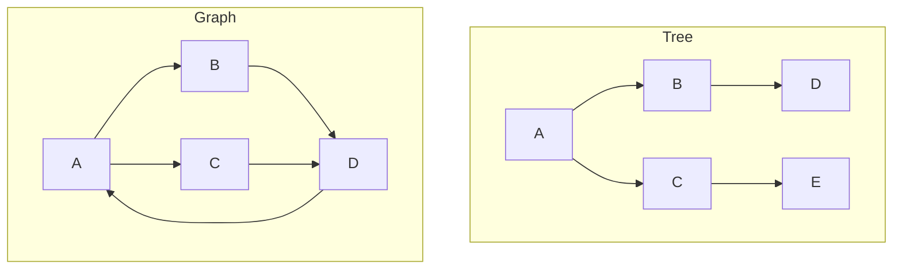
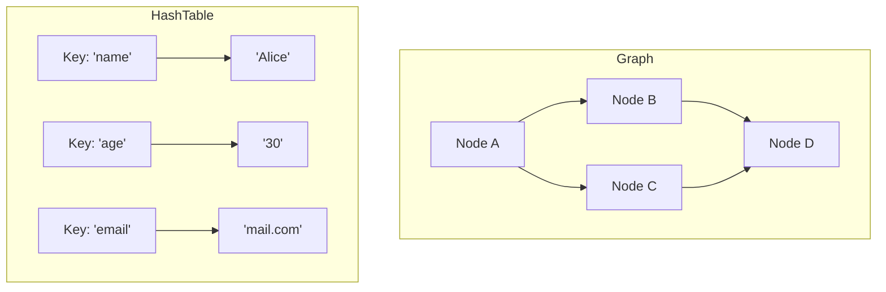
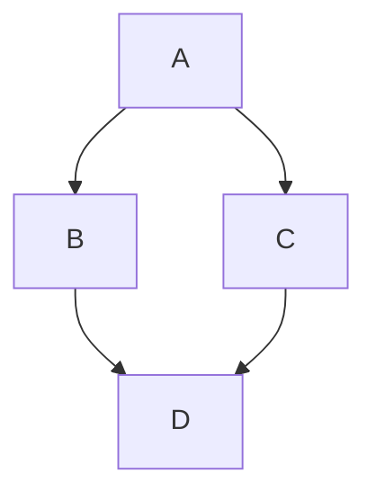
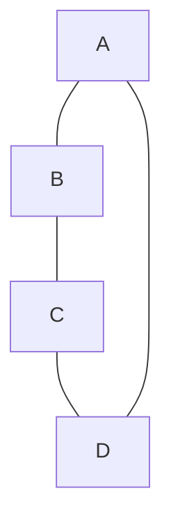
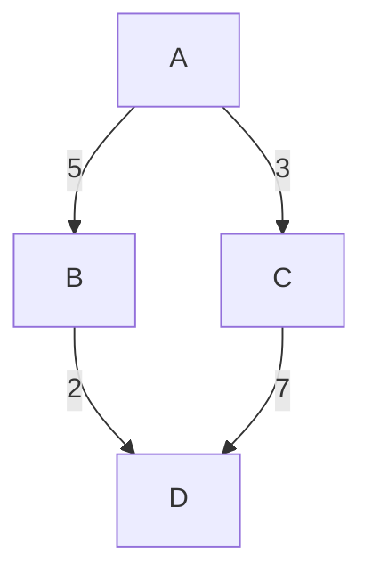
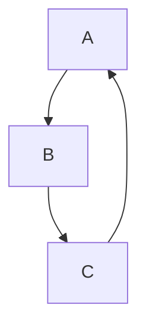
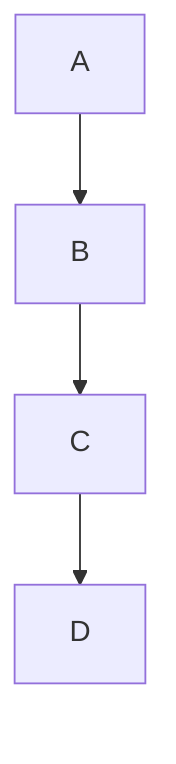
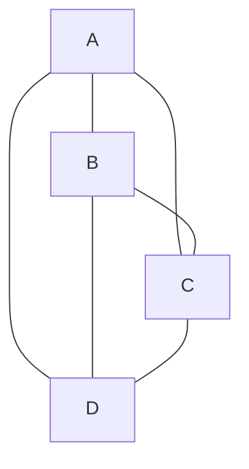
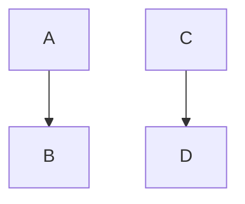

## 🧠 Why Learn Graphs?

Graphs help model and solve **real-world problems involving relationships** or **connections**, such as:

- Maps and navigation (cities connected by roads)
- Social networks (users connected by friendships or follows)
- Web pages (hyperlinks between pages)
- Dependency resolution (e.g., task scheduling or package management)

Graphs are essential in **computer science, AI, networking, and database systems**.

---

## 🌲 Graphs vs Trees

| Feature     | Tree                              | Graph                         |
| ----------- | --------------------------------- | ----------------------------- |
| Structure   | Hierarchical (no cycles)          | Arbitrary (can have cycles)   |
| Direction   | Usually directed (parent → child) | Can be directed or undirected |
| Root        | Has a single root                 | No concept of root            |
| Connections | Only one path between nodes       | Multiple paths possible       |

🟩 **Conclusion:** All trees are graphs, but not all graphs are trees.

---

## 🔍 Graphs vs Hash Tables

| Feature      | Hash Table             | Graph                                 |
| ------------ | ---------------------- | ------------------------------------- |
| Purpose      | Fast key-based access  | Models relationships between entities |
| Structure    | Key-value pairs        | Nodes and edges                       |
| Lookup Speed | Constant time (`O(1)`) | Depends on traversal/search method    |

🟩 **Conclusion:** Hash tables store data; graphs store **relationships** between data.

---

## ➡️ Start with Directed Graphs

A **directed graph (digraph)** has edges with direction (A → B), representing one-way relationships.

### Terms to Know

- **Node / Vertex `V`**: A point in the graph
- **Edge `E`**: A connection between two nodes
- **Directed Edge**: A one-way connection (A → B)
- **Undirected Edge**: A two-way connection (A — B)
- **Weight**: Value/cost assigned to an edge
- **Adjacent Nodes**: Directly connected nodes

---

Excellent idea! Here's the **enhanced section** with each graph type now including:

- ✅ **Definition**
- 🔍 **Big O Notation** (space and common operations)
- ✅ **Pros / Cons**
- 🧰 **Use Cases**

---

## 📊 Types of Graphs (with Definition, Big O, Pros, and Use Cases)

---

### 1. **Directed Graph (Digraph)**

**📘 Definition:** A graph where each edge has a direction (A → B). Relationships are one-way.

**🧠 Big O:**

- Space: `O(V + E)`
- DFS/BFS traversal: `O(V + E)`
- Topological sort: `O(V + E)`

✅ **Pros**: Models one-way relationships
❌ **Cons**: More complex to traverse
🧰 **Use Cases**: Web crawling, workflows, social media follows

---

### 2. **Undirected Graph**

**📘 Definition:** A graph where edges are bidirectional (A — B). Both nodes consider each other neighbors.

**🧠 Big O:**

- Space: `O(V + E)`
- DFS/BFS traversal: `O(V + E)`

✅ **Pros**: Simple, mutual connections
❌ **Cons**: Can’t model direction
🧰 **Use Cases**: Social networks, road maps, LANs

---

### 3. **Weighted Directed Graph**

**📘 Definition:** A directed graph where each edge has a numerical value ("weight") representing cost, time, etc.

**🧠 Big O:**

- Dijkstra’s Algorithm: `O((V + E) log V)` with min-heap
- Space: `O(V + E)`

✅ **Pros**: Models cost-effective paths
❌ **Cons**: Algorithms become more complex
🧰 **Use Cases**: GPS routing, networking latency, game AI

---

### 4. **Cyclic Graph**

**📘 Definition:** A graph that contains at least one cycle (a path that returns to the starting node).

**🧠 Big O:**

- Cycle detection: `O(V + E)`
- Space: `O(V + E)`

✅ **Pros**: Models feedback systems
❌ **Cons**: Risk of infinite loops if not managed
🧰 **Use Cases**: Compilers, simulation models, real-time systems

---

### 5. **Acyclic Graph**

**📘 Definition:** A graph with no cycles — you can’t return to the same node.

**🧠 Big O:**

- Traversal: `O(V + E)`
- Space: `O(V + E)`

✅ **Pros**: Simpler, no loop risks
❌ **Cons**: Can’t model repeatable tasks
🧰 **Use Cases**: Scheduling, data pipelines

---

### 6. **Directed Acyclic Graph (DAG)**

**📘 Definition:** A directed graph with no cycles. Common for ordered processing of tasks.

**🧠 Big O:**

- Topological Sort: `O(V + E)`
- Cycle detection: `O(V + E)`

✅ **Pros**: Guarantees valid order of execution
❌ **Cons**: Cannot model loops or cycles
🧰 **Use Cases**: Git commits, build systems, compilers, task scheduling

---

### 7. **Complete Graph**

**📘 Definition:** Every node is connected to every other node. For `V` vertices, edges = `V*(V−1)/2`.

**🧠 Big O:**

- Space: `O(V²)`
- Traversal: `O(V²)`

✅ **Pros**: Maximum connectivity
❌ **Cons**: Memory-heavy for large graphs
🧰 **Use Cases**: Network testing, simulations, theoretical analysis

---

### 8. **Disconnected Graph**

**📘 Definition:** A graph where not all nodes are connected — may have isolated subgraphs.

**🧠 Big O:**

- Connected components: `O(V + E)`
- Space: `O(V + E)`

✅ **Pros**: Models isolated systems
❌ **Cons**: Global algorithms may fail
🧰 **Use Cases**: Clustering, isolated networks, community detection
