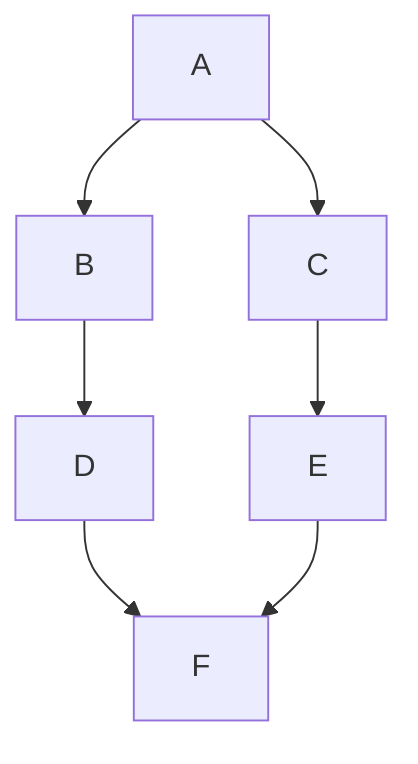

# 🔍 Graph Traversal: DFS vs BFS

When working with graphs, you often need to **explore all the nodes** or **search for a specific node**. Two of the most important algorithms for this are:

- ✅ **Depth-First Search (DFS)**
- ✅ **Breadth-First Search (BFS)**

---

## 🧠 What is Traversal?

**Traversal** means visiting every node in a graph **in a specific order**, typically to:

- Search for a value
- Explore relationships
- Process every node (e.g., counting, coloring, labeling, etc.)

---

## 🔢 Notation

- `V` → Number of **vertices** (nodes)
- `E` → Number of **edges** (connections)

Most traversal algorithms run in **O(V + E)** time because they:

- Visit every node (`V`)
- Check every edge (`E`)

---

## 🌊 Breadth-First Search (BFS)

### 📘 Definition

BFS visits nodes **level by level**. It starts at a source node and explores all its **direct neighbors first**, before going deeper.

### 💡 How BFS Works

1. Use a **queue** (FIFO: First In First Out)
2. Start with the root (or any starting node)
3. Enqueue the start node and mark it as visited
4. While the queue is not empty:

   - Dequeue a node
   - Visit all its unvisited neighbors
   - Enqueue those neighbors

5. Repeat until the queue is empty

### 🧠 Time & Space Complexity

- **Time**: `O(V + E)`
- **Space**: `O(V)` (to store visited nodes and queue)

### ✅ Pros

- Always finds the **shortest path** in unweighted graphs
- Good for **level-order traversal**

### ❌ Cons

- Can use more memory than DFS in wide graphs

### 🧭 BFS Example

Start from node `A`
🔄 **BFS Traversal Order:** `A → B → C → D → E → F`

---

## 🌲 Depth-First Search (DFS)

### 📘 Definition

DFS explores as **deep as possible** along one path before backtracking. It’s like walking down one hallway until you hit a wall, then turning around to try a different hallway.

### 💡 How DFS Works

1. Use **recursion** or a **stack**
2. Start with the root (or any starting node)
3. Mark the node as visited
4. Visit each unvisited neighbor **one by one** (go deep)
5. Backtrack when needed

### 🧠 Time & Space Complexity

- **Time**: `O(V + E)`
- **Space**:

  - Recursive DFS: `O(V)` (call stack)
  - Iterative DFS with stack: `O(V)`

### ✅ Pros

- Uses less memory in wide graphs
- Good for pathfinding, maze solving, topological sort

### ❌ Cons

- Doesn’t always find the shortest path
- Can get stuck in cycles (unless you track visited nodes)

### 🧭 DFS Example

Start from node `A`
🔁 **DFS Traversal Order:**
One possible path: `A → B → D → F → C → E`

---

## 🔁 Side-by-Side Comparison

| Feature       | BFS                           | DFS                               |
| ------------- | ----------------------------- | --------------------------------- |
| Structure     | Queue                         | Stack / Recursion                 |
| Strategy      | Explore level by level        | Explore depth before backtracking |
| Shortest Path | ✅ Yes (in unweighted graphs) | ❌ Not guaranteed                 |
| Memory Usage  | Higher in wide graphs         | Lower in wide graphs              |
| Use Cases     | Shortest path, levels         | Topological sort, maze solving    |

---

## 🎯 When to Use What?

| Problem Type                     | Recommended |
| -------------------------------- | ----------- |
| Find the shortest path           | ✅ **BFS**  |
| Solve a maze                     | ✅ **DFS**  |
| Topological sorting              | ✅ **DFS**  |
| Search all possible combinations | ✅ **DFS**  |
| Explore all nodes layer by layer | ✅ **BFS**  |

---

## 🧪 BFS vs DFS on Same Graph

### 🔄 BFS

**BFS from A**:
Visit order → `A → B → C → D → E → F`

---

### 🔁 DFS

**DFS from A**:
Visit order (one path) → `A → B → D → F → C → E`

> ⚠️ Note: DFS order **may vary** depending on which neighbor is visited first!
