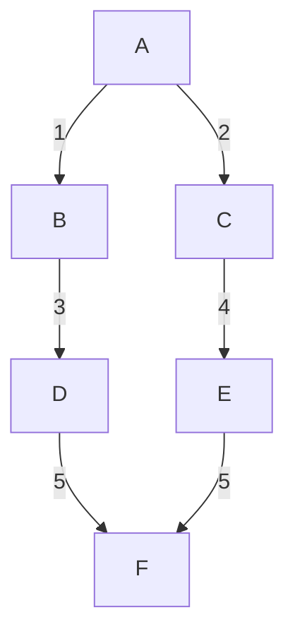
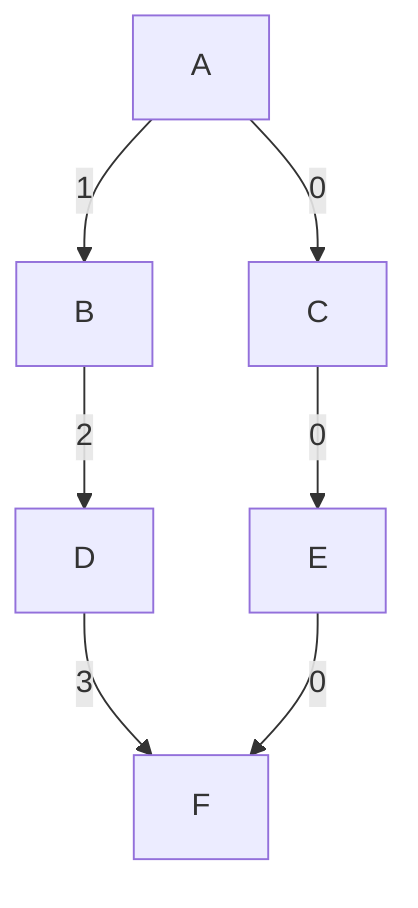
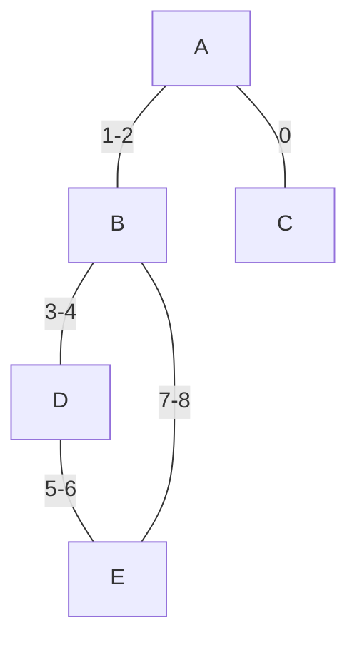
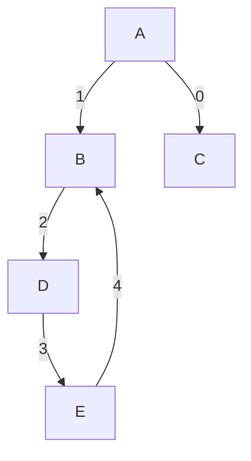
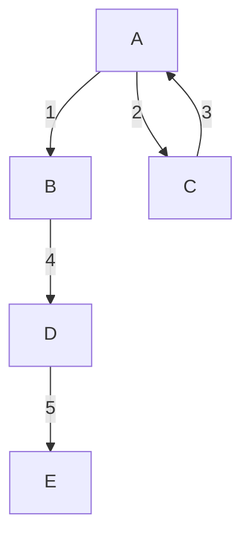
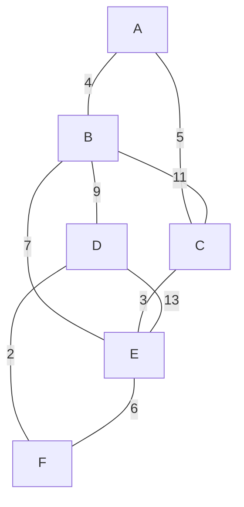
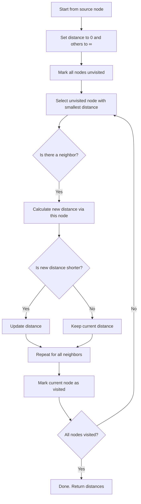
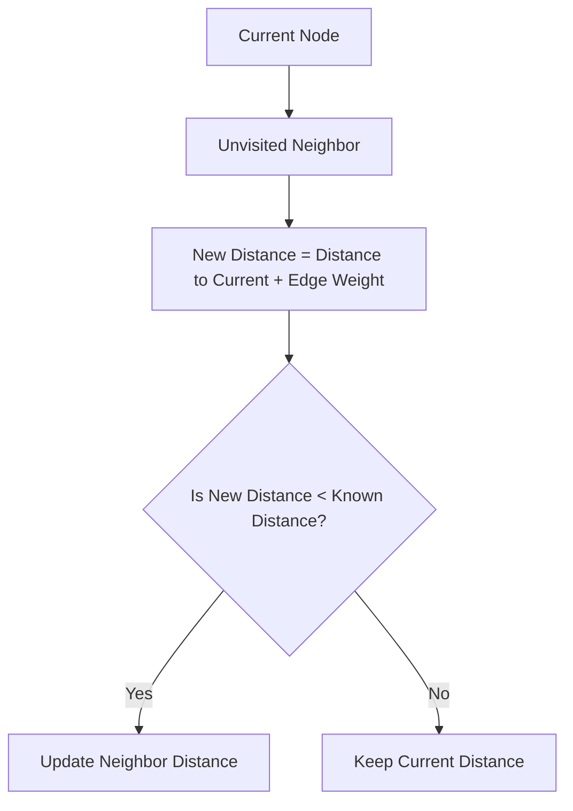

# 🔍 Graph Traversal: DFS vs BFS

When working with graphs, you often need to **explore all the nodes** or **search for a specific node**. Two of the most important algorithms for this are:

- ✅ **Depth-First Search (DFS)**
- ✅ **Breadth-First Search (BFS)**

---

## 🧠 What is Traversal?

**Traversal** means visiting every node in a graph **in a specific order**, typically to:

- Search for a value
- Explore relationships
- Process every node (e.g., counting, coloring, labeling, etc.)

---

## 🔢 Notation

- `V` → Number of **vertices** (nodes)
- `E` → Number of **edges** (connections)

Most traversal algorithms run in **O(V + E)** time because they:

- Visit every node (`V`)
- Check every edge (`E`)

---

## 🌊 Breadth-First Search (BFS)

### 📘 Definition

BFS visits nodes **level by level**. It starts at a source node and explores all its **direct neighbors first**, before going deeper.

### 🧭 BFS Example

Start from node `A` **BFS Traversal Order:** `A → B → C → D → E → F`

### 💡 How BFS Works

1. Use a **queue** (FIFO: First In First Out)
2. Start with the root (or any starting node)
3. Enqueue the start node and mark it as visited
4. While the queue is not empty:

   - Dequeue a node
   - Visit all its unvisited neighbors
   - Enqueue those neighbors

5. Repeat until the queue is empty

### 🧠 Time & Space Complexity

- **Time**: `O(V + E)`
- **Space**: `O(V)` (to store visited nodes and queue)

### ✅ Pros

- Always finds the **shortest path** in unweighted graphs
- Good for **level-order traversal**

### ❌ Cons

- Can use more memory than DFS in wide graphs

---

## 🌲 Depth-First Search (DFS)

### 📘 Definition

DFS explores as **deep as possible** along one path before backtracking. It’s like walking down one hallway until you hit a wall, then turning around to try a different hallway.

### 🧭 DFS Example

Start from node `A`
🔁 **DFS Traversal Order:**
One possible path: `A → B → D → F → C → E`

### 💡 How DFS Works

1. Use **recursion** or a **stack**
2. Start with the root (or any starting node)
3. Mark the node as visited
4. Visit each unvisited neighbor **one by one** (go deep)
5. Backtrack when needed

### 🧠 Time & Space Complexity

- **Time**: `O(V + E)`
- **Space**:

  - Recursive DFS: `O(V)` (call stack)
  - Iterative DFS with stack: `O(V)`

### ✅ Pros

- Uses less memory in wide graphs
- Good for pathfinding, maze solving, topological sort

### ❌ Cons

- Doesn’t always find the shortest path
- Can get stuck in cycles (unless you track visited nodes)

---

## 🔁 Side-by-Side Comparison

| Feature       | BFS                           | DFS                               |
| ------------- | ----------------------------- | --------------------------------- |
| Structure     | Queue                         | Stack / Recursion                 |
| Strategy      | Explore level by level        | Explore depth before backtracking |
| Shortest Path | ✅ Yes (in unweighted graphs) | ❌ Not guaranteed                 |
| Memory Usage  | Higher in wide graphs         | Lower in wide graphs              |
| Use Cases     | Shortest path, levels         | Topological sort, maze solving    |

---

## 🎯 When to Use What?

| Problem Type                     | Recommended |
| -------------------------------- | ----------- |
| Find the shortest path           | ✅ **BFS**  |
| Solve a maze                     | ✅ **DFS**  |
| Topological sorting              | ✅ **DFS**  |
| Search all possible combinations | ✅ **DFS**  |
| Explore all nodes layer by layer | ✅ **BFS**  |

---

## 🔁 Cycle Detection in Graphs

### ❓ What is a Cycle?

A **cycle** in a graph is a path that **starts and ends at the same node** without repeating any edge (and in simple graphs, without repeating any node except the start/end).

---

## 🔄 Directed vs Undirected Graphs

### ➤ **Undirected Graph**

- A cycle means a **loop between nodes**
- If you can revisit a node (other than the immediate parent), there's a cycle

### ➤ **Directed Graph**

- A cycle occurs when there's a **path from a node back to itself**
- You must detect **back edges** in DFS

---

## ⚠️ Why Detect Cycles?

Cycle detection is important in:

- Deadlock detection in OS
- Checking if a course schedule (graph of prerequisites) is valid
- Validating dependency graphs
- Topological sorting (only works on DAGs: Directed Acyclic Graphs)

---

## 🔎 Cycle Detection in Undirected Graph (Using DFS)

### 💡 Key Idea

Track each node’s parent during DFS.
If a neighbor is visited and **not the parent**, it’s a **cycle**.

Time Complexity `O(V + E)`

Cycle: `A → B → C → D → A`

---

## 🔎 Cycle Detection in Directed Graph (Using DFS)

### 💡 Key Idea

Use a **visited set** AND a **recursion stack**.
If you revisit a node **already in the recursion stack**, a **cycle exists**.

Time Complexity `O(V + E)`.

Cycle: `B → C → D → B`

---

## 🔄 Cycle Detection Using BFS (Kahn’s Algorithm – Directed Graph Only)

### 📘 What is Kahn's Algorithm?

Kahn's Algorithm is used for **topological sorting**.

- If you **cannot topologically sort** all nodes (i.e., some remain with incoming edges), the graph has a **cycle**.

### 💡 How it Works

1. Calculate the **in-degree** of each node
2. Add all **0 in-degree** nodes to a queue
3. Repeatedly remove nodes from the queue, decreasing the in-degree of neighbors
4. If all nodes are removed: **no cycle**
5. If some nodes remain: **cycle exists**
6. Time Complexity `O(V + E)`

## 🧾 Summary Table

| Graph Type | Method     | Approach               | Cycle Detected When...                        |
| ---------- | ---------- | ---------------------- | --------------------------------------------- |
| Undirected | DFS        | Track parent           | Visiting an already visited neighbor ≠ parent |
| Directed   | DFS        | Recursion + call stack | Node revisited while in the stack             |
| Directed   | BFS (Kahn) | In-degree              | Not all nodes can be sorted (remain in graph) |

Great! Here are a couple of **Mermaid diagrams** you can insert between the cells of your Jupyter notebook to help explain what's going on visually.

---

### 📌 1. **Graph Structure Diagram**

This Mermaid diagram represents your undirected graph structure based on the adjacency matrix:

You can place this **right after the cell where the graph is defined and printed**.

---

### 📌 2. **Dijkstra Algorithm Flowchart**

This diagram shows the high-level logic of Dijkstra’s algorithm:

You can insert this **right before the Dijkstra function**.

---

### 📌 3. (Optional) **Relaxation Step Only**

To highlight just the "Relax Neighbors" step:

