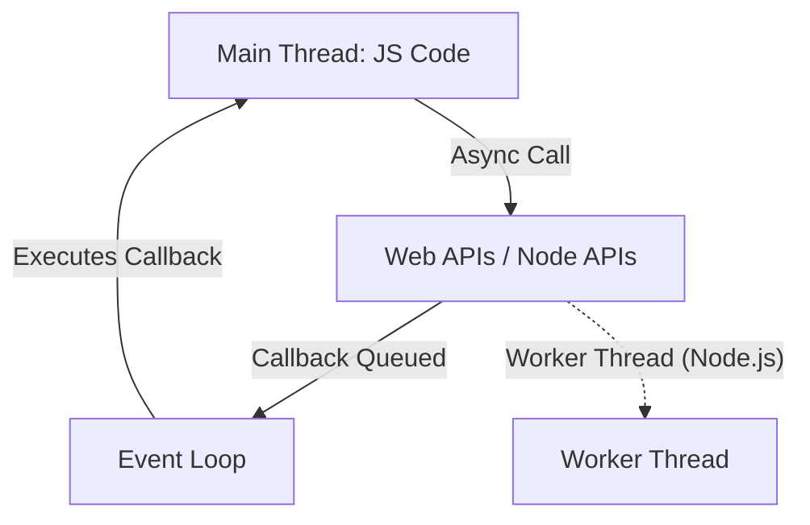

# Node.js Lecture

## 1. Why Was Node.js Created?

Node.js was created to enable JavaScript to run outside the browser, allowing developers to build scalable network applications. It was designed to handle many simultaneous connections efficiently, making it ideal for real-time applications like chat servers and APIs.

## 2. The Node.js Environment

- **Runtime:** Node.js is a runtime environment for executing JavaScript code on the server side.
- **V8 Engine:** It uses Google’s V8 JavaScript engine (the same as Chrome) to execute code.
- **APIs:** Node provides APIs for file system, networking, OS, and more.
- **Package Manager:** npm (Node Package Manager) is used to manage libraries and dependencies.

## 3. How Node.js Differs from JavaScript, C, and Python

- **JavaScript (Browser):** Runs in the browser, interacts with the DOM, limited access to OS resources.
- **Node.js:** Runs on the server, has access to the file system, network, OS, and more. No DOM.
- **C:** Compiled, low-level, manual memory management, synchronous by default.
- **Python:** Interpreted, high-level, synchronous by default, multi-threading via GIL.
- **Node.js:** Interpreted, event-driven, non-blocking I/O, single-threaded with event loop.

## 4. How to Run Node.js on Your Machine

1. **Install Node.js:** Download from [nodejs.org](https://nodejs.org/).
2. **Check Installation:**
   ```bash
   node -v
   npm -v
   ```
3. **Run a JavaScript File:**
   ```bash
   node yourfile.js
   ```

## 5. Example Node.js Code

### Hello World

```js
console.log('Hello, Node.js!');
```

---

## 6. The `os` Module in Node.js

Node.js provides the `os` module to interact with the operating system.

### Examples

```js
const os = require('os');

console.log('OS platform:', os.platform());
console.log('CPU architecture:', os.arch());
console.log('Total memory:', os.totalmem());
console.log('Free memory:', os.freemem());
console.log('Home directory:', os.homedir());
```

---

## 7. Understanding Threads and Concurrency in JavaScript and Node.js

### What is a Thread?

A thread is the smallest unit of execution within a process. In traditional programming languages like C or Java, you can have multiple threads running in parallel, each doing different tasks. Threads allow programs to perform multiple operations at the same time (concurrency).

### JavaScript and Node.js Thread Model

- **JavaScript (Browser):** Single-threaded, meaning only one operation can execute at a time. However, asynchronous operations (like `setTimeout`, AJAX) are handled by the browser, allowing the main thread to remain responsive. Web Workers can be used for parallelism.
- **Node.js:** Also single-threaded for JavaScript code, but uses an event loop and background worker threads (in C++) for I/O operations. Node.js can use the `worker_threads` module for true multi-threading if needed.

### Example: Asynchronous Behavior with setTimeout

```js
console.log('Start');
setTimeout(() => {
  console.log('Timeout finished');
}, 1000);
console.log('End');
```

// Output:
// Start
// End
// Timeout finished

This shows that while JavaScript is single-threaded, asynchronous operations are handled outside the main thread, and their callbacks are queued for later execution.

### Example: Using Worker Threads in Node.js

```js
const { Worker, isMainThread, parentPort } = require('worker_threads');

if (isMainThread) {
  const worker = new Worker(__filename);
  worker.on('message', (msg) => console.log('From worker:', msg));
  worker.postMessage('Hello Worker');
} else {
  parentPort.on('message', (msg) => {
    parentPort.postMessage(msg + ' received!');
  });
}
```

### Event Loop and Threads



**Summary:**

- JavaScript and Node.js are single-threaded for JS code, but can handle many tasks concurrently using the event loop and background threads for I/O.
- Node.js can use true threads with the `worker_threads` module for CPU-intensive tasks.

---

## 8. File System Example in Node.js

Node.js provides the `fs` module to interact with the file system.

### Example: Reading a File

```js
const fs = require('fs');

fs.readFile('example.txt', 'utf8', (err, data) => {
  if (err) {
    console.error(err);
    return;
  }
  console.log(data);
});
```

---

## 9. Why Do We Need a Server? What is a Three-Tier Architecture?

### Why Do We Need a Server?

A server is a computer program or device that provides functionality for other programs or devices, called clients. In web development, a server hosts your application, handles requests from users, processes data, and sends responses back.

### Three-Tier Architecture

Three-tier architecture is a common way to structure web applications. It separates the application into three layers:

- **Presentation Tier:** The user interface (browser, mobile app)
- **Logic Tier:** The application logic (Node.js server, Python, etc.)
- **Data Tier:** The database (MySQL, MongoDB, etc.)

This separation makes applications easier to manage, scale, and secure.

#### Mermaid Diagram: Three-Tier Architecture


## 10. Creating a Simple Server with Node.js

Node.js makes it easy to create servers for web applications, APIs, and more. The HTTP server example below is a basic demonstration. For more advanced features, frameworks like Express.js are commonly used.

### Example: Simple HTTP Server

```js
const http = require('http');

const server = http.createServer((req, res) => {
  res.writeHead(200, { 'Content-Type': 'text/plain' });
  res.end('Hello from Node.js server!');
});

server.listen(3000, () => {
  console.log('Server running at http://localhost:3000/');
});
```

---
