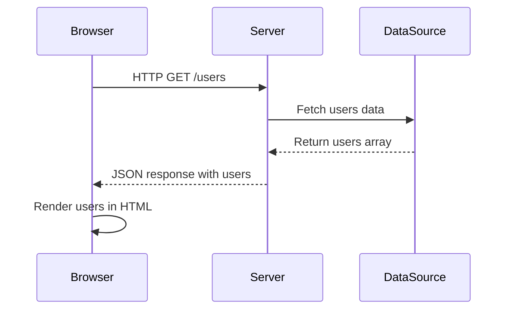

# Lecture: Serving Data from a Node.js Server

## Introduction

In this section, you will learn how to serve data from a Node.js server to the browser using the HTTP protocol. This is a key step in building dynamic web applications, where the data is no longer static or hardcoded, but is sent from the server to the client (browser) on request.

---

## Three-Tier Architecture & Request/Response Cycle

Modern web applications are often structured in three logical layers (tiers):

1. **Presentation Layer (Client/Browser):**
   - Displays the user interface (HTML, CSS, JS)
   - Makes requests to the server (e.g., using `fetch` in `main.js`)
2. **Application Layer (Server):**
   - Handles incoming requests
   - Processes data and business logic
   - Sends responses (data) back to the client
3. **Data Layer (Database or Data Source):**
   - Stores and retrieves data (in this example, an in-memory array)

### Request/Response Flow



---

## How Data is Served from the Server

1. The browser (client) sends an HTTP request to the server (e.g., `/users`).
2. The server receives the request, fetches the data (from memory, file, or database), and sends it back as a JSON response.
3. The browser receives the data and uses JavaScript (e.g., `main.js`) to update the HTML and display the user list.

This pattern allows the data to be updated on the server without changing the HTML or JavaScript on the client.

---

## How to Create a Simple Node.js Server

1. **Initialize a project (optional):**
   ```bash
   npm init -y
   ```
2. **Create `server.js`:**
   - Use the built-in `http` module to create a server.
   - Listen for requests and send responses.
3. **Run the server:**
   ```bash
   node server.js
   ```
4. **Access the server:**
   - Open your browser and go to `http://localhost:3000/users` to see the JSON data.

---

## Example: `server.js` with Comments

```js
// Import the built-in http module
const http = require('http');

// Our data source (could be a database or file in real apps)
const data = [
  { name: 'Alice', email: 'alice@example.com' },
  { name: 'Bob', email: 'bob@example.com' },
  // ...more users...
];

// Create the HTTP server
const server = http.createServer((req, res) => {
  // Set CORS headers to allow requests from other origins (e.g., if using a separate frontend)
  res.setHeader('Access-Control-Allow-Origin', '*');
  res.setHeader('Access-Control-Allow-Methods', 'GET, POST, OPTIONS');
  res.setHeader('Access-Control-Allow-Headers', 'Content-Type');

  // Handle preflight OPTIONS request for CORS
  if (req.method === 'OPTIONS') {
    res.writeHead(204);
    res.end();
    return;
  }

  // Serve a welcome message at the root path
  if (req.url === '/') {
    res.writeHead(200, { 'Content-Type': 'text/plain' });
    res.end('welcome to server');
  }
  // Serve the users data as JSON at /users
  else if (req.url === '/users') {
    res.writeHead(200, { 'Content-Type': 'application/json' });
    res.end(JSON.stringify(data));
  }
  // Handle unknown routes
  else {
    res.writeHead(404, { 'Content-Type': 'text/plain' });
    res.end('Not found');
  }
});

// Start the server on port 3000
server.listen(3000, () => {
  console.log(`Server running at http://localhost:3000/`);
});
```

---

This example demonstrates the basics of serving data from a Node.js server and how the client and server communicate in a three-tier architecture. In later sections, you'll see how to connect the server to files or databases for even more dynamic data.
