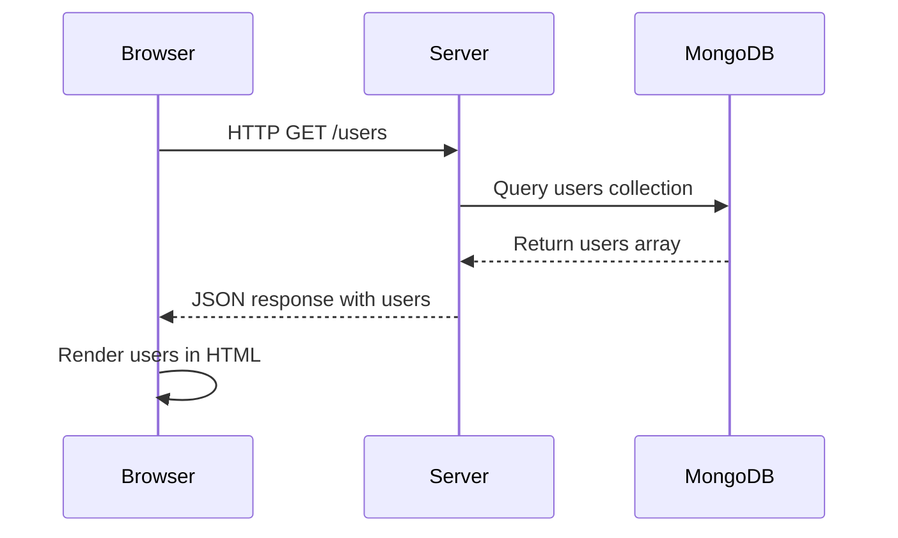

# Lecture: Serving Data from MongoDB in Node.js

## Introduction

In this section, you will learn how to serve data from a real database—MongoDB—using Node.js. This is the next step after serving data from a static file or in-memory array. Now, your server will connect to a database, fetch data, and send it to the client on request.

---

## How to Start MongoDB

1. **Install MongoDB:**
   - Download and install MongoDB Community Edition from [mongodb.com](https://www.mongodb.com/try/download/community).
2. **Start the MongoDB server:**
   - On most systems, you can start MongoDB with:
     ```bash
     mongod
     ```
   - By default, MongoDB runs on `mongodb://localhost:27017`.
3. **Insert sample data:**
   - Open a new terminal and run:
     ```bash
     mongo
     use test
     db.users.insertMany([
       { name: 'Alice', email: 'alice@example.com' },
       { name: 'Bob', email: 'bob@example.com' },
       // ...more users...
     ])
     ```

---

## Step-by-Step: Connecting and Serving Data

1. **Install dependencies:**
   - Make sure you have run:
     ```bash
     npm install
     ```
2. **Establish a connection to MongoDB:**
   - In `server.js`, use the `mongodb` package to connect to the database.
   - Example:
     ```js
     import { MongoClient } from 'mongodb';
     const client = new MongoClient('mongodb://localhost:27017');
     await client.connect();
     ```
3. **Fetch data from the database:**
   - Use the MongoDB client to get the `users` collection and fetch all users:
     ```js
     const db = client.db('test');
     const users = await db.collection('users').find({}).toArray();
     ```
4. **Serve the data to the client:**
   - Send the users as a JSON response to the browser.

---

## Three-Tier Architecture with MongoDB

The flow is now:

1. **Presentation Layer (main.js in the browser):**
   - Sends a `fetch` request to `/users` on the server.
2. **Application Layer (server.js):**
   - Receives the request, connects to MongoDB, fetches the data, and sends it back as JSON.
3. **Data Layer (MongoDB):**
   - Stores the user data and responds to queries from the server.

### Sequence Diagram



---

## Summary

- The only difference from previous sections is the data source: now it's a real database (MongoDB).
- The rest of the architecture and request/response cycle remains the same.
- This is a major step toward building full-stack, real-world web applications.
