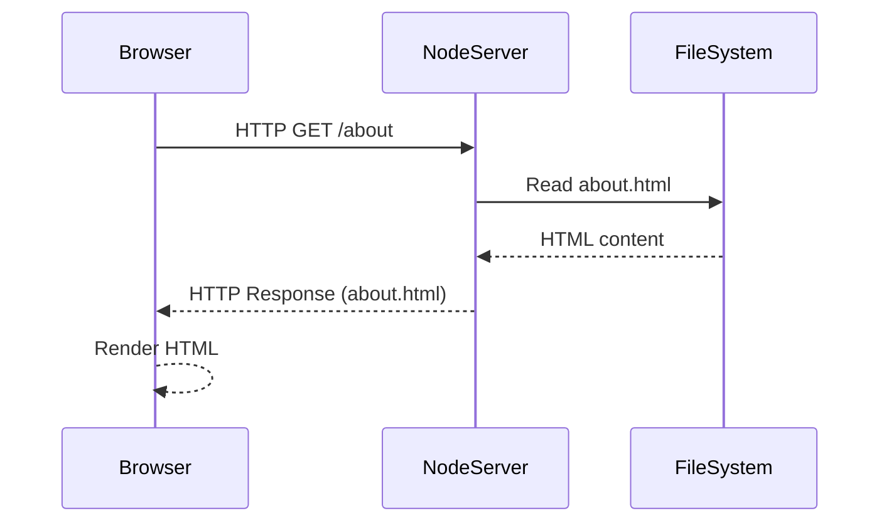

# Simple SSR Node.js Server: How It Works

## What is SSR (Server-Side Rendering)?

SSR means the server generates the HTML for each page and sends it to the browser. In our example, Node.js serves static HTML files based on the request.

## The HTTP Request-Response Cycle (Locally)

1. **Browser sends a request**: When you visit `http://localhost:3000/`, your browser sends an HTTP request to your local machine (the server).
2. **Node.js server receives the request**: The server checks the URL path (like `/`, `/about`, `/contact`).
3. **Server finds the file**: Based on the URL, the server looks for the corresponding HTML file (`home.html`, `about.html`, or `contact.html`) in the same folder.
4. **Server sends a response**: The server reads the file and sends its contents back to the browser as the HTTP response.
5. **Browser displays the page**: The browser renders the HTML it received.

## How the URL Determines the File

- The URL path (the part after the domain/port) tells the server which file to serve.
- For example:
  - `/` or `/home` → `home.html`
  - `/about` → `about.html`
  - `/contact` → `contact.html`
- The server uses simple logic to match the URL to a file name.

## Why is it Local?

- The server is running on your own computer (localhost), not on the internet.
- `localhost` is a special address that always points to your own machine.
- The files are read from your local folder, not from a remote server.

## Visual: SSR Request-Response Flow

---

This is a basic example of how a Node.js server can serve static HTML files locally using SSR principles. For more advanced routing and dynamic content, frameworks like Express.js are often used.
