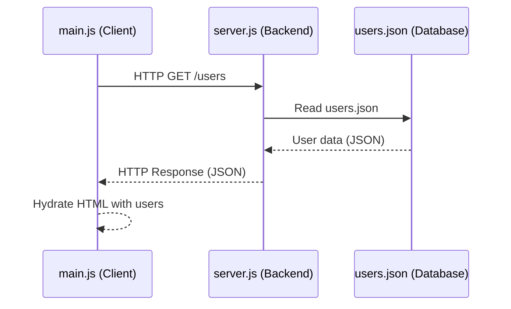
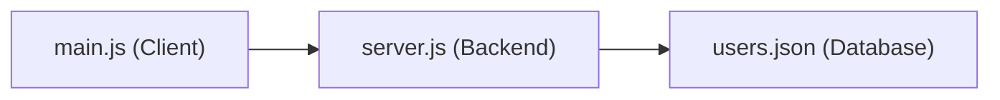

# CSR (Client-Side Rendering) Example with Node.js

This example demonstrates client-side rendering (CSR) using a static HTML file and JavaScript. The list of users is loaded from a local `users.json` file using `fetch` and rendered dynamically in the browser.

## How It Works

When Home is shown, the app fetches users from the `/users` API endpoint (served by `server.js`) and displays the list of users.

## Files

`main.js`: Handles navigation and loads users from the `/users` API endpoint.

## How to Run Locally

1. Open a terminal in this folder.
2. Start a simple static server (for example, with Python):
3. Run the Node.js server:

```bash
node server.js
```

3. Open your browser and go to `http://localhost:3000/`

## What is CSR?

## HTTP Request Cycle (CSR) — Mermaid Diagram



## Three-Tier Architecture in This Example

Here, `main.js` is the client, `server.js` is the backend, and `users.json` is the database.


