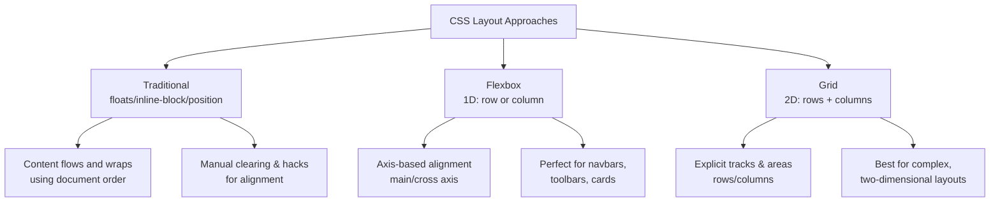
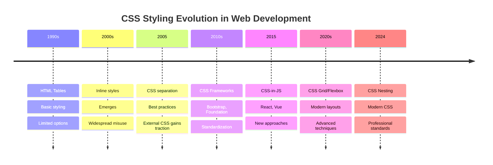
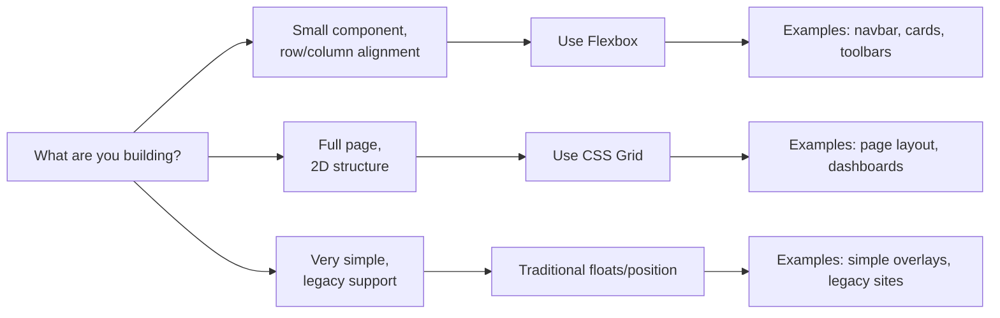

# 🧩 CSS Layout Methods: Flexbox vs Grid vs Traditional

Understand the core differences between CSS layout techniques and when to use each: Traditional (floats/inline-block/positioning), Flexbox, and CSS Grid.

## Connect with Me [LinkedIn](https://www.linkedin.com/in/bashar-alwarad-2a960b1b6/)

---

## 🎓 What is this?

This lecture explains three ways to lay out content in modern web apps:

1. Traditional CSS layout (floats, inline-block, positioning)
2. Flexbox (1D layout: rows or columns)
3. CSS Grid (2D layout: rows and columns)

You’ll see the pros/cons, best-fit scenarios, and concise CSS examples.

---

## 🎯 Learning Objectives

✅ Identify when to use Traditional vs Flexbox vs Grid  
✅ Write core CSS for each method  
✅ Understand alignment, responsiveness, and source-order impacts  
✅ Choose the right tool quickly with a decision flow

---

## 📊 Visual Overview



---

## 1️⃣ Traditional Layout (Floats, Inline-Block, Positioning)

Use when you need very simple flow-based layouts or legacy browser support. Alignment and equal-height columns often require workarounds.

---

## 🔄 Evolution of CSS Methods



---

### Core CSS (Float-based two-column)

```css
/* Container clears floats to prevent collapse */
.container::after {
  content: '';
  display: table;
  clear: both;
}

.col {
  float: left;
  width: 50%;
  padding: 16px;
}

/* Stack columns on small screens */
@media (max-width: 768px) {
  .col {
    width: 100%;
  }
}
```

### Inline-Block variation

```css
.nav {
  font-size: 0; /* remove whitespace between inline-blocks */
}
.nav__item {
  display: inline-block;
  font-size: 16px; /* restore font-size for item */
  padding: 8px 12px;
}
```

### Positioning for overlays

```css
.card {
  position: relative;
}
.card__badge {
  position: absolute;
  top: 8px;
  right: 8px;
  background: crimson;
  color: #fff;
  padding: 4px 8px;
  border-radius: 4px;
}
```

### Pros

- Simple, widely supported
- Good for basic flows and overlays

### Cons

- Manual hacks for alignment/centering
- No native gap; clearfix needed
- Hard to build complex 2D layouts cleanly

---

## 2️⃣ Flexbox (One-Dimensional Layout)

Flexbox excels at distributing space and aligning items along one axis (row or column). Great for navbars, cards, toolbars, and components.

### Core CSS (Row of cards with wrapping and gaps)

```css
.cards {
  display: flex;
  flex-wrap: wrap;
  gap: 16px; /* native spacing */
  align-items: stretch; /* cross-axis alignment */
}

.card {
  flex: 1 1 240px; /* grow, shrink, base width */
  min-width: 200px;
  padding: 16px;
  background: #fff;
  border: 1px solid #e5e7eb;
  border-radius: 8px;
}
```

### Navbar with centered, spaced links

```css
.nav {
  display: flex;
  align-items: center;
  justify-content: space-between;
  padding: 12px 16px;
  background: #2c3e50;
}
.nav__links {
  display: flex;
  gap: 12px;
}
.nav__link {
  color: #fff;
}
```

### Axis controls and alignment

```css
/* Horizontal layout */
.row {
  display: flex;
  flex-direction: row;
}
/* Vertical layout */
.column {
  display: flex;
  flex-direction: column;
}

/* Main-axis distribution */
.space-between {
  justify-content: space-between;
}
.center {
  justify-content: center;
  align-items: center;
}
```

### Pros

- Easy alignment and spacing (gap, justify, align)
- Content-first sizing (flex-basis, flex-grow)
- Great for components and 1D layouts

### Cons

- Not ideal for complex two-dimensional page grids
- Track-based placement is limited compared to Grid

---

## 3️⃣ CSS Grid (Two-Dimensional Layout)

Grid defines explicit rows and columns (tracks) and places items into a 2D matrix. Perfect for page structure, dashboards, and complex layouts.

### Core CSS (Responsive 3-column grid)

```css
.grid {
  display: grid;
  grid-template-columns: repeat(3, 1fr);
  gap: 16px;
}

/* Responsive: 2 cols on tablets, 1 on phones */
@media (max-width: 1024px) {
  .grid {
    grid-template-columns: repeat(2, 1fr);
  }
}
@media (max-width: 640px) {
  .grid {
    grid-template-columns: 1fr;
  }
}

.grid__item {
  background: #fff;
  border: 1px solid #e5e7eb;
  border-radius: 8px;
  padding: 16px;
}
```

### Named areas for full page layout

```css
.layout {
  display: grid;
  grid-template-columns: 240px 1fr;
  grid-template-rows: 64px 1fr 64px;
  grid-template-areas:
    'sidebar header'
    'sidebar main'
    'sidebar footer';
  height: 100vh;
}
.sidebar {
  grid-area: sidebar;
}
.header {
  grid-area: header;
}
.main {
  grid-area: main;
}
.footer {
  grid-area: footer;
}
```

### Pros

- True 2D control (rows + columns)
- Named areas, explicit tracks, auto-placement
- Powerful for full-page, dashboard, magazine layouts

### Cons

- Slightly higher learning curve than Flexbox
- Overkill for simple 1D components

---

## 🔀 Decision Flow



---

## 🧪 Practical Exercise

Convert a float-based grid to Flexbox, then to Grid.

### Float-based (start)

```css
.container::after {
  content: '';
  display: table;
  clear: both;
}
.item {
  float: left;
  width: 33.333%;
  padding: 16px;
}
```

### Flexbox conversion

```css
.container {
  display: flex;
  flex-wrap: wrap;
  gap: 16px;
}
.item {
  flex: 1 1 calc(33.333% - 16px);
}
```

### Grid conversion

```css
.container {
  display: grid;
  grid-template-columns: repeat(3, 1fr);
  gap: 16px;
}
.item {
  /* content styles only */
}
```

---

## 📚 Further Reading

- MDN: Flexbox — https://developer.mozilla.org/en-US/docs/Web/CSS/CSS_flexible_box_layout
- MDN: Grid — https://developer.mozilla.org/en-US/docs/Web/CSS/CSS_grid_layout
- MDN: Floats — https://developer.mozilla.org/en-US/docs/Learn/CSS/CSS_layout/Floats
- MDN: Positioning — https://developer.mozilla.org/en-US/docs/Learn/CSS/CSS_layout/Positioning
- CSS Tricks: Flexbox Guide — https://css-tricks.com/snippets/css/a-guide-to-flexbox/
- CSS Tricks: Grid Guide — https://css-tricks.com/snippets/css/complete-guide-grid/

---

## ✅ Key Takeaways

- Flexbox is best for components and 1D alignment.
- Grid is best for full-page or complex 2D layouts.
- Traditional methods still matter for overlays and legacy needs.
- Prefer semantic HTML with minimal layout overrides.
- Use `gap` for spacing; avoid manual margins for layout rhythm.

---

**Happy building with modern CSS layouts!**

_Educational content for Software Engineering Course_
