# Simple Introduction to Databases

## Table of Contents

- [How SQL Works Behind the Scenes](#how-sql-works-behind-the-scenes)
- [What is a Database?](#what-is-a-database)
- [Why Use Databases Instead of Lists?](#why-use-databases-instead-of-lists)
- [Your First Database](#your-first-database)
- [CRUD Operations](#crud-operations-create-read-update-delete)
- [Complete Simple Example](#complete-simple-example)
- [Project Progress](#project-progress)

## What is a Database?

A database is like a digital filing cabinet that stores information permanently. Unlike Python lists that disappear when your program ends, databases save data to your computer's hard drive.

## Why Use Databases Instead of Lists?

**Python List Problems:**

```python
# This data disappears when program ends!
students = [
    {"name": "John", "age": 20, "grade": "A"},
    {"name": "Alice", "age": 19, "grade": "B"}
]
```

**Database Benefits:**

- Data stays saved forever
- Much faster for large amounts of data
- Multiple programs can use the same data
- Built-in search and sorting

### Performance Comparison: Lists vs Databases

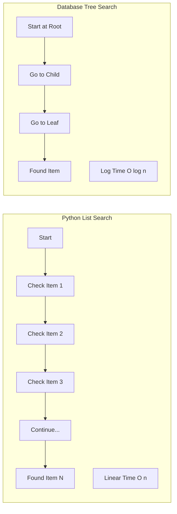

**Performance Comparison:**

- **1,000 records**: List = 500 checks avg, Database = 10 checks
- **1,000,000 records**: List = 500,000 checks avg, Database = 20 checks
- **1,000,000,000 records**: List = 500,000,000 checks avg, Database = 30 checks

## Your First Database

### Database Creation Process

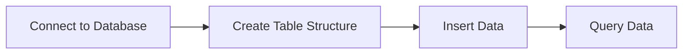

### Step 1: Connect to Database

```python
import sqlite3

# Creates a file called "students.db"
connection = sqlite3.connect("students.db")
cursor = connection.cursor()
```

### Step 2: Create a Table

```python
# Make a table to store student information
cursor.execute('''
    CREATE TABLE students (
        id INTEGER PRIMARY KEY,
        name TEXT,
        age INTEGER,
        grade TEXT
    )
''')
```

## CRUD Operations (Create, Read, Update, Delete)

### CRUD Operations Flow

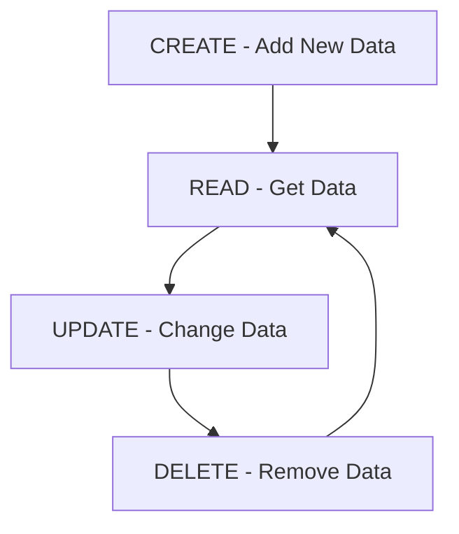

### CREATE - Add New Data

```python
# Add a student to the database
cursor.execute("INSERT INTO students (name, age, grade) VALUES ('John', 20, 'A')")
connection.commit()  # Save the changes
```

**Result in Database:**
| id | name | age | grade |
|----|------|-----|-------|
| 1 | John | 20 | A |

### READ - Get Data

```python
# Get all students
cursor.execute("SELECT * FROM students")
all_students = cursor.fetchall()

# Get specific students
cursor.execute("SELECT name FROM students WHERE grade = 'A'")
a_students = cursor.fetchall()
```

**Full Database Contents:**
| id | name | age | grade |
|----|-------|-----|-------|
| 1 | John | 20 | A |
| 2 | Alice | 19 | B |
| 3 | Bob | 21 | A |

### UPDATE - Change Data

```python
# Change John's grade to A+
cursor.execute("UPDATE students SET grade = 'A+' WHERE name = 'John'")
connection.commit()
```

**Updated Database:**
| id | name | age | grade |
|----|-------|-----|-------|
| 1 | John | 20 | A+ |
| 2 | Alice | 19 | B |
| 3 | Bob | 21 | A |

### DELETE - Remove Data

```python
# Remove Bob from database
cursor.execute("DELETE FROM students WHERE name = 'Bob'")
connection.commit()
```

**Final Database:**
| id | name | age | grade |
|----|-------|-----|-------|
| 1 | John | 20 | A+ |
| 2 | Alice | 19 | B |

## Complete Simple Example

Here's the complete working example from `intro_to_DataBase.py`:

```python
"""
Simple Introduction to Databases
Very basic example for beginners
No classes, no joining, no complex operations
"""

import sqlite3

# Create a database in the same folder as this file
print("📚 Learning Databases - Simple Example")
print("=" * 40)

# Connect to database (creates file if it doesn't exist)
connection = sqlite3.connect("students.db")
cursor = connection.cursor()

# Create a simple table
print("Creating students table...")
cursor.execute('''
    CREATE TABLE IF NOT EXISTS students (
        id INTEGER PRIMARY KEY,
        name TEXT,
        age INTEGER,
        grade TEXT
    )
''')

# Add some students (CREATE)
print("Adding students to database...")
cursor.execute("INSERT INTO students (name, age, grade) VALUES ('John', 20, 'A')")
cursor.execute("INSERT INTO students (name, age, grade) VALUES ('Alice', 19, 'B')")
cursor.execute("INSERT INTO students (name, age, grade) VALUES ('Bob', 21, 'A')")

# Save changes
connection.commit()

# Read all students (READ)
print("\nAll students in database:")
cursor.execute("SELECT * FROM students")
all_students = cursor.fetchall()
for student in all_students:
    print(f"ID: {student[0]}, Name: {student[1]}, Age: {student[2]}, Grade: {student[3]}")

# Find students with grade A (READ with condition)
print("\nStudents with grade A:")
cursor.execute("SELECT name, age FROM students WHERE grade = 'A'")
a_students = cursor.fetchall()
for student in a_students:
    print(f"Name: {student[0]}, Age: {student[1]}")

# Update a student's grade (UPDATE)
print("\nUpdating John's grade to A+...")
cursor.execute("UPDATE students SET grade = 'A+' WHERE name = 'John'")
connection.commit()

# Check the update
cursor.execute("SELECT name, grade FROM students WHERE name = 'John'")
john = cursor.fetchone()
print(f"John's new grade: {john[1]}")

# Delete a student (DELETE)
print("\nRemoving Bob from database...")
cursor.execute("DELETE FROM students WHERE name = 'Bob'")
connection.commit()

# Show remaining students
print("\nRemaining students:")
cursor.execute("SELECT name FROM students")
remaining = cursor.fetchall()
for student in remaining:
    print(f"- {student[0]}")

# Close database connection
connection.close()
print("\n✅ Database operations completed!")
print("Check 'students.db' file - your data is saved there!")
```

### How SQL Query Execution Works

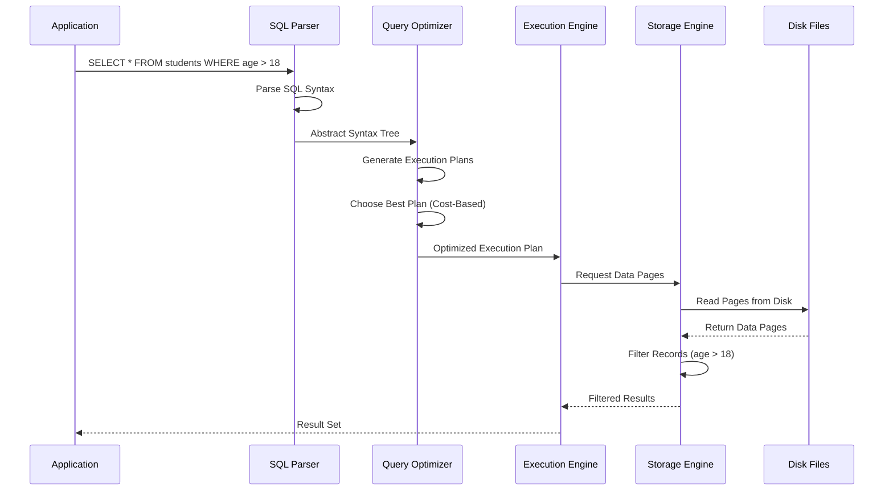

## Key Points to Remember

1. **Always commit** after INSERT, UPDATE, or DELETE
2. **Always close** the connection when done
3. **Use PRIMARY KEY** for the ID column
4. **SQLite is built into Python** - no installation needed
5. **Database files are created automatically** when you connect

## Common SQL Commands

- `CREATE TABLE` - Make a new table
- `INSERT INTO` - Add new data
- `SELECT` - Get data
- `UPDATE` - Change existing data
- `DELETE` - Remove data
- `WHERE` - Filter results

## Project Progress

### Database Schema Evolution

#### Stage 1: Simple Student Table

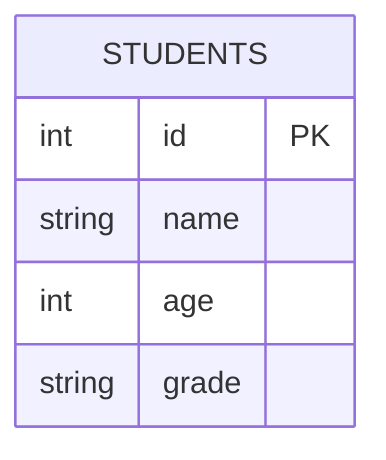

#### Stage 2: Real-World Database Structure

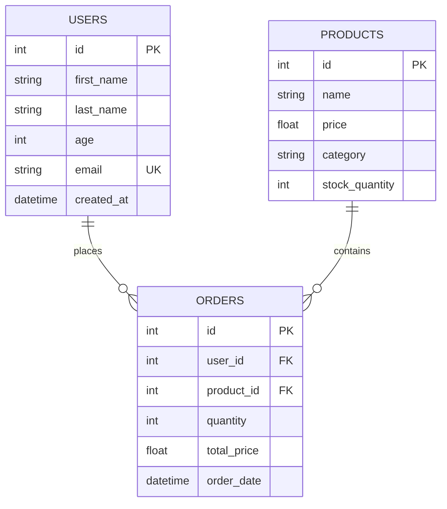

### Performance Comparison

#### Data Storage Comparison

| Feature               | Python Lists      | SQLite Database          |
| --------------------- | ----------------- | ------------------------ |
| **Persistence**       | ❌ Lost on exit   | ✅ Saved to disk         |
| **Search Speed**      | O(n) - Linear     | O(log n) - Logarithmic   |
| **Memory Usage**      | All in RAM        | Pages loaded as needed   |
| **Concurrent Access** | ❌ Single process | ✅ Multiple connections  |
| **Data Validation**   | ❌ Manual         | ✅ Built-in constraints  |
| **Backup**            | ❌ Manual copy    | ✅ Database backup tools |

#### Operation Time Complexity

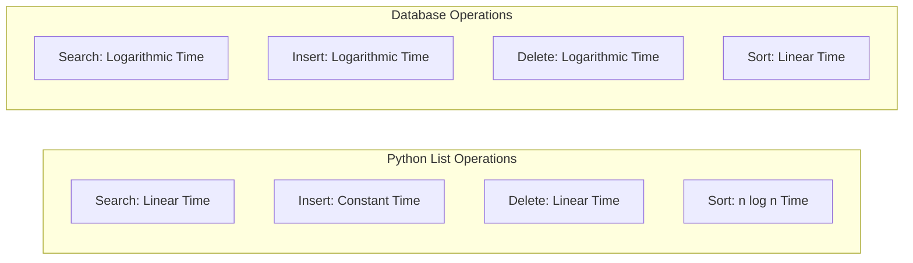

### Code Evolution Progress

#### Level 1: Basic Database Operations

```python
# What we learned - Simple CRUD
connection = sqlite3.connect("students.db")
cursor = connection.cursor()

# CREATE TABLE
cursor.execute("CREATE TABLE students (...)")

# INSERT DATA
cursor.execute("INSERT INTO students VALUES (...)")

# SELECT DATA
cursor.execute("SELECT * FROM students")

# Close connection
connection.close()
```

#### Level 2: Real-World Application (Future)

```python
# What's next - Production-ready code
class DatabaseManager:
    def __init__(self):
        self.setup_connection()
        self.create_indexes()

    def execute_transaction(self, queries):
        # Handle multiple operations safely
        pass

    def backup_database(self):
        # Data protection
        pass
```

## How SQL Works Behind the Scenes

### Database Storage Architecture

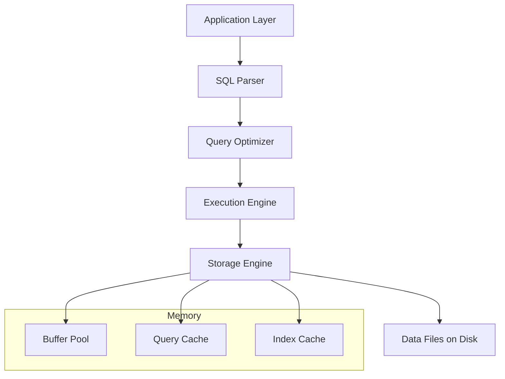

### Data Structures Used in Databases

#### 1. B+ Trees (Primary Data Structure)

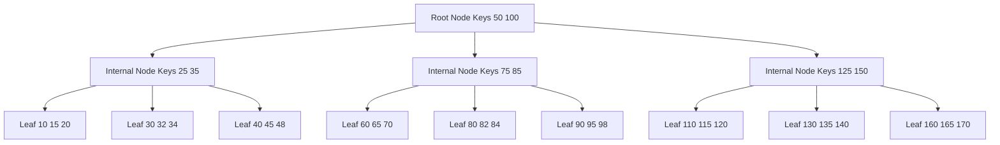

**Why B+ Trees?**

- **Balanced**: All leaf nodes at same level → consistent performance
- **Range Queries**: Linked leaf nodes allow fast range scans
- **Cache Friendly**: Nodes fit in memory pages
- **Logarithmic Time**: O(log n) for search, insert, delete

#### 2. Hash Tables (for Indexes)

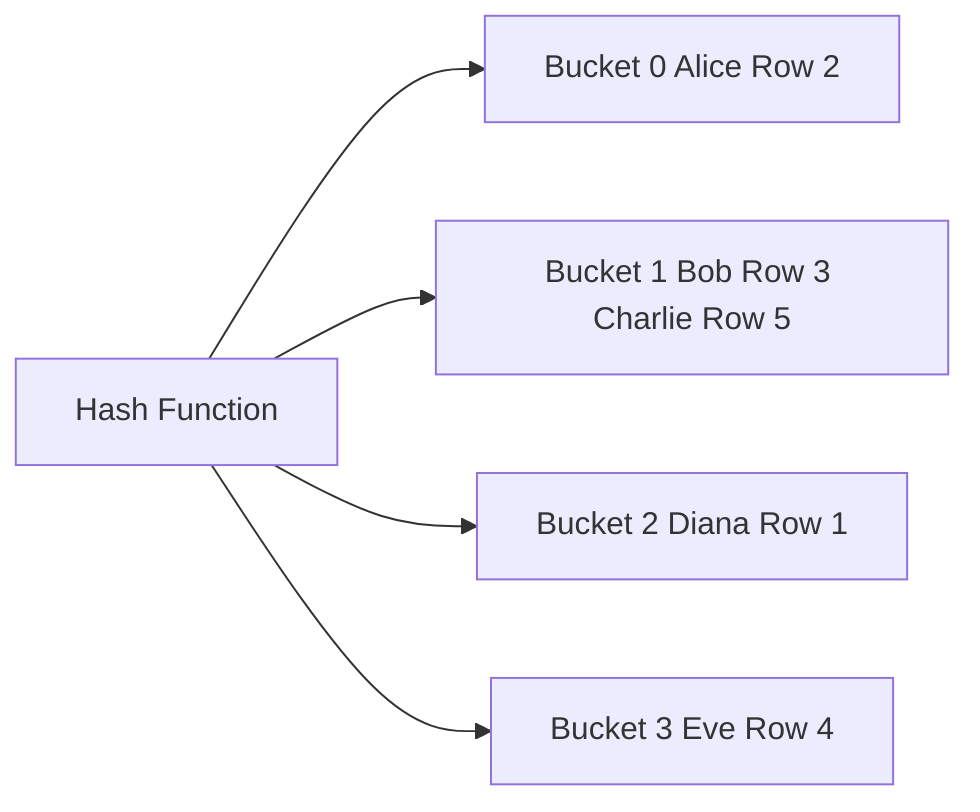

#### 3. Page Structure (How Data is Stored)

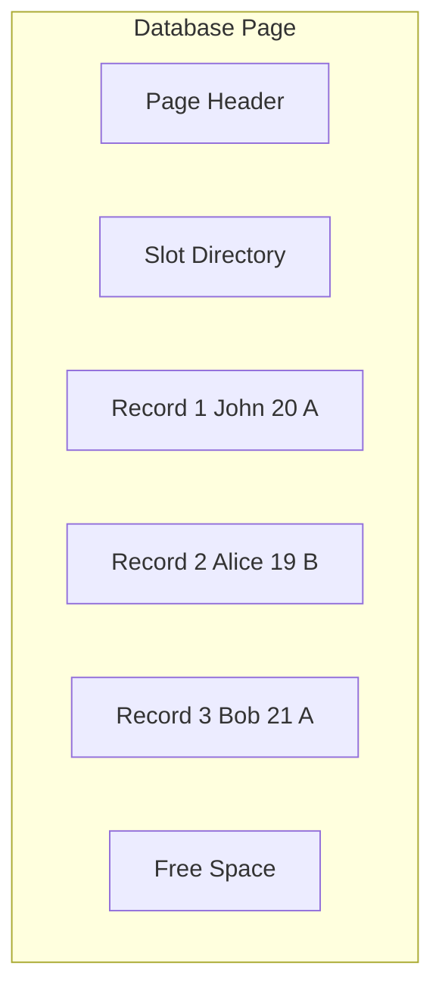

### Memory vs Disk Operations

| Operation       | Memory (RAM) | Disk (SSD/HDD) | Speed Difference   |
| --------------- | ------------ | -------------- | ------------------ |
| Random Access   | ~10 ns       | ~0.1ms (SSD)   | **10,000x faster** |
| Sequential Read | ~50 ns       | ~0.05ms (SSD)  | **1,000x faster**  |
| Data Transfer   | 50+ GB/s     | 500 MB/s (SSD) | **100x faster**    |

**This is why databases use:**

- **Buffer Pools**: Keep frequently used pages in memory
- **Indexes**: Reduce disk reads needed
- **Query Optimization**: Minimize data access
