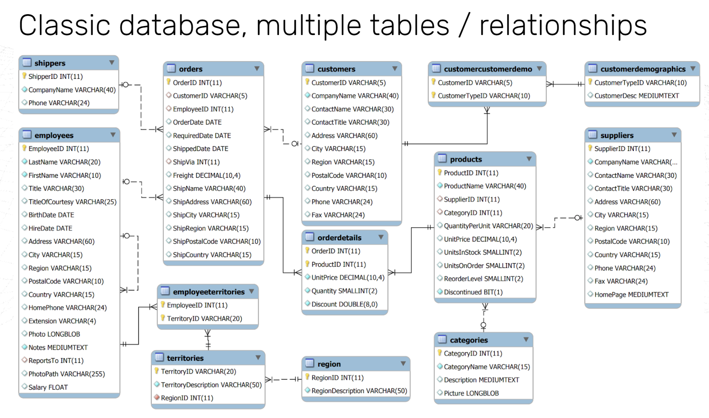
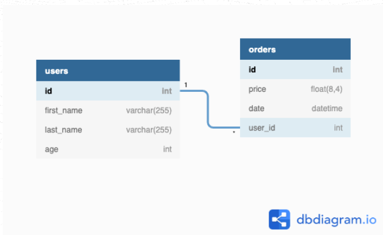
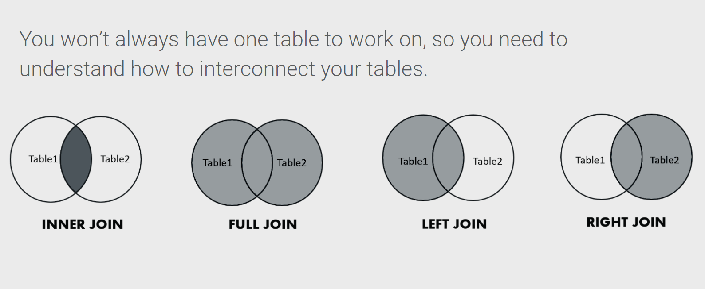

# SQL for Python Developers

## Table of Contents

- [SQL for Python Developers](#sql-for-python-developers)
  - [Table of Contents](#table-of-contents)
  - [From Python Data Structures to SQL Schema](#from-python-data-structures-to-sql-schema)
    - [Data Modeling: Python Lists vs SQL Tables](#data-modeling-python-lists-vs-sql-tables)
  - [Relational Database (Think: Connected Python Dictionaries)](#relational-database-think-connected-python-dictionaries)
    - [From Python dictionaries to SQL tables](#from-python-dictionaries-to-sql-tables)
    - [The Problem: How to Connect Data?](#the-problem-how-to-connect-data)
    - [The SQL Solution: Foreign Keys (Like Python Object References)](#the-sql-solution-foreign-keys-like-python-object-references)
  - [Connecting Tables (Like Joining Python Lists)](#connecting-tables-like-joining-python-lists)
    - [Joining tables (Python's zip() but better)](#joining-tables-pythons-zip-but-better)
    - [But we want the user information too!](#but-we-want-the-user-information-too)
  - [More To JOIN (Advanced Python-like Operations)](#more-to-join-advanced-python-like-operations)
    - [JOIN types (Different ways to merge data)](#join-types-different-ways-to-merge-data)
    - [1. **INNER JOIN** (Like Python set intersection)](#1-inner-join-like-python-set-intersection)
    - [2. **LEFT JOIN** (Like Python's "keep all from first list")](#2-left-join-like-pythons-keep-all-from-first-list)
    - [3. **FULL JOIN** (Like Python set union)](#3-full-join-like-python-set-union)
  - [Key Takeaways for Python Developers](#key-takeaways-for-python-developers)

## From Python Data Structures to SQL Schema

### Data Modeling: Python Lists vs SQL Tables

Think of SQL tables like **structured Python lists of dictionaries**, but with enforced rules and better performance.

In Python, you might store user data like this:

```python
users = [
    {"id": 1, "first_name": "John", "last_name": "Doe", "age": 18},
    {"id": 2, "first_name": "Bob", "last_name": "Dylan", "age": 30},
    {"id": 3, "first_name": "Jane", "last_name": "Doe", "age": 25}
]
```

But what if someone accidentally adds inconsistent data?

```python
users.append({"id": "four", "name": "Alice", "years_old": 28})  # Different structure!
```

SQL prevents this by defining a **schema** (like a Python class structure) that all data must follow.



## Relational Database (Think: Connected Python Dictionaries)

### From Python dictionaries to SQL tables

Imagine you're building an ECommerce website in Python. You might start with separate lists:

```python
# In Python, you might do this:
users = [
    {"id": 1, "first_name": "John", "last_name": "Doe", "age": 18},
    {"id": 2, "first_name": "Bob", "last_name": "Dylan", "age": 30},
    {"id": 3, "first_name": "Jane", "last_name": "Doe", "age": 25}
]

orders = [
    {"id": 1, "price": 18.0, "date": "2001-01-01"},
    {"id": 2, "price": 112.0, "date": "2001-01-02"},
    {"id": 3, "price": 9.0, "date": "2001-01-04"},
    {"id": 4, "price": 14.5, "date": "2001-01-03"}
]
```

But in SQL, we create **tables** with enforced structure. Think of it like defining a Python dataclass:

**Users table (like a Python dataclass):**

```sql
CREATE TABLE users (
    id serial  PRIMARY KEY,        -- Like: id: int (auto-incrementing)
    first_name varchar(255),       -- Like: first_name: str
    last_name varchar(255),        -- Like: last_name: str
    age int                        -- Like: age: int
);
```

| ID  | first_name | last_name | Age |
| --- | ---------- | --------- | --- |
| 1   | John       | Doe       | 18  |
| 2   | Bob        | Dylan     | 30  |
| 3   | Jane       | Doe       | 25  |

**Orders table:**

```sql
CREATE TABLE orders (
    id serial PRIMARY KEY,         -- Like: id: int (auto-incrementing)
    price float,                   -- Like: price: float
    date timestamp                 -- Like: date: datetime
);
```

| ID  | Price | Date                 |
| --- | ----- | -------------------- |
| 1   | 18    | 2001-01-01 00:00Z:00 |
| 2   | 112   | 2001-01-02 04:00:00Z |
| 3   | 9     | 2001-01-04 05:00:00Z |
| 4   | 14.5  | 2001-01-03 05:00:00Z |

### The Problem: How to Connect Data?

In Python, you might try to connect users and orders like this:

```python
# Inefficient Python approach - adding user names to orders
orders_with_users = [
    {"id": 1, "price": 18.0, "date": "2001-01-01", "user": "John"},
    {"id": 2, "price": 112.0, "date": "2001-01-02", "user": "John"},
    {"id": 3, "price": 9.0, "date": "2001-01-04", "user": "Bob"},
    {"id": 4, "price": 14.5, "date": "2001-01-03", "user": "Jane"}
]
```

**Problems with this approach:**

1. What if two users have the same name? (Like two "John"s)
2. Data duplication (storing user info in multiple places)
3. What if a user changes their name? You'd have to update it everywhere!

### The SQL Solution: Foreign Keys (Like Python Object References)

Instead of storing the actual name, we store a **reference** (like a Python object reference):

```python
# Python equivalent using IDs as references
orders_with_user_ids = [
    {"id": 1, "price": 18.0, "date": "2001-01-01", "user_id": 1},  # References user with id=1
    {"id": 2, "price": 112.0, "date": "2001-01-02", "user_id": 1},  # References user with id=1
    {"id": 3, "price": 9.0, "date": "2001-01-04", "user_id": 2},    # References user with id=2
    {"id": 4, "price": 14.5, "date": "2001-01-03", "user_id": 3}    # References user with id=3
]
```

In SQL, we enforce this relationship with **Foreign Keys**:

```sql
CREATE TABLE orders (
    id serial PRIMARY KEY,
    price float,
    date timestamp,
    user_id int,                           -- This references the user
    FOREIGN KEY (user_id) REFERENCES users(id)  -- Enforces the connection
);
```

**Final tables with relationships:**

| ID    | first_name | last_name | Age |
| ----- | ---------- | --------- | --- |
| **1** | John       | Doe       | 18  |
| **2** | Bob        | Dylan     | 30  |
| **3** | Jane       | Doe       | 25  |

| ID  | Price | Date                 | User_Id |
| --- | ----- | -------------------- | ------- |
| 1   | 18    | 2001-01-01 00:00Z:00 | **1**   |
| 2   | 112   | 2001-01-02 04:00:00Z | **1**   |
| 3   | 9     | 2001-01-04 05:00:00Z | **2**   |
| 4   | 14.5  | 2001-01-03 05:00:00Z | **3**   |

Think of `user_id` like a **pointer** in Python - it points to the actual user record.



**Adding data (like Python's list.append()):**

```sql
-- Like: users.append({"first_name": "John", "last_name": "Doe", "age": 18})
INSERT INTO users (first_name, last_name, age)
VALUES ('John', 'Doe', 18),
       ('Bob', 'Dylan', 30),
       ('Jane', 'Doe', 25);

-- Like: orders.append({"price": 18.0, "date": "2001-01-01", "user_id": 1})
INSERT INTO orders (price, date, user_id)
VALUES
    (18, '2001-01-01 00:00:00Z', 1),
    (112, '2001-01-02 04:00:00Z', 1),
    (9, current_timestamp, 2),
    (14.5, current_timestamp, 3);
```

## Connecting Tables (Like Joining Python Lists)

### Joining tables (Python's zip() but better)

Now we have separate tables, but how do we **combine** them? In Python, you might do something like this:

```python
# Python way - manual lookup (inefficient for large data)
def get_johns_orders():
    john_id = None
    # Find John's ID
    for user in users:
        if user['first_name'] == 'John':
            john_id = user['id']
            break

    # Find John's orders
    johns_orders = []
    for order in orders:
        if order['user_id'] == john_id:
            johns_orders.append(order)

    return johns_orders

# Result: [{"id": 1, "price": 18.0, ...}, {"id": 2, "price": 112.0, ...}]
```

**SQL makes this much easier and faster:**

```sql
-- Like: filter(lambda order: order['user_id'] == 1, orders)
SELECT *
FROM orders
WHERE user_id = 1;
```

**Result:**
| ID | Price | Date | User_Id |
| --- | ----- | -------------------- | ------- |
| 1 | 18 | 2001-01-01 00:00Z:00 | 1 |
| 2 | 112 | 2001-01-02 04:00:00Z | 1 |

### But we want the user information too!

In Python, you'd need to do another lookup:

```python
# Python way - combining data from different lists
def get_johns_orders_with_user_info():
    johns_orders = []
    for order in orders:
        if order['user_id'] == 1:
            # Find the user info
            user = next(u for u in users if u['id'] == order['user_id'])
            # Combine order and user data
            combined = {**order, **user}
            johns_orders.append(combined)
    return johns_orders
```

**SQL JOIN is like Python's merge, but built-in and optimized:**

```sql
-- Like: pd.merge() in pandas, but built into the language
SELECT *
FROM orders INNER JOIN users
ON orders.user_id = users.id
WHERE user_id = 1;
```

**Think of JOIN as:**

- `orders INNER JOIN users` = "Take each order and find its matching user"
- `ON orders.user_id = users.id` = "Match them where order's user_id equals user's id"
- Like calling `zip()` but with matching conditions

**Joined result:**
| ID | Price | Date | User_Id | ID | first_name | last_name | Age |
| --- | ----- | -------------------- | ------- | --- | ---------- | --------- | --- |
| 1 | 18 | 2001-01-01 00:00:00Z | 1 | 1 | John | Doe | 18 |
| 2 | 112 | 2001-01-02 04:00:00Z | 1 | 1 | John | Doe | 18 |

**In Python, this would look like:**

```python
johns_orders_with_info = [
    {
        "id": 1, "price": 18, "date": "2001-01-01 00:00:00Z", "user_id": 1,
        "first_name": "John", "last_name": "Doe", "age": 18
    },
    {
        "id": 2, "price": 112, "date": "2001-01-02 04:00:00Z", "user_id": 1,
        "first_name": "John", "last_name": "Doe", "age": 18
    }
]
```

**Why JOIN is better than Python loops:**

1. **Performance**: Databases are optimized for these operations
2. **Simplicity**: One query instead of nested loops
3. **Memory efficient**: Doesn't load everything into memory at once
4. **Declarative**: You say "what" you want, not "how" to get it

[Practice Here!](https://www.db-fiddle.com/f/oDar5WXtmyLWs3hGLCuTek/179)

## More To JOIN (Advanced Python-like Operations)

### JOIN types (Different ways to merge data)

Think of JOINs like different ways to combine Python lists or sets. Let's add some test data first:

```python
# Let's add a user who hasn't made any orders
users.append({"id": 4, "first_name": "George", "last_name": "Orwell", "age": None})

# And an order without a user (maybe a deleted user)
orders.append({"id": 5, "price": 100.0, "date": "2001-01-05", "user_id": None})
```

```sql
-- Same in SQL:
INSERT INTO users (first_name, last_name, age)
VALUES ('George', 'Orwell', NULL);

INSERT INTO orders (price, date, user_id)
VALUES (100, NOW(), NULL);
```



### 1. **INNER JOIN** (Like Python set intersection)

**Python equivalent:**

```python
# Only include records that exist in BOTH lists
def inner_join_python():
    result = []
    for order in orders:
        for user in users:
            if order.get('user_id') == user.get('id') and order['user_id'] is not None:
                combined = {**order, **user}
                result.append(combined)
    return result

# Result: Only orders that have matching users
```

**SQL:**

```sql
-- Like: set(orders) & set(users) - only matching records
SELECT *
FROM orders INNER JOIN users
ON orders.user_id = users.id;
```

| ID  | Price | Date                     | User_Id | ID  | first_name | last_name | Age |
| --- | ----- | ------------------------ | ------- | --- | ---------- | --------- | --- |
| 1   | 18    | 2001-01-01T00:00:00.000Z | 1       | 1   | John       | Doe       | 18  |
| 2   | 112   | 2001-01-02T04:00:00.000Z | 1       | 1   | John       | Doe       | 18  |
| 3   | 9     | 2001-01-04T05:00:00.000Z | 2       | 2   | Bob        | Dylan     | 30  |
| 4   | 14.5  | 2001-01-03T05:00:00.000Z | 3       | 3   | Jane       | Doe       | 25  |

**Notice:** George (user without orders) and the order without user are excluded.

### 2. **LEFT JOIN** (Like Python's "keep all from first list")

**Python equivalent:**

```python
# Keep ALL orders, add user info where available
def left_join_python():
    result = []
    for order in orders:
        combined = order.copy()
        # Try to find matching user
        user = next((u for u in users if u['id'] == order.get('user_id')), None)
        if user:
            combined.update(user)
        else:
            # Add None values for missing user fields
            combined.update({"first_name": None, "last_name": None, "age": None})
        result.append(combined)
    return result
```

**SQL:**

```sql
-- Keep ALL orders, add user info where possible
SELECT *
FROM orders LEFT JOIN users
ON orders.user_id = users.id;
```

| ID  | Price | Date                     | User_Id | ID   | first_name | last_name | Age  |
| --- | ----- | ------------------------ | ------- | ---- | ---------- | --------- | ---- |
| 1   | 18    | 2001-01-01T00:00:00.000Z | 1       | 1    | John       | Doe       | 18   |
| 2   | 112   | 2001-01-02T04:00:00.000Z | 1       | 1    | John       | Doe       | 18   |
| 3   | 9     | 2001-01-04T05:00:00.000Z | 2       | 2    | Bob        | Dylan     | 30   |
| 4   | 14.5  | 2001-01-03T05:00:00.000Z | 3       | 3    | Jane       | Doe       | 25   |
| 5   | 100   | 2001-01-05T05:00:00.000Z | NULL    | NULL | NULL       | NULL      | NULL |

**Notice:** The order without a user is included with NULL user info.

### 3. **FULL JOIN** (Like Python set union)

**Python equivalent:**

```python
# Include EVERYTHING - like set(orders) | set(users)
def full_join_python():
    result = []
    # First, add all matching pairs
    result.extend(inner_join_python())

    # Add orders without users
    for order in orders:
        if not any(u['id'] == order.get('user_id') for u in users if order.get('user_id')):
            combined = order.copy()
            combined.update({"first_name": None, "last_name": None, "age": None})
            result.append(combined)

    # Add users without orders
    for user in users:
        if not any(o.get('user_id') == user['id'] for o in orders):
            combined = user.copy()
            combined.update({"order_id": None, "price": None, "date": None})
            result.append(combined)

    return result
```

**SQL:**

```sql
SELECT \*
FROM orders FULL JOIN users
ON orders.user_id = users.id;
```

| ID   | Price | Date                     | User_Id | ID   | first_name | last_name | Age  |
| ---- | ----- | ------------------------ | ------- | ---- | ---------- | --------- | ---- |
| 1    | 18    | 2001-01-01T00:00:00.000Z | 1       | 1    | John       | Doe       | 18   |
| 2    | 112   | 2001-01-02T04:00:00.000Z | 1       | 1    | John       | Doe       | 18   |
| 3    | 9     | 2001-01-04T05:00:00.000Z | 2       | 2    | Bob        | Dylan     | 30   |
| 4    | 14.5  | 2001-01-03T05:00:00.000Z | 3       | 3    | Jane       | Doe       | 25   |
| 5    | 100   | 2001-01-05T05:00:00.000Z | NULL    | NULL | NULL       | NULL      | NULL |
| NULL | NULL  | NULL                     | NULL    | 4    | George     | Orwell    | NULL |

1. **INNER JOIN**

- Return only records when there is a match in both left and right tables.

```sql
SELECT *
FROM orders INNER JOIN users
ON orders.user_id = users.id;
```

| ID  | Price | Date                     | User_Id | ID  | first_name | last_name | Age |
| --- | ----- | ------------------------ | ------- | --- | ---------- | --------- | --- |
| 1   | 18    | 2001-01-01T00:00:00.000Z | 1       | 1   | John       | Doe       | 18  |
| 2   | 112   | 2001-01-02T04:00:00.000Z | 1       | 1   | John       | Doe       | 18  |
| 3   | 9     | 2001-01-04T05:00:00.000Z | 2       | 2   | Bob        | Dylan     | 30  |
| 4   | 14.5  | 2001-01-03T05:00:00.000Z | 3       | 3   | Jane       | Doe       | 25  |

3. **LEFT JOIN**

- Return all records from the left table ("orders"), and the matched records from the right table ("users").

```sql
SELECT *
FROM orders LEFT JOIN users
ON orders.user_id = users.id;
```

| ID  | Price | Date                     | User_Id | ID   | first_name | last_name | Age  |
| --- | ----- | ------------------------ | ------- | ---- | ---------- | --------- | ---- |
| 1   | 18    | 2001-01-01T00:00:00.000Z | 1       | 1    | John       | Doe       | 18   |
| 2   | 112   | 2001-01-02T04:00:00.000Z | 1       | 1    | John       | Doe       | 18   |
| 3   | 9     | 2001-01-04T05:00:00.000Z | 2       | 2    | Bob        | Dylan     | 30   |
| 4   | 14.5  | 2001-01-03T05:00:00.000Z | 3       | 3    | Jane       | Doe       | 25   |
| 5   | 100   | 2001-01-05T05:00:00.000Z | NULL    | NULL | NULL       | NULL      | NULL |

4. **RIGHT JOIN**

- Return all records from the right table and the matched records from the left table. RIGHT JOIN is also known as OUTER JOIN.

```sql
SELECT *
FROM users RIGHT JOIN orders
ON users.id = orders.user_id ;
```

| ID  | first_name | last_name | Age  | ID   | Price | Date                     | User_Id |
| --- | ---------- | --------- | ---- | ---- | ----- | ------------------------ | ------- |
| 1   | John       | Doe       | 18   | 1    | 18    | 2001-01-01T00:00:00.000Z | 1       |
| 1   | John       | Doe       | 18   | 2    | 112   | 2001-01-02T04:00:00.000Z | 1       |
| 2   | Bob        | Dylan     | 30   | 3    | 9     | 2001-01-04T05:00:00.000Z | 2       |
| 3   | Jane       | Doe       | 25   | 4    | 14.5  | 2001-01-03T05:00:00.000Z | 3       |
| 4   | George     | Orwell    | NULL | NULL | NULL  | NULL                     | NULL    |

**Summary:**

- **INNER JOIN** = `set1 & set2` (intersection)
- **LEFT JOIN** = "Keep all from left, match from right"
- **RIGHT JOIN** = "Keep all from right, match from left"
- **FULL JOIN** = `set1 | set2` (union)

**When to use each:**

- **INNER JOIN**: "Show me orders that have valid customers"
- **LEFT JOIN**: "Show me all orders, even if customer data is missing"
- **RIGHT JOIN**: "Show me all customers, even if they haven't ordered"
- **FULL JOIN**: "Show me everything - orders and customers, matched where possible"

## Key Takeaways for Python Developers

1. **SQL tables** = Python lists of dictionaries with enforced structure
2. **Foreign keys** = Object references that maintain data integrity
3. **JOINs** = Built-in merge operations (like pandas merge, but faster)
4. **SQL is declarative** = Say "what" you want, not "how" to get it
5. **Performance** = SQL engines are optimized for these operations

**Next steps:** Practice these concepts with real data and try converting your Python data processing code to SQL!
