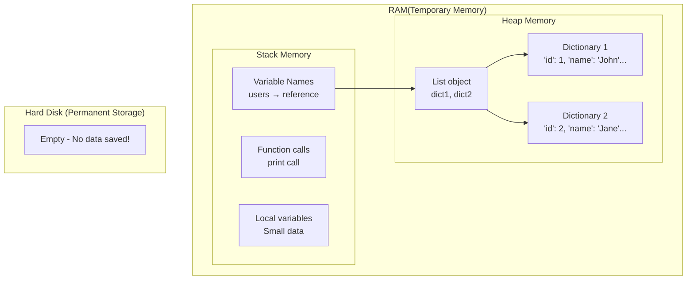
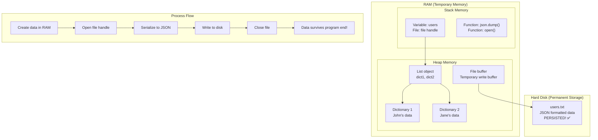

# Python Text File Database

## Table of Contents

- [Python Text File Database](#python-text-file-database)
  - [Table of Contents](#table-of-contents)
  - [Introduction: Before Databases, There Were Files](#introduction-before-databases-there-were-files)
    - [Why Start with Text Files?](#why-start-with-text-files)
    - [The Challenge: Persistent Data Storage](#the-challenge-persistent-data-storage)
    - [Understanding Memory: Why Data Disappears](#understanding-memory-why-data-disappears)
      - [Stack vs Heap Memory Management](#stack-vs-heap-memory-management)
    - [Understanding Persistent Storage: How Data Survives](#understanding-persistent-storage-how-data-survives)
      - [Memory + File Storage Management](#memory--file-storage-management)
  - [Setting Up Our Text File "Database"](#setting-up-our-text-file-database)
    - [File Structure](#file-structure)
    - [Data Format: JSON in Text Files](#data-format-json-in-text-files)
  - [Building Our Text File Database Manager](#building-our-text-file-database-manager)
    - [Database Folder Setup](#database-folder-setup)
    - [Basic File Operations](#basic-file-operations)
    - [Simple File Operations with Functions](#simple-file-operations-with-functions)
    - [Performance Measurement](#performance-measurement)
  - [Problems in CRUD Operations with Text Files](#problems-in-crud-operations-with-text-files)
    - [Data Integrity Problems](#data-integrity-problems)
    - [Concurrency Issues](#concurrency-issues)
  - [When to Use Text Files vs Real Databases](#when-to-use-text-files-vs-real-databases)
    - [✅ Use Text Files When:](#-use-text-files-when)
    - [❌ Use Real Databases When:](#-use-real-databases-when)
    - [The Evolution Path:](#the-evolution-path)
  - [🎯 Key Takeaways](#-key-takeaways)

## Introduction: Before Databases, There Were Files

### Why Start with Text Files?

Before learning about SQL databases, it's important to understand how data was traditionally stored and why databases were invented. Text files are the simplest form of persistent data storage, and understanding their limitations helps appreciate database features.

**What you'll learn:**

- How to store Python data in text files permanently
- CRUD operations using file I/O
- The challenges of managing data relationships manually
- Why databases solve problems that text files create

### The Challenge: Persistent Data Storage

You've probably noticed that when your Python program ends, all your data disappears:

```python
# This data disappears when the program ends!
users = [
    {"id": 1, "name": "John Doe", "email": "john@example.com", "age": 25},
    {"id": 2, "name": "Jane Smith", "email": "jane@example.com", "age": 30}
]

print("Program ending... data will be lost! 😢")
```

### Understanding Memory: Why Data Disappears

When you create variables in Python, they're stored in **RAM (Random Access Memory)**, which is temporary storage. Let's understand how this works:

#### Stack vs Heap Memory Management



**What happens in memory:**

1. **Stack Memory** (Fast, Small, Auto-managed):

   - Stores variable names like `users`
   - Stores references/pointers to actual data
   - Automatically cleaned up when program ends

2. **Heap Memory** (Slower, Large, Manual management):

   - Stores the actual data (lists, dictionaries, objects)
   - Python's garbage collector manages this
   - Also cleared when program ends

3. **Hard Disk** (Permanent, Slow):
   - Data survives program restarts
   - Must explicitly save data here

```python
# Let's trace what happens in memory:
users = [{"id": 1, "name": "John"}]  # Stack: 'users' → Heap: list object

# Stack Memory:
# +----------------+
# | users (ref)    | → Points to heap address
# +----------------+

# Heap Memory:
# +----------------+
# | List object    | → Contains references to dictionaries
# | [dict_ref1]    |
# +----------------+
# | Dict object 1  |
# | {"id": 1,      |
# |  "name": "John"}|
# +----------------+

# When program ends:
# Stack: CLEARED ❌
# Heap: CLEARED ❌
# Hard Disk: NOTHING SAVED ❌
print("All data lost when program terminates!")
```

**Solution: Save data to files!**

```python
# This data survives program restarts!
import json

users = [
    {"id": 1, "name": "John Doe", "email": "john@example.com", "age": 25},
    {"id": 2, "name": "Jane Smith", "email": "jane@example.com", "age": 30}
]

# Save to file
with open("users.txt", "w") as file:
    json.dump(users, file, indent=2)

print("Data saved! It will survive program restart! 🎉")
```

### Understanding Persistent Storage: How Data Survives

When we save data to files, we're moving it from temporary RAM to permanent hard disk storage. Here's how this works:

#### Memory + File Storage Management



**Step-by-step process:**

1. **Data Creation** (RAM):

   ```python
   users = [{"id": 1, "name": "John"}]  # Created in heap memory
   ```

2. **File Opening** (OS Operation):

   ```python
   with open("users.txt", "w") as file:  # OS creates file handle
   ```

3. **Serialization** (RAM → Format Conversion):

   ```python
   # Python converts objects to JSON string in memory
   # Heap now contains: list + JSON string representation
   ```

4. **Writing to Disk** (RAM → Hard Disk):

   ```python
   json.dump(users, file, indent=2)  # Data flows from RAM to disk
   ```

5. **File Closing** (OS Operation):
   ```python
   # File handle closed, data flushed to disk, guaranteed persistence
   ```

**Memory state during file operations:**

```python
# Before saving:
# Stack: 'users' → Heap: [list with dictionaries]
# Hard Disk: Empty

users = [{"id": 1, "name": "John Doe"}]

# During saving:
# Stack: 'users', 'file' → Heap: [original data] + [JSON string] + [file buffer]
# Hard Disk: Being written...

with open("users.txt", "w") as file:
    json.dump(users, file, indent=2)  # RAM → Disk transfer

# After program ends:
# Stack: CLEARED ❌
# Heap: CLEARED ❌
# Hard Disk: users.txt EXISTS ✅

# Next program run:
# Can read from disk back into RAM!
with open("users.txt", "r") as file:
    loaded_users = json.load(file)  # Disk → RAM transfer
```

**Key differences between memory types:**

| Memory Type   | Speed     | Size       | Persistence      | Use Case                            |
| ------------- | --------- | ---------- | ---------------- | ----------------------------------- |
| **Stack**     | Very Fast | Small (MB) | Program lifetime | Variable names, function calls      |
| **Heap**      | Fast      | Large (GB) | Program lifetime | Objects, data structures            |
| **Hard Disk** | Slow      | Huge (TB)  | Permanent        | Files, databases, long-term storage |

**Why this matters for databases:**

- **Text files**: Manual RAM ↔ Disk management (what we're learning)
- **Databases**: Automatic, optimized RAM ↔ Disk management
- **Database engines**: Smart caching, indexing, and memory management

## Setting Up Our Text File "Database"

### File Structure

We'll create three separate text files to store our data in a dedicated database folder:

- `database/users.txt` - Store user information
- `database/products.txt` - Store product catalog
- `database/orders.txt` - Store order records

```
📁 project_folder/
├── database/           # Database folder for organized file storage
│   ├── users.txt       # User data
│   ├── products.txt    # Product data
│   └── orders.txt      # Order data
└── main.py            # Our Python code
```

**Why use a database folder?**

- **Organization**: Keeps data files separate from code
- **Security**: Easier to backup and protect data files
- **Scalability**: Can add more data files without cluttering
- **Professional**: Mimics real database directory structures

### Data Format: JSON in Text Files

We'll use JSON format because it's easy to read and write with Python:

**users.txt:**

```json
[
  {
    "id": 1,
    "first_name": "John",
    "last_name": "Doe",
    "email": "john@example.com",
    "age": 25,
    "created_at": "2024-01-15T10:30:00"
  },
  {
    "id": 2,
    "first_name": "Jane",
    "last_name": "Smith",
    "email": "jane@example.com",
    "age": 30,
    "created_at": "2024-01-16T14:20:00"
  }
]
```

**products.txt:**

```json
[
  {
    "id": 1,
    "name": "Gaming Laptop",
    "price": 1299.99,
    "category": "Electronics",
    "stock": 5
  },
  {
    "id": 2,
    "name": "Wireless Mouse",
    "price": 29.99,
    "category": "Electronics",
    "stock": 20
  }
]
```

**orders.txt:**

```json
[
  {
    "id": 1,
    "user_id": 1,
    "product_id": 1,
    "quantity": 1,
    "total_price": 1299.99,
    "order_date": "2024-01-17T09:15:00"
  },
  {
    "id": 2,
    "user_id": 2,
    "product_id": 2,
    "quantity": 2,
    "total_price": 59.98,
    "order_date": "2024-01-17T11:30:00"
  }
]
```

## Building Our Text File Database Manager

### Database Folder Setup

First, let's create a dedicated folder for our database files:

```python
import json
import os
import time
from datetime import datetime

# Database folder setup
DATABASE_FOLDER = "database"
if not os.path.exists(DATABASE_FOLDER):
    os.makedirs(DATABASE_FOLDER)

print(f"✅ Database folder ready: {DATABASE_FOLDER}")
```

**Why this is important:**

- **Organization**: Keeps data separate from code
- **Scalability**: Easy to add more data files
- **Professional**: Follows database best practices
- **Backup**: Simple to backup just the database folder

### Basic File Operations

Now let's create functions that work with our database folder:

```python
def read_file(filename):
    """Read data from a text file in the database folder"""
    filepath = os.path.join(DATABASE_FOLDER, filename)
    try:
        with open(filepath, 'r') as file:
            return json.load(file)
    except FileNotFoundError:
        # If file doesn't exist, return empty list
        return []

def write_file(filename, data):
    """Write data to a text file in the database folder"""
    filepath = os.path.join(DATABASE_FOLDER, filename)
    with open(filepath, 'w') as file:
        json.dump(data, file, indent=2)

def get_next_id(data):
    """Generate next available ID"""
    if not data:
        return 1
    return max(item['id'] for item in data) + 1

# Test basic operations
print("📝 Testing basic file operations...")

# Create sample data
sample_users = [
    {"id": 1, "name": "John", "email": "john@example.com"}
]

# Write to database folder
write_file("test_users.txt", sample_users)

# Read from database folder
loaded_users = read_file("test_users.txt")
print(f"✅ Loaded: {loaded_users}")
print(f"📁 File saved in: {DATABASE_FOLDER}/test_users.txt")
```

### Simple File Operations with Functions

Instead of complex classes, let's use simple functions for teaching:

```python
def read_file(filename):
    """Read data from a text file in the database folder"""
    filepath = os.path.join(DATABASE_FOLDER, filename)
    try:
        with open(filepath, 'r') as file:
            return json.load(file)
    except FileNotFoundError:
        return []

def write_file(filename, data):
    """Write data to a text file in the database folder"""
    filepath = os.path.join(DATABASE_FOLDER, filename)
    with open(filepath, 'w') as file:
        json.dump(data, file, indent=2)

def get_next_id(data):
    """Generate next available ID"""
    if not data:
        return 1
    return max(item['id'] for item in data) + 1
```

### Performance Measurement

To understand how fast our text file operations are, let's add performance measurement:

```python
def measure_performance(func):
    """Decorator to measure function execution time"""
    def wrapper(*args, **kwargs):
        start_time = time.time()
        result = func(*args, **kwargs)
        end_time = time.time()
        execution_time = (end_time - start_time) * 1000  # Convert to milliseconds
        print(f"⏱️  Performance: {func.__name__} took {execution_time:.2f}ms")
        return result
    return wrapper

# Now we can measure any function's performance!
@measure_performance
def create_user_measured(first_name, last_name, email, age):
    users = read_file("users.txt")
    # ... rest of function
    return user_id
```

**Why measure performance?**

- **Understanding**: See how slow file operations can be
- **Optimization**: Find bottlenecks in your code
- **Comparison**: Compare text files vs real databases
- **Learning**: Understand why databases are faster

## Problems in CRUD Operations with Text Files

### Data Integrity Problems

- **No automatic validation:**

  - Someone could manually edit files and break data
  - No data type enforcement
  - No required field validation

- **Relationship problems:**

  - Orders can reference non-existent users
  - Deleting users doesn't automatically delete orders
  - No foreign key constraints

- **Consistency issues:**
  - Data can become inconsistent if program crashes
  - No atomic transactions
  - Partial writes can corrupt data

**Example of corrupted file:**

```json
[
  {"id": 1, "name": "John", "email": "john@example.com"},
  {"id": 2, "name": "Jane" /* MISSING CLOSING BRACE AND EMAIL
```

→ This would crash your entire application!

### Concurrency Issues

- **Race conditions:**

  - Two programs read same file simultaneously
  - Both make changes
  - Last writer wins, data is lost!

- **File locking:**

  - Operating system might lock files
  - Programs crash if can't access files
  - No built-in coordination between programs

- **No atomic operations:**
  - Can't guarantee multiple changes succeed together
  - Example: Transferring stock between products
  - If program crashes mid-operation, data is inconsistent

**Example Problem Scenario:**

1. Program A reads users.txt (1000 users)
2. Program B reads users.txt (1000 users)
3. Program A adds user #1001
4. Program B adds user #1001 (same ID!)
5. Program A saves file (1001 users)
6. Program B saves file (overwrites A's changes!)
   → **Result: Data loss and duplicate IDs!**

## When to Use Text Files vs Real Databases

### ✅ Use Text Files When:

**Good use cases for text files:**

- Configuration files (settings.json)
- Small datasets (< 1000 records)
- Log files (append-only)
- Cache files (temporary data)
- Data backups/exports
- Simple single-user applications
- Prototypes and learning projects

### ❌ Use Real Databases When:

**When you need a real database:**

- Large datasets (> 1000 records)
- Multiple users accessing data
- Data integrity is critical
- Complex relationships between data
- Need fast searches and queries
- Concurrent read/write operations
- Production applications
- E-commerce, banking, social media
- Any web application with users

### The Evolution Path:

**📈 Data Storage Evolution:**

1. Start with Python lists (learning)
   ↓
2. Move to text files (simple persistence)
   ↓
3. Use SQLite (single-user database)
   ↓
4. Use PostgreSQL/MySQL (multi-user database)
   ↓
5. Use distributed databases (massive scale)

---

## 🎯 Key Takeaways

1. **Text files provide persistence** but have major limitations
2. **Manual relationship management** is complex and error-prone
3. **Performance degrades** quickly with larger datasets
4. **No built-in data validation** or integrity constraints
5. **Concurrency problems** make multi-user applications impossible
6. **Real databases solve** all these problems elegantly

**Next Step:** Now that you understand the problems with text files, you'll appreciate why SQL databases were invented and why they're essential for real applications!
